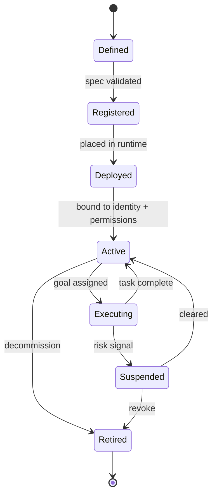

# Volume 13 - Agent Lifecycle

| Field | Value |
|---|---|
| Document ID | WORLD-VOL13-002 |
| Title | Agent Lifecycle |
| Version | 1.0 |
| Status | Approved |
| Classification | Internal |
| Founder | Mahesh Choudhary |

## Purpose

An agent is not a static artifact; it is a managed entity with a beginning, an operating life, and a controlled end. This chapter defines the lifecycle every WORLD agent traverses - from definition through deployment, activation, execution, supervision, and retirement - so that no agent exists on the platform without a governed record of how it came to be, what authority it holds, and when it ceased to act. The lifecycle is the temporal spine on which identity (Chapter 06), permissions (Chapter 07), and governance (Section G) hang.

## Scope

The chapter defines the lifecycle stages, the transitions between them, and the controls at each boundary. It applies to long-lived standing agents and to ephemeral, task-scoped sub-agents alike. It does not define runtime execution mechanics (Chapter 04) or the registry data model (Chapter 05); it establishes the states those systems operate on.

## Concept

The agent lifecycle exists because authority must be granted deliberately and reclaimed reliably. Every stage is a control point. An agent is first **defined** as a declarative specification - its goal, tools, data scope, and approval requirements. It is then **registered** and **deployed** into a runtime. It is **activated** against a principal identity, **executes** its loop under supervision, may be **suspended** on risk, and is finally **retired**, at which point its identity and permissions are revoked.

A central principle is symmetry between creation and destruction: whatever authority an activation grants, retirement must fully reclaim, leaving no orphaned agent identity or standing permission. Task-scoped sub-agents make this vivid - they are minted for a single task and destroyed on completion, mirroring the ephemeral agent identities of Volume 12 Chapter 03.

## Architecture

The lifecycle is a governed state machine. Forward transitions require validation and, for consequential agents, human sign-off; suspension can be triggered at any operating moment by a risk signal; retirement is terminal and irreversibly revokes authority.

No agent reaches Executing without a bound identity and permission set, and no agent leaves the system except through Retired, where credentials are revoked.

## Key Components

| Stage | Trigger | Control | Output |
|---|---|---|---|
| Defined | Author submits agent spec | Schema + policy validation | Versioned specification |
| Registered | Spec approved | Catalog entry, version pin | Discoverable agent record |
| Deployed | Release to runtime | Resource + isolation checks | Running instance |
| Active | Bind to identity | Least-privilege grant | Authorized agent |
| Executing | Goal assigned | Governance gate per action | Business outcomes |
| Suspended | Risk or anomaly | Immediate, reversible halt | Contained agent |
| Retired | Decommission or task end | Identity + permission revocation | Clean teardown |

## Relationship to Other Layers

**AI Business Partner (Volume 03):** The Partner initiates the lifecycle when it delegates work, and Volume 03 Section G governance approves promotion of an agent into consequential operation. Lifecycle transitions for high-authority agents are themselves subject to human-in-the-loop review.

**Security (Volume 12):** Activation binds the agent to a first-class identity (Chapter 06) and least-privilege permissions (Chapter 07), directly mirroring the joiner-mover-leaver identity lifecycle of Volume 12 Chapter 03. Retirement invokes the same deprovisioning rigor.

**Knowledge Engine (Volume 14):** Definition and versioning of an agent are recorded as knowledge, so the enterprise retains an auditable history of which agent version made which decision.

**ERP (Volume 05):** Executing agents act on ERP objects; suspension immediately halts their ERP-affecting actions, protecting business records during any anomaly.

## Trade-offs & Considerations

Standing agents amortize setup cost and accumulate context but carry persistent authority that must be continuously governed; ephemeral agents minimize standing risk but re-pay activation cost per task. WORLD uses ephemeral, task-scoped agents by default and reserves standing agents for well-bounded, high-frequency roles. Gating every promotion behind human approval adds friction; the platform mitigates this by pre-approving low-risk agent classes while holding consequential ones to full review. The essential discipline is that no stage may be skipped: an agent that never passed validation must never execute, and an agent that was retired must never act again.

**Enterprise example:** A retailer defines a Reconciliation Agent to match daily settlement files against sales orders. The specification is validated and registered as version 1.2, then deployed. Each night the agent is activated as an ephemeral instance bound to a task-scoped identity, executes its reconciliation, flags three exceptions for a human clerk, and is retired at completion - its identity destroyed, its permissions revoked. When a malformed settlement file triggers an anomaly one night, the agent is automatically suspended before it can post erroneous adjustments, and a human is alerted.

## Cross-References

- [AI Agent Philosophy](/docs/blueprint/volume-13-ai-agents/section-a-agent-foundations/01-ai-agent-philosophy.md)
- [Agent Registry](/docs/blueprint/volume-13-ai-agents/section-b-agent-runtime-and-identity/05-agent-registry.md)
- [Volume 12 - Security](/docs/blueprint/volume-12-security/README.md)
- [Volume 03 - AI Business Partner](/docs/blueprint/volume-03-ai-business-partner/README.md)

## References

- [Volume 01 - Vision and Philosophy](/docs/blueprint/volume-01-vision-and-philosophy/README.md)
- [Document Standards](/docs/governance/document-standards.md)

## Change Log

| Version | Date | Author | Notes |
|---|---|---|---|
| 1.0 | 2026-07-12 | Lead Software Engineer | Initial approved version. |
