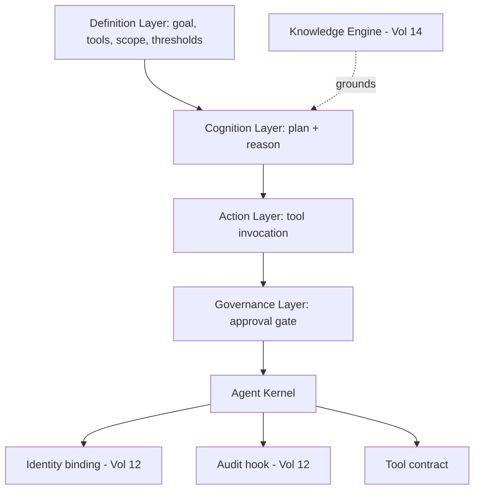

# Volume 13 - Agent Framework

| Field | Value |
|---|---|
| Document ID | WORLD-VOL13-003 |
| Title | Agent Framework |
| Version | 1.0 |
| Status | Approved |
| Classification | Internal |
| Founder | Mahesh Choudhary |

## Purpose

Philosophy (Chapter 01) states what an agent must be; lifecycle (Chapter 02) states how it comes to be and cease. This chapter defines the **framework** - the common structural blueprint that every WORLD agent shares. A framework is what turns a set of convictions into a repeatable engineering standard: a fixed set of components, contracts, and extension points so that thousands of agents across departments and industries are built, governed, and reasoned about uniformly rather than as bespoke one-offs.

## Scope

The chapter defines the layered anatomy of an agent, the declarative agent-definition contract, and the extension model that lets specialist agents (Sections E-F) inherit the common core. It does not implement the runtime that hosts the framework (Chapter 04) or the identity and permission subsystems (Chapters 06-07); it defines the structure those subsystems plug into.

## Concept

The framework separates the parts of an agent that must be uniform from the parts that must vary. Uniform across all agents are the identity binding, the governance gate, the tool-invocation contract, and the audit hook - these are the guardrails and must never be re-implemented per agent. Variable are the agent's goal, its reasoning strategy, its knowledge sources, and its specific tools - these are declared in the agent definition. This separation is the core design principle: **a common governed spine with declarative specialization**. Every agent is therefore a composition of shared infrastructure and a small, reviewable specification, never a monolith of custom code.

The agent definition is declarative on purpose. Because an agent is described by data - goal, tools, data scope, approval thresholds, KPIs - it can be validated, versioned, cataloged, and audited before it ever runs, and its authority can be understood without reading code.

## Architecture

Every agent is assembled from four layers over a shared kernel. The definition layer declares intent; the cognition layer reasons; the action layer invokes governed tools; and the governance layer wraps all consequential action. The kernel provides identity, audit, and the tool contract to every layer.

The kernel is fixed and trusted; the layers above it are specialized through the declarative definition, so specialization never bypasses the guardrails.

## Key Components

| Component | Layer | Responsibility | Uniform / Variable |
|---|---|---|---|
| Agent Definition | Definition | Declares goal, tools, scope, thresholds, KPIs | Variable |
| Reasoning Core | Cognition | Plans and decides toward the goal | Variable |
| Knowledge Binding | Cognition | Grounds reasoning in Volume 14 | Variable |
| Tool Contract | Kernel | Uniform interface for all governed actions | Uniform |
| Governance Gate | Governance | Routes consequential actions to humans | Uniform |
| Identity Binding | Kernel | Ties the agent to a first-class principal | Uniform |
| Audit Hook | Kernel | Records every decision and action | Uniform |

## Relationship to Other Layers

**AI Business Partner (Volume 03):** The framework is how the Partner scales from a single intelligence to a fleet of specialized agents that all obey the same governance contract of Volume 03 Section G. Consistency of the framework is what makes the whole fleet trustworthy.

**Security (Volume 12):** The kernel's identity binding and audit hook are direct integrations with Volume 12 - every framework instance is a principal (Chapters 03-06) whose tool calls are authorized (Chapters 05-08) and logged. Guardrails live in the kernel precisely so no specialization can remove them.

**Knowledge Engine (Volume 14):** The cognition layer binds to the Knowledge Engine so agents reason over governed enterprise knowledge rather than free-floating model output.

**ERP (Volume 05):** Tools in the action layer are the agent's hands on ERP objects; the uniform tool contract ensures every ERP mutation passes through the same permission and audit path as a human transaction.

## Trade-offs & Considerations

A rigid common kernel constrains what any single agent can do, which occasionally frustrates a highly specialized use case; WORLD accepts this because uniform guardrails are worth more than local flexibility. A declarative definition is easier to govern but less expressive than arbitrary code, so genuinely novel logic is added as reviewed tools rather than as freeform agent code. The framework must evolve carefully: because every agent depends on the kernel, kernel changes are high-leverage and are themselves versioned and governed. The guiding rule is that the guardrails are never optional and never per-agent - specialization happens above the kernel, never inside it.

**Enterprise example:** A professional-services firm builds a Timesheet Agent and an Invoicing Agent. Both are authored as declarative definitions over the same kernel: they differ only in goal, knowledge sources, tools, and approval thresholds. The Timesheet Agent reads project data and drafts weekly entries with no approval needed; the Invoicing Agent, sharing the identical governance gate and audit hook, routes every generated invoice above a set value to a human partner. Because both inherit the same kernel, the firm reasons about their authority and audits their actions with one mental model, and a later kernel upgrade to strengthen audit logging applies to both agents at once.

## Cross-References

- [AI Agent Philosophy](/docs/blueprint/volume-13-ai-agents/section-a-agent-foundations/01-ai-agent-philosophy.md)
- [Agent Runtime](/docs/blueprint/volume-13-ai-agents/section-b-agent-runtime-and-identity/04-agent-runtime.md)
- [Volume 14 - Knowledge Engine](/docs/blueprint/volume-14-knowledge-engine/README.md)
- [Volume 12 - Security](/docs/blueprint/volume-12-security/README.md)

## References

- [Volume 01 - Vision and Philosophy](/docs/blueprint/volume-01-vision-and-philosophy/README.md)
- [Document Standards](/docs/governance/document-standards.md)

## Change Log

| Version | Date | Author | Notes |
|---|---|---|---|
| 1.0 | 2026-07-12 | Lead Software Engineer | Initial approved version. |
