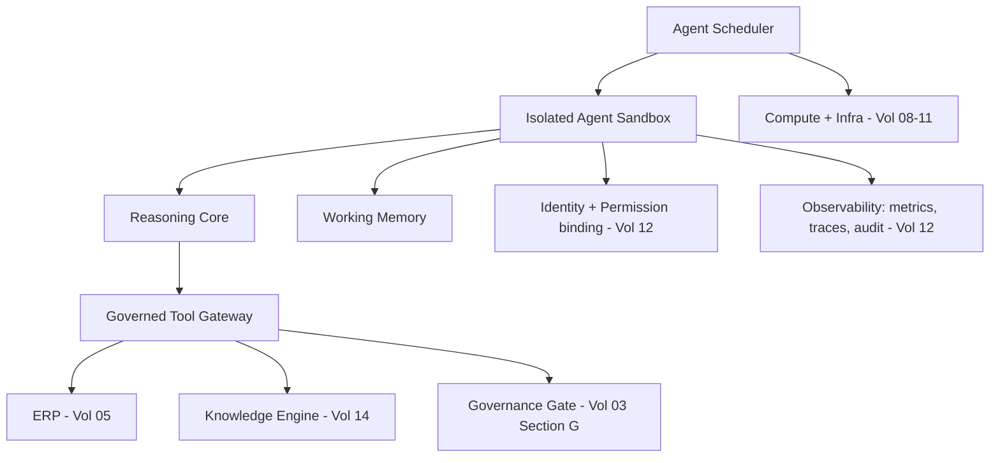

# Volume 13 - Agent Runtime

| Field | Value |
|---|---|
| Document ID | WORLD-VOL13-004 |
| Title | Agent Runtime |
| Version | 1.0 |
| Status | Approved |
| Classification | Internal |
| Founder | Mahesh Choudhary |

## Purpose

The framework of Chapter 03 defines what an agent is made of; the runtime defines where and how it actually runs. This chapter specifies the execution environment that hosts WORLD agents - how instances are scheduled, isolated, resourced, and observed while they carry out their perceive-reason-act loop. The runtime is the operational surface where philosophy meets infrastructure: it is responsible for making agent execution safe, isolated, and observable on the architecture of Volumes 08-11.

## Scope

The chapter defines the agent execution model, instance isolation, resource governance, and observability. It hosts both standing and ephemeral agents and enforces the boundaries that identity (Chapter 06) and permissions (Chapter 07) declare. It does not define the registry (Chapter 05) or the identity subsystem itself; it consumes them to place and bound running agents.

## Concept

The runtime exists to give every agent a controlled, isolated place to think and act. Its central principle is **strong isolation with governed egress**: each agent instance runs in its own sandbox, cannot touch another agent's state, and can reach the outside world only through the governed tool contract. A second principle is **ephemerality by default**: most agent instances are short-lived, spun up for a task and torn down at completion, mirroring the ephemeral identities of Volume 12 Chapter 03 and minimizing standing attack surface.

The runtime treats the reasoning model, the agent's working memory, and its tool connections as separable, independently governed resources. This lets the platform meter compute, cap tool usage, and revoke access instantly without terminating a whole workload, giving fine operational control over autonomous behavior.

## Architecture

The runtime schedules agent instances into isolated sandboxes on the platform's compute layer. Each sandbox binds to the agent's identity and permissions, reaches knowledge and ERP only through the tool gateway, and streams telemetry to the observability plane.

Every outward action of the sandbox passes through the tool gateway, where permissions are checked, governance is applied, and audit is written; nothing escapes the sandbox unobserved.

## Key Components

| Component | Responsibility | Bounded By |
|---|---|---|
| Agent Scheduler | Places and scales instances | Resource quotas |
| Agent Sandbox | Isolates one running instance | Namespace + policy isolation |
| Reasoning Core | Executes the agent's cognition | Model + token budget |
| Working Memory | Holds task-scoped state | Instance lifetime |
| Tool Gateway | Mediates all external action | Permissions - Chapter 07 |
| Observability Plane | Metrics, traces, audit stream | Volume 12 audit trail |
| Resource Governor | Meters compute and tool usage | Per-agent limits |

## Relationship to Other Layers

**AI Business Partner (Volume 03):** The runtime enforces Volume 03 Section G by routing consequential tool calls through the governance gate before execution, so human-in-the-loop control is applied at the moment of action, not merely at design time.

**Security (Volume 12):** Isolation, identity binding, and the audit stream implement Volume 12 controls at execution. Each sandbox authenticates as its agent principal, is authorized per tool call, and emits to the immutable audit trail; a compromised instance is contained by its sandbox.

**Knowledge Engine (Volume 14):** Agents reach the Knowledge Engine only through the tool gateway, so knowledge access is scoped, logged, and revocable per instance.

**ERP (Volume 05):** ERP mutations occur exclusively through governed tools, ensuring the runtime cannot bypass ERP permission and posting rules regardless of what the reasoning core concludes.

## Trade-offs & Considerations

Strong per-instance isolation costs startup latency and compute overhead; WORLD accepts this because containment of autonomous action is worth more than raw density. Ephemeral instances lose warm context between tasks, which the platform offsets by rehydrating durable memory from the cognition layer rather than keeping instances alive. Tight resource governance can throttle a legitimately heavy task, so quotas are set per agent class and can be raised through governed review. The overriding rule is that the runtime never widens an agent's authority - it can only enforce or reduce what identity and permissions grant.

**Enterprise example:** A bank runs a Fraud-Triage Agent that wakes on each flagged transaction. The scheduler spins an ephemeral sandbox bound to the agent's identity; the reasoning core pulls the transaction and customer history through the tool gateway from the ERP and Knowledge Engine, scores the risk, and - because freezing an account is consequential - routes a freeze recommendation through the governance gate to a human analyst. The sandbox is torn down after the decision, its working memory discarded, while metrics and the full decision trace persist in the observability plane for audit. When one instance hits its compute ceiling on an unusually large history, the resource governor caps it and signals for review rather than letting it run unbounded.

## Cross-References

- [Agent Framework](/docs/blueprint/volume-13-ai-agents/section-a-agent-foundations/03-agent-framework.md)
- [Agent Permissions](/docs/blueprint/volume-13-ai-agents/section-b-agent-runtime-and-identity/07-agent-permissions.md)
- [Volume 12 - Security](/docs/blueprint/volume-12-security/README.md)
- [Volume 05 - ERP Foundation](/docs/blueprint/volume-05-erp-foundation/README.md)

## References

- [Volume 01 - Vision and Philosophy](/docs/blueprint/volume-01-vision-and-philosophy/README.md)
- [Document Standards](/docs/governance/document-standards.md)

## Change Log

| Version | Date | Author | Notes |
|---|---|---|---|
| 1.0 | 2026-07-12 | Lead Software Engineer | Initial approved version. |
