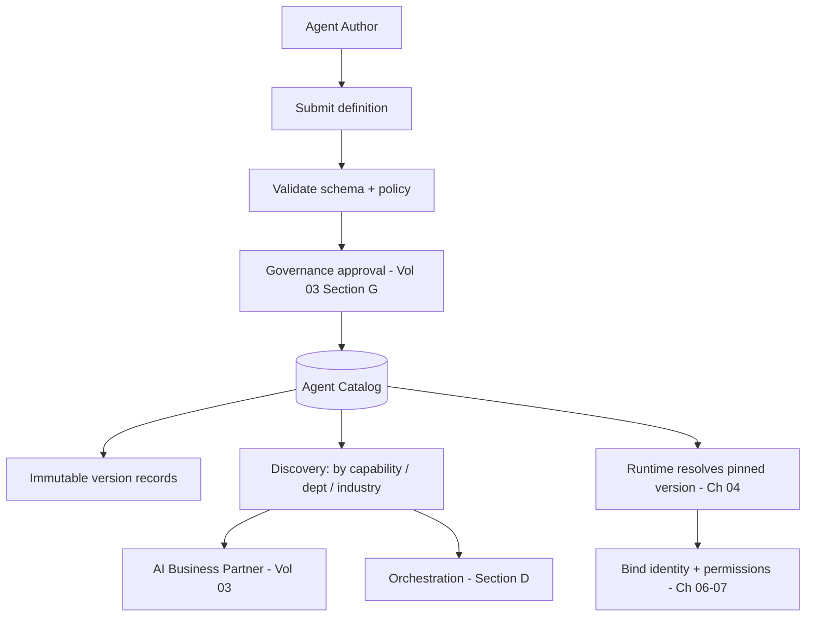

# Volume 13 - Agent Registry

| Field | Value |
|---|---|
| Document ID | WORLD-VOL13-005 |
| Title | Agent Registry |
| Version | 1.0 |
| Status | Approved |
| Classification | Internal |
| Founder | Mahesh Choudhary |

## Purpose

A platform that runs thousands of agents needs one authoritative answer to the questions: which agents exist, what does each one do, what version is running, and who may use it? This chapter defines the Agent Registry - the governed catalog of every agent definition in WORLD, its versioning discipline, and its discovery model. Without a registry, agents proliferate as untracked shadow automation; with it, the fleet is inventoried, versioned, and discoverable, which is the precondition for governing it at all.

## Scope

The chapter defines the registry's catalog model, version control, discovery interface, and governance metadata. It records agent definitions produced in the lifecycle (Chapter 02) and referenced by the runtime (Chapter 04). It does not define agent identity credentials (Chapter 06) or permission evaluation (Chapter 07); it holds the catalog metadata that those systems bind to at activation.

## Concept

The registry is the single source of truth for agent definitions. Its guiding principle is **nothing runs that is not registered**: the runtime will only activate an agent whose definition exists, is approved, and is version-pinned in the catalog. This closes the door on ungoverned automation.

Three capabilities define the registry. **Cataloging** records each agent's declarative definition - goal, tools, data scope, owner, KPIs, and approval requirements - as reviewable metadata. **Versioning** treats every definition as immutable and versioned, so an agent is always a specific version and the exact behavior behind any past decision is reconstructable. **Discovery** lets the AI Business Partner, orchestration layers, and humans find the right agent by capability, department, or industry, enabling reuse rather than reinvention. Together these make the agent fleet an inventoried asset rather than sprawling, opaque scripting.

## Architecture

Authors submit definitions that are validated and, once approved, published as immutable versions in the catalog. Consumers discover agents by capability; the runtime resolves a pinned version at activation and binds it to identity and permissions.

The catalog sits between authorship and execution: approval is required to enter it, and the runtime resolves only from it.

## Key Components

| Component | Responsibility | Governance Value |
|---|---|---|
| Catalog Record | Stores an agent definition and metadata | Complete inventory |
| Version Register | Immutable, ordered version history | Reproducibility |
| Capability Index | Discovery by function, department, industry | Reuse, no duplication |
| Ownership Metadata | Names the accountable owner | Clear accountability |
| Approval State | Tracks review and sign-off | Nothing unapproved runs |
| Deprecation Flag | Marks retired or superseded versions | Safe evolution |

## Relationship to Other Layers

**AI Business Partner (Volume 03):** The Partner and its orchestration layers query the registry to select agents by capability, and Volume 03 Section G governance gates entry into the catalog, so publication of a new agent is itself a governed act.

**Security (Volume 12):** Registry metadata is the reference the identity and permission systems (Volume 12 Chapters 03-08) bind to at activation - the catalog says what an agent version is allowed to be, and the security layer enforces it. Every catalog change is written to the audit trail.

**Knowledge Engine (Volume 14):** The registry is itself curated knowledge - a queryable, versioned record of the enterprise's automation - and links each version to the decisions it produced.

**ERP (Volume 05):** Agents that act on ERP modules declare their target scope in the catalog, giving the enterprise a clear map of which automations touch which ERP objects.

## Trade-offs & Considerations

Mandatory registration adds friction to creating a new agent, which can tempt teams toward shadow automation; WORLD counters this by making registration fast and by refusing to run anything unregistered, so the compliant path is also the only working path. Immutable versioning consumes storage and requires disciplined deprecation, but the ability to reconstruct any past agent behavior is essential for audit and trust. A rich capability index improves reuse but must be curated to stay accurate. The firm rule is single-source-of-truth: if two systems disagree about what an agent is, the registry wins.

**Enterprise example:** A logistics company has grown to forty agents across dispatch, billing, and compliance. A dispatch lead needs an agent that estimates delivery windows; instead of building one, she searches the registry's capability index and finds an existing Route-ETA Agent at version 2.3, already approved and owned by the operations team, and reuses it. Months later an audit asks why a specific ETA was quoted; because the registry pinned version 2.3 to that run, the team reproduces the exact definition and reasoning behind the quote. When version 3.0 ships with a new model, 2.3 is marked deprecated but retained, so historical decisions remain explainable.

## Cross-References

- [Agent Lifecycle](/docs/blueprint/volume-13-ai-agents/section-a-agent-foundations/02-agent-lifecycle.md)
- [Agent Identity](/docs/blueprint/volume-13-ai-agents/section-b-agent-runtime-and-identity/06-agent-identity.md)
- [Volume 03 - AI Business Partner](/docs/blueprint/volume-03-ai-business-partner/README.md)
- [Volume 14 - Knowledge Engine](/docs/blueprint/volume-14-knowledge-engine/README.md)

## References

- [Volume 01 - Vision and Philosophy](/docs/blueprint/volume-01-vision-and-philosophy/README.md)
- [Document Standards](/docs/governance/document-standards.md)

## Change Log

| Version | Date | Author | Notes |
|---|---|---|---|
| 1.0 | 2026-07-12 | Lead Software Engineer | Initial approved version. |
