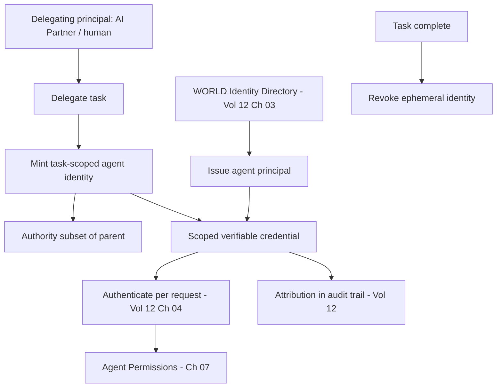

# Volume 13 - Agent Identity

| Field | Value |
|---|---|
| Document ID | WORLD-VOL13-006 |
| Title | Agent Identity |
| Version | 1.0 |
| Status | Approved |
| Classification | Internal |
| Founder | Mahesh Choudhary |

## Purpose

Every access decision in WORLD begins with knowing precisely who is asking. This chapter defines how agents obtain and carry identity - establishing that an agent is a first-class principal in the identity model of Volume 12 Chapters 03-08, with its own unique, verifiable, lifecycle-governed identity, never a borrower of human credentials. Identity is what makes autonomous action attributable, auditable, and revocable at the granularity of a single agent, and it is the subject on which agent permissions (Chapter 07) operate.

## Scope

The chapter defines the agent identity model: the agent principal type, credential issuance and verification, delegation of authority, and the ephemeral identity pattern for task-scoped agents. It aligns directly with the WORLD identity directory of Volume 12 Chapter 03 and the authentication model of Volume 12 Chapter 04. It does not define what an identity may do; that is authorization and permissions (Chapter 07).

## Concept

An agent identity is a typed, first-class principal in the same directory that holds human, service, and device identities. The governing principle is **distinct, attributable, revocable identity per agent**: no agent shares another's credential, and no agent ever impersonates the human who delegated to it. When the AI Business Partner delegates work, it does not lend its own identity - it causes a **task-scoped, ephemeral agent identity** to be minted, used for exactly that task, and destroyed on completion, exactly as described in Volume 12 Chapter 03.

Delegation carries a chain of accountability. A minted agent identity records the principal that authorized it, so a line can always be drawn from an autonomous action back through the delegating agent or human. Authority delegated is always equal to or narrower than the delegator's - an agent can never mint a child with more power than itself. This makes AI action bounded and traceable by construction.

## Architecture

Agent identities are issued by the identity directory, verified at authentication, and carried as a scoped credential on every action. Delegation mints child identities whose authority is a subset of the parent's, and ephemeral identities are revoked at task end.

Identity flows from directory to credential to authentication to permission, and every step is attributable in the audit trail; ephemeral identities are reclaimed the moment their task ends.

## Key Components

| Component | Responsibility | Alignment |
|---|---|---|
| Agent Principal | First-class typed identity for an agent | Vol 12 Ch 03 identity classes |
| Credential | Verifiable, scoped proof of identity | Vol 12 Ch 04 authentication |
| Delegation Record | Links agent to its authorizing principal | Chain of accountability |
| Ephemeral Identity | Task-scoped, auto-revoked identity | Vol 12 Ch 03 lifecycle |
| Attribution Tag | Binds every action to the acting agent | Vol 12 audit trail |
| Revocation Control | Immediate, per-agent credential kill | Least standing risk |

## Relationship to Other Layers

**AI Business Partner (Volume 03):** The Partner delegates through minted agent identities rather than sharing its own, so every autonomous action under Volume 03 Section G is attributable to a specific, bounded principal and can be revoked without affecting the Partner.

**Security (Volume 12):** This chapter is the agent specialization of Volume 12 Chapters 03-04. Agent principals live in the same directory, authenticate through the same mechanisms, and are governed by the same joiner-mover-leaver lifecycle as every other identity, giving one uniform governance model across humans and machines.

**Knowledge Engine (Volume 14):** Attribution tags let the enterprise record which agent identity produced which knowledge or decision, preserving provenance across the knowledge base.

**ERP (Volume 05):** When an agent touches an ERP object, the agent identity - not a human proxy - is the actor on record, so ERP audit history reflects true authorship of every machine-made change.

## Trade-offs & Considerations

Minting a distinct identity per task multiplies the number of identities the directory manages, which the platform absorbs by making agent identities ephemeral and automatically revoked, keeping standing identities few. Distinct agent identities complicate naive access reviews that assume human users, so reviews must treat agents as principals in their own right - which is precisely the point. Strict subset-only delegation occasionally blocks a convenient shortcut where an agent would need more power than its delegator; WORLD holds this line because privilege escalation through delegation is a core risk. The non-negotiable rule is that an agent never acts as a human and never holds authority its delegator lacked.

**Enterprise example:** A CFO asks the AI Business Partner to prepare the quarterly close. The Partner mints an ephemeral Close-Coordinator identity whose authority is a subset of the finance scope it was granted; that agent in turn mints narrower child identities for reconciliation and accrual sub-tasks, each strictly less privileged. Every journal entry drafted is attributed in the ERP audit trail to the specific sub-agent identity that produced it. When the close completes, all these identities are revoked automatically, leaving no standing agent authority - yet a full, attributable record of who did what remains for the auditors.

## Cross-References

- [Agent Permissions](/docs/blueprint/volume-13-ai-agents/section-b-agent-runtime-and-identity/07-agent-permissions.md)
- [Agent Registry](/docs/blueprint/volume-13-ai-agents/section-b-agent-runtime-and-identity/05-agent-registry.md)
- [Volume 12 - Security](/docs/blueprint/volume-12-security/README.md)
- [Volume 03 - AI Business Partner](/docs/blueprint/volume-03-ai-business-partner/README.md)

## References

- [Volume 01 - Vision and Philosophy](/docs/blueprint/volume-01-vision-and-philosophy/README.md)
- [Document Standards](/docs/governance/document-standards.md)

## Change Log

| Version | Date | Author | Notes |
|---|---|---|---|
| 1.0 | 2026-07-12 | Lead Software Engineer | Initial approved version. |
