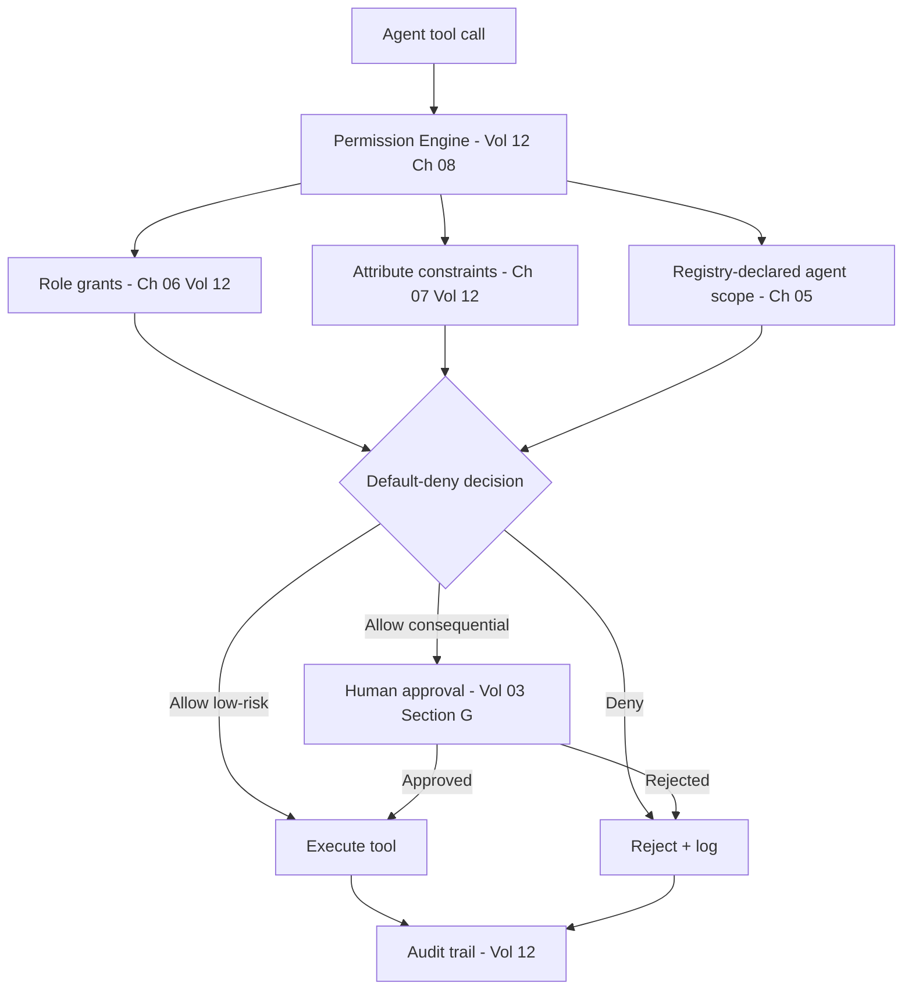

# Volume 13 - Agent Permissions

| Field | Value |
|---|---|
| Document ID | WORLD-VOL13-007 |
| Title | Agent Permissions |
| Version | 1.0 |
| Status | Approved |
| Classification | Internal |
| Founder | Mahesh Choudhary |

## Purpose

Identity (Chapter 06) establishes who an agent is; permissions establish what it may do. This chapter defines how WORLD authorizes agent action under strict least privilege, using the same authorization and permission machinery that governs human users in Volume 12 Chapters 05-08. An agent, being a first-class principal, is subject to default-deny, role-and-attribute policy, and per-request evaluation exactly as a person is - and, because it acts autonomously and at machine speed, its permissions are held to an especially tight standard.

## Scope

The chapter defines the agent permission model: least-privilege scoping, the tool-and-data permission surface, dynamic and time-bounded grants, and the escalation-to-human boundary. It operates on agent identities from Chapter 06 and delegates decisions to the Permission Engine of Volume 12 Chapter 08. It does not re-define the engine itself; it specifies how agents are bound by it.

## Concept

Agent permissions are governed by one overriding principle: **least privilege, enforced per action**. An agent is granted only the specific tools and data scopes its declared goal requires, nothing more, and every use is checked at the moment of action under default-deny - absent an explicit grant, the action is refused. This mirrors Volume 12 Chapter 05 authorization directly.

Two properties tighten agent authority beyond the human baseline. Permissions are **scoped to the agent definition** in the registry (Chapter 05), so an agent physically cannot request a capability its version was not granted. And consequential permissions are **conditioned on human approval** - the agent may propose an action but the governance gate of Volume 03 Section G must clear it before the tool executes. Autonomy is thus a graduated privilege: low-risk actions flow freely, high-risk actions require a human, and the boundary between them is policy the enterprise controls centrally without redeploying the agent.

## Architecture

Every agent tool call is evaluated by the Permission Engine against role grants, attribute constraints, and the agent's registry-declared scope; consequential actions additionally pass the human governance gate before execution, and every decision is logged.

No tool executes without an explicit allow, and no consequential tool executes without a human clearing the gate; every path ends in the audit trail.

## Key Components

| Component | Responsibility | Principle |
|---|---|---|
| Tool Permission | Grants use of a specific tool | Least privilege |
| Data Scope | Bounds which records the agent may read or write | Minimal exposure |
| Registry Binding | Caps permissions at the declared definition | No scope creep |
| Time-Bounded Grant | Expires ephemeral authority automatically | No standing risk |
| Governance Gate | Requires human sign-off on consequential acts | Human control |
| Decision Log | Records every allow and deny with reason | Auditability |

## Relationship to Other Layers

**AI Business Partner (Volume 03):** The consequential-action gate is the direct enforcement point of Volume 03 Section G human-in-the-loop governance; the enterprise tunes the risk threshold centrally to widen or narrow AI autonomy in real time without touching agent code.

**Security (Volume 12):** Agent authorization is not a parallel system - it is the same Permission Engine and default-deny model of Volume 12 Chapters 05-08 applied to an agent principal. One authority model spans humans and machines, so agent access appears in the same reviews and audits as human access.

**Knowledge Engine (Volume 14):** Data-scope permissions govern what knowledge an agent may read, preventing an agent from reasoning over records outside its mandate.

**ERP (Volume 05):** When an agent acts on an ERP object, the ERP delegates the decision to the same Permission Engine that governs Volume 05 Chapter 27 module permissions, so an agent can never exceed the ERP authority its role and scope allow.

## Trade-offs & Considerations

Tight least-privilege scoping means agents occasionally hit a wall on a legitimately needed action and must escalate, adding latency; WORLD accepts this friction as the cost of preventing autonomous over-reach. Per-action evaluation adds overhead to every tool call, mitigated by deploying the Permission Engine as a low-latency, highly available service per Volume 11. Human approval gates on consequential actions bound throughput, so the platform lets enterprises pre-approve well-understood low-risk action classes while holding high-impact ones to review. The unbreakable rule is default-deny: an agent that was never explicitly granted a capability does not have it, no matter how confident its reasoning.

**Enterprise example:** A Collections Agent at a services firm is granted read access to overdue invoices and the tool to send payment reminders, but no authority to issue credits. It identifies a disputed invoice and reasons that a goodwill credit would resolve it - but the credit tool is outside its registry-declared scope, so the Permission Engine denies the call under default-deny and the agent escalates to a human collections manager. Sending the reminder, a low-risk action within scope, executes immediately. Both the denied credit attempt and the sent reminder are logged with their rationale, giving the firm a complete, reviewable record of the agent's authority in action.

## Cross-References

- [Agent Identity](/docs/blueprint/volume-13-ai-agents/section-b-agent-runtime-and-identity/06-agent-identity.md)
- [Agent Runtime](/docs/blueprint/volume-13-ai-agents/section-b-agent-runtime-and-identity/04-agent-runtime.md)
- [Volume 12 - Security](/docs/blueprint/volume-12-security/README.md)
- [Volume 03 - AI Business Partner](/docs/blueprint/volume-03-ai-business-partner/README.md)

## References

- [Volume 01 - Vision and Philosophy](/docs/blueprint/volume-01-vision-and-philosophy/README.md)
- [Document Standards](/docs/governance/document-standards.md)

## Change Log

| Version | Date | Author | Notes |
|---|---|---|---|
| 1.0 | 2026-07-12 | Lead Software Engineer | Initial approved version. |
