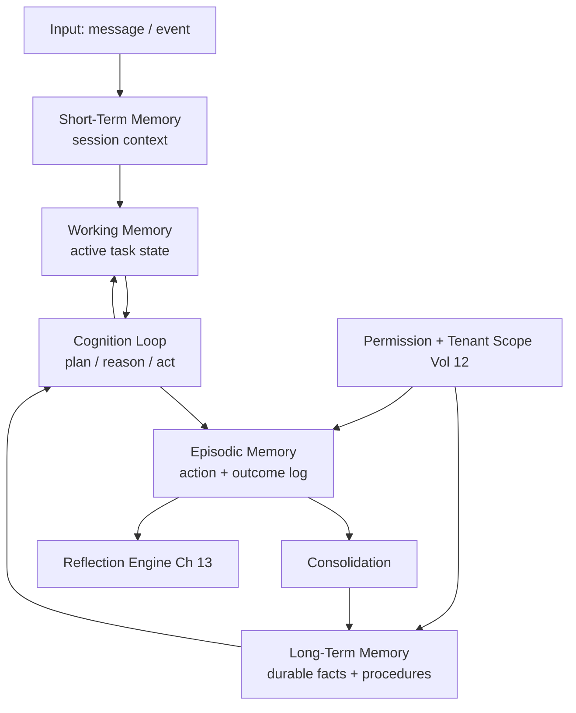

# Volume 13 - Agent Memory

| Field | Value |
|---|---|
| Document ID | WORLD-VOL13-008 |
| Title | Agent Memory |
| Version | 1.0 |
| Status | Approved |
| Classification | Internal |
| Founder | Mahesh Choudhary |

## Purpose

This chapter defines how a WORLD agent remembers. An agent without memory is a stateless function: it cannot pursue a goal across turns, learn from a mistake, or honour a commitment made an hour ago. Memory is what turns a language model call into a persistent, accountable business actor. This chapter establishes the memory tiers a WORLD agent uses, how they are written and read, and how they inherit the discipline of the Volume 03 Memory Model rather than reinventing it.

## Scope

The chapter covers the four memory tiers - short-term, working, long-term, and episodic - their lifecycles, retention, and isolation. It defines how memory interacts with the cognition loop (planning, reasoning, reflection, learning) and how it is bounded by tenant and permission scope. It does not define the underlying vector or relational stores (Volume 09) or the Knowledge Engine's corpus (Volume 14); memory is the agent's private, experiential state, distinct from shared organizational knowledge.

## Concept

From first principles, cognition requires state that outlives a single inference. WORLD separates that state by lifespan and purpose rather than storing everything in one undifferentiated context. **Short-term memory** is the live conversation and immediate signals - volatile, high-fidelity, discarded at session end. **Working memory** is the scratchpad of an active task: the current plan, intermediate results, and tool outputs the agent is actively manipulating. **Long-term memory** is durable, consolidated knowledge the agent has earned - stable facts, preferences, and learned procedures that persist across sessions. **Episodic memory** is the timestamped record of what happened: which actions were taken, why, and with what outcome, forming the substrate for reflection and audit. Each tier answers a different question: what is being said now, what am I doing now, what do I know, and what have I done.

## Architecture

Input enters short-term memory; the cognition loop draws on working and long-term memory to act; every action is written to episodic memory; a consolidation step promotes durable signal from episodes into long-term memory. All persistent writes pass a permission and tenant-scope gate so no memory crosses a tenant boundary.

## Key Components

| Component | Tier | Lifespan | Written By | Read By |
|---|---|---|---|---|
| Session Context | Short-term | Session | Input handler | Cognition loop |
| Task Scratchpad | Working | Task | Planner, tools | Reasoning, reflection |
| Fact & Preference Store | Long-term | Persistent | Consolidation | Planning, reasoning |
| Procedure Store | Long-term | Persistent | Learning Model Ch 14 | Planning |
| Episode Log | Episodic | Retained per policy | Cognition loop | Reflection, audit |
| Consolidation Service | Cross-tier | Continuous | System | System |

## Relationship to Other Layers

**Volume 03 Cognition:** This chapter is the agent-level realization of the [Memory Model](/docs/blueprint/volume-03-ai-business-partner/section-c-ai-cognition/18-memory-model.md). The tiers, retention semantics, and consolidation discipline are inherited from Volume 03; Volume 13 binds them to a concrete agent instance and its lifecycle. **Volume 14 Knowledge:** Memory is private and experiential; the [Knowledge Engine](/docs/blueprint/volume-14-knowledge-engine/README.md) is shared and authoritative. When an agent needs a fact it did not experience, it retrieves from knowledge (Chapter 10) rather than fabricating memory. **Volume 10 Tools:** Tool outputs land in working memory and are logged as episodes, so tool calls (Chapter 09) are always traceable. **Volume 12 Security:** Every persistent memory write is scoped by tenant and permission; an agent can never read another tenant's memory, and sensitive values are classified and, where required, redacted before consolidation.

## Trade-offs & Considerations

More memory is not better memory. Unbounded context degrades reasoning quality and inflates cost, so short-term memory is aggressively summarized. Consolidation trades recall for reliability: promoting a wrong fact to long-term memory poisons future decisions, so promotion requires corroboration and is reversible. Retention is a governance decision, not a technical default - episodic logs are retained for audit but subject to privacy and deletion rules from Volume 12. Finally, memory must be forgettable: a stale preference must be correctable, which is why long-term entries carry provenance and confidence rather than being treated as immutable truth.

**Enterprise example:** A procurement agent negotiates a supplier renewal over several days. Short-term memory holds the current email thread; working memory holds the live comparison of quotes and the drafted counter-offer; long-term memory holds the buyer's standing preference for net-45 terms learned across prior deals; episodic memory records each counter-offer sent and the supplier's response. When the deal closes, consolidation promotes the final negotiated rate and a reusable negotiation procedure to long-term memory, and the reflection engine reviews the episode log to assess whether the concession pattern was optimal.

## Cross-References

- [Reflection Engine](/docs/blueprint/volume-13-ai-agents/section-c-agent-cognition/13-reflection-engine.md)
- [Learning Model](/docs/blueprint/volume-13-ai-agents/section-c-agent-cognition/14-learning-model.md)
- [Volume 03 - Memory Model](/docs/blueprint/volume-03-ai-business-partner/section-c-ai-cognition/18-memory-model.md)
- [Volume 14 - Knowledge Engine](/docs/blueprint/volume-14-knowledge-engine/README.md)

## References

- [Volume 01 - Vision and Philosophy](/docs/blueprint/volume-01-vision-and-philosophy/README.md)
- [Document Standards](/docs/governance/document-standards.md)

## Change Log

| Version | Date | Author | Notes |
|---|---|---|---|
| 1.0 | 2026-07-12 | Lead Software Engineer | Initial approved version. |
