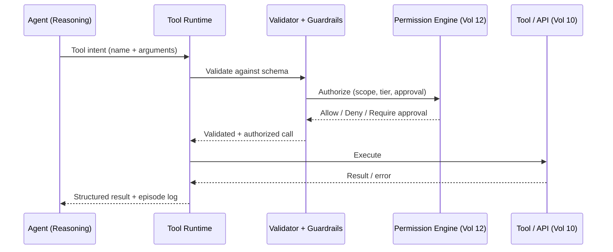

# Volume 13 - Tool Calling

| Field | Value |
|---|---|
| Document ID | WORLD-VOL13-009 |
| Title | Tool Calling |
| Version | 1.0 |
| Status | Approved |
| Classification | Internal |
| Founder | Mahesh Choudhary |

## Purpose

This chapter defines how a WORLD agent acts on the world. Reasoning alone changes nothing; a tool call is the moment an agent moves from thinking to doing - reading a ledger, posting a journal entry, sending an email, invoking an external API. Because tool calls have real consequences, they are the highest-risk surface in agent cognition. This chapter specifies how tools are described, selected, validated, executed, and guarded so that every action is deliberate, authorized, and reversible where possible.

## Scope

The chapter covers the tool schema, the invocation lifecycle, argument validation, execution guardrails, and result handling. It aligns tool calling with the API architecture of Volume 10, treating every tool as a governed capability rather than an arbitrary code path. It does not define the APIs themselves (Volume 10) or the permission model (Volume 12); it defines how an agent discovers, requests, and safely uses them.

## Concept

A tool is a typed, described capability the agent may invoke. From first principles, safe tool use requires four separations: **description** (what the tool does and what it expects), **selection** (choosing the right tool for the goal), **validation** (proving the arguments are well-formed and permitted), and **execution** (running it under guardrails with a recorded outcome). WORLD never lets a model call raw code. Instead the model emits a structured intent - a tool name and arguments - which the runtime validates against a schema, checks against permissions, and only then executes. This turns an open-ended generation problem into a constrained, auditable transaction. Every tool declares whether it is read-only or mutating, whether it is reversible, and what approval tier it requires.

## Architecture

The agent proposes an intent; the runtime validates it against the tool schema; guardrails and the permission engine authorize it; only an authorized, well-formed call reaches the tool; the result returns as structured data and is logged as an episode.

## Key Components

| Component | Responsibility | Guarantee |
|---|---|---|
| Tool Schema | Declares name, typed arguments, effects, reversibility, approval tier | Machine-checkable contract |
| Tool Selector | Maps goal to the correct tool | Least-privilege, purpose-fit |
| Argument Validator | Enforces types, ranges, required fields | No malformed calls execute |
| Guardrail Layer | Rate limits, allowlists, injection checks, dry-run | Blast-radius control |
| Permission Check | Confirms agent may invoke with these arguments | No unauthorized action |
| Result Handler | Normalizes output, records episode, surfaces errors | Full traceability |

## Relationship to Other Layers

**Volume 10 Tools:** Every WORLD tool is a governed API from the [Integration Framework](/docs/blueprint/volume-10-api/section-e-integration-and-messaging/17-integration-framework.md) and passes through the [API Gateway](/docs/blueprint/volume-10-api/section-c-api-security-and-access/10-api-gateway.md); tool calling adds an agent-facing schema and safety layer on top, it does not bypass the gateway. **Volume 03 Cognition:** Tool selection is driven by the reasoning framework of Volume 03; the agent decides which tool serves the current sub-goal. **Volume 14 Knowledge:** Retrieval is itself a read-only tool (Chapter 10), so knowledge access follows the same validated invocation path. **Volume 12 Security:** Authorization is delegated to the permission engine; mutating and irreversible tools require the approval tiers defined in Section D's human approval model, and every call is authenticated, scoped, and audited.

## Trade-offs & Considerations

Rich tool catalogs increase capability but also the risk of wrong-tool selection, so tools are scoped to an agent's role rather than universally available. Strict validation rejects some valid-but-unusual calls; WORLD accepts that friction to eliminate malformed execution. Guardrails such as dry-run and rate limiting add latency but bound the damage of a reasoning error. Prompt injection is treated as a first-class threat: tool arguments derived from untrusted content are sanitized, and no tool output is allowed to silently escalate the agent's privileges. Irreversible actions - payments, deletions, external commitments - always require an explicit approval tier, because the cost of an autonomous mistake exceeds the cost of a confirmation.

**Enterprise example:** A finance agent is asked to pay an overdue invoice. It selects the `create_payment` tool and emits arguments (vendor, amount, account). The validator confirms the amount is numeric and within schema bounds; the guardrail layer flags that the amount exceeds the agent's autonomous limit; the permission engine returns "require approval." The runtime pauses and routes a decision brief to a human approver. Only after approval does the payment execute, and the full chain - intent, validation, approval, execution - is written to the episode log for audit.

## Cross-References

- [Knowledge Access](/docs/blueprint/volume-13-ai-agents/section-c-agent-cognition/10-knowledge-access.md)
- [Reasoning Engine](/docs/blueprint/volume-13-ai-agents/section-c-agent-cognition/12-reasoning-engine.md)
- [Volume 10 - Integration Framework](/docs/blueprint/volume-10-api/section-e-integration-and-messaging/17-integration-framework.md)
- [Volume 10 - API Gateway](/docs/blueprint/volume-10-api/section-c-api-security-and-access/10-api-gateway.md)

## References

- [Volume 01 - Vision and Philosophy](/docs/blueprint/volume-01-vision-and-philosophy/README.md)
- [Document Standards](/docs/governance/document-standards.md)

## Change Log

| Version | Date | Author | Notes |
|---|---|---|---|
| 1.0 | 2026-07-12 | Lead Software Engineer | Initial approved version. |
