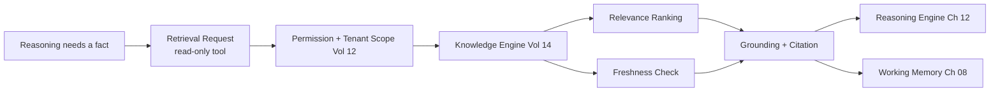

# Volume 13 - Knowledge Access

| Field | Value |
|---|---|
| Document ID | WORLD-VOL13-010 |
| Title | Knowledge Access |
| Version | 1.0 |
| Status | Approved |
| Classification | Internal |
| Founder | Mahesh Choudhary |

## Purpose

This chapter defines how a WORLD agent grounds its reasoning in truth. A language model carries plausible-sounding but unverified parametric knowledge; a business actor cannot make decisions on plausibility. Knowledge access is the discipline of retrieving authoritative, current, permission-scoped facts from the Knowledge Engine and grounding every consequential claim in them. This chapter specifies how agents retrieve, ground, cite, and bound their use of organizational knowledge.

## Scope

The chapter covers retrieval, grounding, citation, and freshness for agent cognition. It defines the boundary between private memory (Chapter 08) and shared knowledge (Volume 14), and how retrieval is invoked as a governed, read-only tool. It does not define the Knowledge Engine's ingestion, indexing, or ontology (Volume 14); it defines the agent-side contract for consuming it safely.

## Concept

From first principles, an agent should trust experience it recorded (memory) and facts it retrieved from an authoritative source (knowledge), and distrust anything it merely generated. **Retrieval** fetches candidate facts relevant to the current question. **Grounding** binds the agent's assertions to those retrieved facts so that answers are supported, not invented. **Citation** attaches provenance so a human can verify the source. **Freshness** ensures the retrieved fact reflects current reality, since a stale price or an outdated policy is worse than no answer. WORLD treats ungrounded factual claims as defects: if the agent cannot ground a claim, it must say so and, where possible, retrieve more or escalate rather than guess.

## Architecture

A reasoning step requests a fact; retrieval is scoped by tenant and permission before it reaches the Knowledge Engine; results are ranked, freshness-checked, and grounded with citations; the grounded evidence flows into reasoning and is cached in working memory for the current task.

## Key Components

| Component | Responsibility | Guarantee |
|---|---|---|
| Retrieval Interface | Issues scoped queries to Volume 14 | Read-only, permissioned |
| Relevance Ranking | Orders candidates by fit | Signal over noise |
| Freshness Check | Rejects stale or superseded facts | Current-state truth |
| Grounding Binder | Ties assertions to evidence | No ungrounded claims |
| Citation Attach | Records source and confidence | Human-verifiable |
| Retrieval Cache | Holds facts in working memory | Consistent within a task |

## Relationship to Other Layers

**Volume 14 Knowledge:** The [Knowledge Engine](/docs/blueprint/volume-14-knowledge-engine/README.md) is the single authoritative source; this chapter is the agent-side consumer contract and adds no facts of its own. **Volume 03 Cognition:** Grounding operationalizes the [Knowledge Model](/docs/blueprint/volume-03-ai-business-partner/section-c-ai-cognition/19-knowledge-model.md), which distinguishes what the AI knows from what it must verify. **Volume 10 Tools:** Retrieval is a read-only tool invoked through the tool-calling path (Chapter 09), so it inherits validation and audit. **Volume 12 Security:** Every retrieval is scoped by tenant and permission, so an agent sees only knowledge its principal is authorized to see; sensitive classifications are enforced at retrieval, not after the fact.

## Trade-offs & Considerations

Retrieval adds latency and cost; WORLD accepts it because ungrounded business decisions are unacceptable. Broad retrieval improves recall but risks pulling in noise that misleads reasoning, so ranking and scoping are tuned for precision on consequential queries. There is a tension between freshness and stability - aggressively invalidating cached facts guarantees currency but can make an agent's answers shift mid-task; WORLD holds retrieved facts stable within a single task while refreshing between tasks. Grounding cannot fully eliminate hallucination, so consequential outputs pair citations with confidence, and low-confidence or unretrievable claims trigger clarification or escalation rather than a confident guess.

**Enterprise example:** A sales agent is asked whether a prospect qualifies for enterprise pricing. Rather than reasoning from its training, it retrieves the current pricing policy and the prospect's account tier from the Knowledge Engine, scoped to the sales team's permissions. The freshness check confirms the pricing policy version is current; the grounding binder ties the agent's answer - "yes, the account qualifies at the enterprise tier" - to the specific policy clause and account record, attaching both as citations. The rep sees not just the answer but exactly which policy and record produced it, and can trust it because it is grounded rather than generated.

## Cross-References

- [Agent Memory](/docs/blueprint/volume-13-ai-agents/section-c-agent-cognition/08-agent-memory.md)
- [Reasoning Engine](/docs/blueprint/volume-13-ai-agents/section-c-agent-cognition/12-reasoning-engine.md)
- [Volume 03 - Knowledge Model](/docs/blueprint/volume-03-ai-business-partner/section-c-ai-cognition/19-knowledge-model.md)
- [Volume 14 - Knowledge Engine](/docs/blueprint/volume-14-knowledge-engine/README.md)

## References

- [Volume 01 - Vision and Philosophy](/docs/blueprint/volume-01-vision-and-philosophy/README.md)
- [Document Standards](/docs/governance/document-standards.md)

## Change Log

| Version | Date | Author | Notes |
|---|---|---|---|
| 1.0 | 2026-07-12 | Lead Software Engineer | Initial approved version. |
