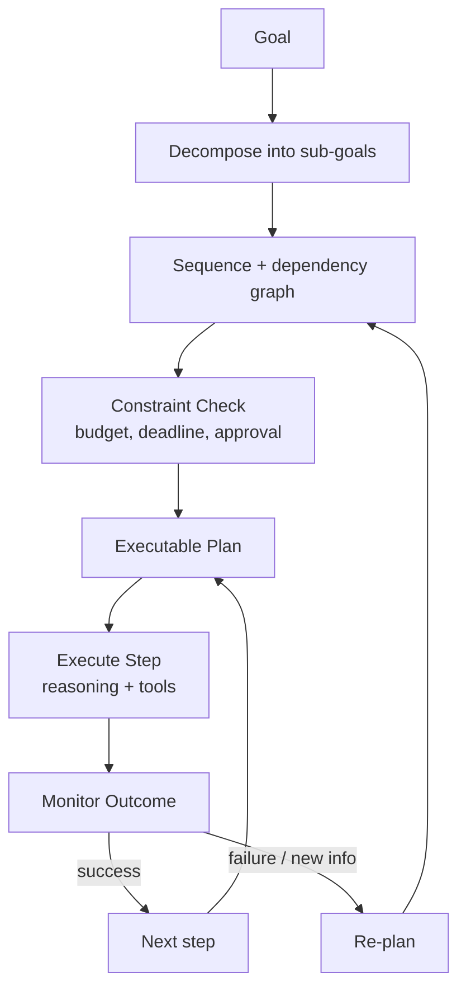

# Volume 13 - Planning Engine

| Field | Value |
|---|---|
| Document ID | WORLD-VOL13-011 |
| Title | Planning Engine |
| Version | 1.0 |
| Status | Approved |
| Classification | Internal |
| Founder | Mahesh Choudhary |

## Purpose

This chapter defines how a WORLD agent turns a goal into an executable sequence of steps. A capable agent that cannot plan will thrash - calling tools reactively, repeating work, and losing sight of the objective. The planning engine decomposes a goal into ordered sub-tasks, sequences them against dependencies and constraints, and adapts the plan as reality diverges from expectation. This chapter specifies how plans are formed, represented, executed, and revised.

## Scope

The chapter covers goal decomposition, task sequencing, dependency handling, constraint checking, and re-planning. It defines the plan as the organizing structure that reasoning (Chapter 12) fills in and tool calling (Chapter 09) executes. It does not define orchestration across multiple agents (Section D) or the reasoning steps themselves; it defines the structure that makes multi-step autonomy coherent.

## Concept

From first principles, autonomy over a multi-step goal requires an explicit plan rather than step-by-step improvisation. A plan is a directed structure of sub-goals with dependencies, each mapped to the capabilities needed to satisfy it. WORLD planning follows a decompose-sequence-execute-adapt cycle. **Decompose** breaks a goal into sub-goals small enough to act on. **Sequence** orders them by dependency and priority, respecting constraints such as approvals, deadlines, and budget. **Execute** dispatches each step to reasoning and tools. **Adapt** monitors outcomes and re-plans when a step fails or new information invalidates an assumption. The plan is a living artifact, held in working memory, that keeps the agent goal-directed instead of reactive.

## Architecture

A goal is decomposed into sub-goals, sequenced into a dependency graph, and constraint-checked into an executable plan; each step is executed and monitored; success advances the plan while failure or new information triggers re-planning.

## Key Components

| Component | Responsibility | Output |
|---|---|---|
| Decomposer | Breaks goal into actionable sub-goals | Sub-goal set |
| Sequencer | Orders steps by dependency and priority | Dependency graph |
| Constraint Checker | Applies budget, deadline, approval limits | Feasible plan |
| Executor | Dispatches steps to reasoning and tools | Step results |
| Monitor | Detects failure and drift | Adapt signal |
| Re-planner | Revises the plan on change | Updated plan |

## Relationship to Other Layers

**Volume 03 Cognition:** The engine realizes the [Planning Framework](/docs/blueprint/volume-03-ai-business-partner/section-c-ai-cognition/21-planning-framework.md); Volume 03 defines how the AI plans in principle, Volume 13 makes it an executable agent capability. **Volume 14 Knowledge:** Constraint checking and decomposition draw on retrieved facts (Chapter 10) - deadlines, policy limits, and current state - so plans are grounded in reality. **Volume 10 Tools:** Each executable step ultimately becomes one or more validated tool calls (Chapter 09). **Volume 12 Security:** Steps that require elevated authority carry their approval requirement in the plan itself, so the human approval model (Section D) is honoured at planning time rather than discovered mid-execution.

## Trade-offs & Considerations

Detailed upfront planning improves coherence but wastes effort when the environment is uncertain, so WORLD favours shallow initial plans that are refined as execution reveals information. Aggressive re-planning adapts to change but risks oscillation and looping, so re-plan cycles are bounded and monitored for progress. There is a tension between autonomy and control: a plan may be fully formed, but any step above an approval threshold pauses for a human. Long-horizon plans risk goal drift, so the original goal is retained and each re-plan is checked against it. Finally, a plan is only as good as its constraints; missing a budget or deadline constraint produces a confident but wrong plan, so constraint gathering is treated as part of planning, not an afterthought.

**Enterprise example:** An operations agent is tasked with onboarding a new supplier before quarter-end. It decomposes the goal into: collect supplier documents, run a compliance check, create the vendor record, negotiate payment terms, and schedule the first order. The sequencer notes that the vendor record depends on a passed compliance check, and the constraint checker flags that negotiating terms above a threshold requires manager approval. Mid-execution, the compliance check fails on a missing certificate; the monitor triggers a re-plan that inserts a document-request step and pauses downstream work. The agent stays goal-directed toward quarter-end without abandoning the objective or acting outside its authority.

## Cross-References

- [Reasoning Engine](/docs/blueprint/volume-13-ai-agents/section-c-agent-cognition/12-reasoning-engine.md)
- [Tool Calling](/docs/blueprint/volume-13-ai-agents/section-c-agent-cognition/09-tool-calling.md)
- [Volume 03 - Planning Framework](/docs/blueprint/volume-03-ai-business-partner/section-c-ai-cognition/21-planning-framework.md)
- [Volume 14 - Knowledge Engine](/docs/blueprint/volume-14-knowledge-engine/README.md)

## References

- [Volume 01 - Vision and Philosophy](/docs/blueprint/volume-01-vision-and-philosophy/README.md)
- [Document Standards](/docs/governance/document-standards.md)

## Change Log

| Version | Date | Author | Notes |
|---|---|---|---|
| 1.0 | 2026-07-12 | Lead Software Engineer | Initial approved version. |
