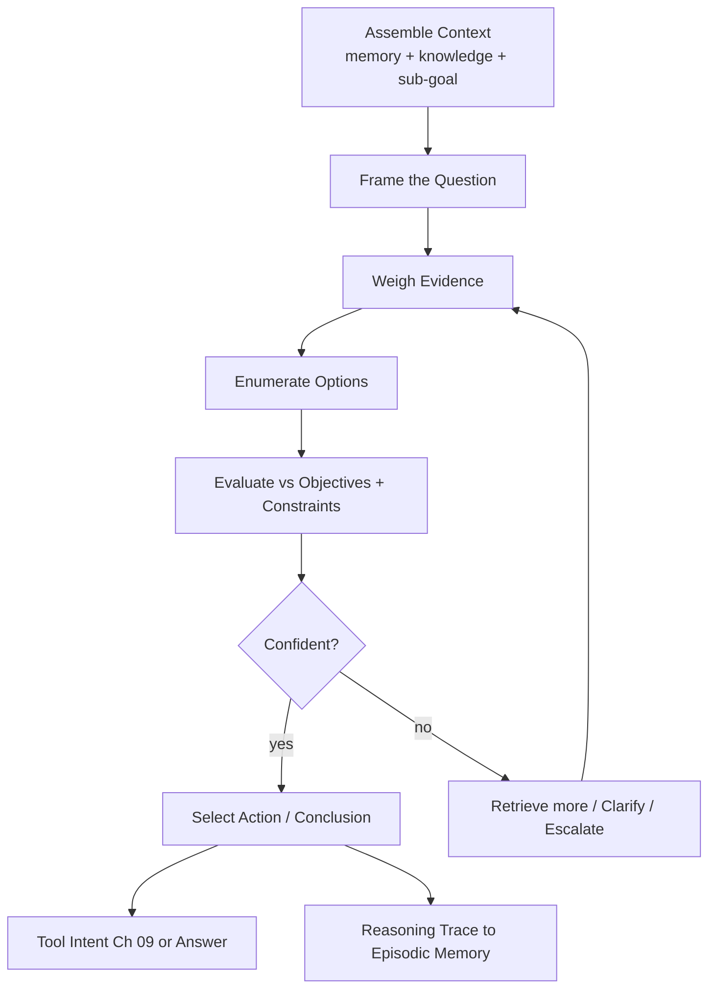

# Volume 13 - Reasoning Engine

| Field | Value |
|---|---|
| Document ID | WORLD-VOL13-012 |
| Title | Reasoning Engine |
| Version | 1.0 |
| Status | Approved |
| Classification | Internal |
| Founder | Mahesh Choudhary |

## Purpose

This chapter defines how a WORLD agent thinks through a single step. Where the planning engine decides what to do next, the reasoning engine decides how - inferring, weighing options, and choosing an action given the current evidence. Reasoning is where memory, retrieved knowledge, and the active plan converge into a justified decision. This chapter specifies how the agent deliberates, structures its chain of thought, and produces decisions that are both effective and explainable.

## Scope

The chapter covers deliberation, chain-of-thought structuring, option evaluation, and decision selection for a single cognitive step. It defines how reasoning consumes grounded evidence and emits either a tool intent or a conclusion. It does not define planning across steps (Chapter 11) or self-evaluation after the fact (Chapter 13); it defines the in-the-moment inference that turns evidence into action.

## Concept

From first principles, a business decision must be defensible: it should follow from stated evidence by explainable steps. WORLD reasoning is therefore explicit and inspectable rather than a black-box leap. The engine assembles the relevant context - working memory, retrieved facts, the current sub-goal - and reasons over it in structured steps: frame the question, gather and weigh evidence, enumerate options, evaluate them against objectives and constraints, and select. This chain of thought is retained so the decision can be audited and, if wrong, diagnosed. Deliberation depth is proportional to stakes: a routine lookup reasons shallowly, a consequential financial judgment reasons deeply and may branch and compare alternatives before committing.

## Architecture

The engine assembles context, frames the question, weighs evidence, enumerates and evaluates options, and either commits to an action when confident or gathers more, clarifies, or escalates when not; the reasoning trace is recorded for audit and reflection.

## Key Components

| Component | Responsibility | Output |
|---|---|---|
| Context Assembler | Gathers memory, knowledge, sub-goal | Reasoning input |
| Deliberation Controller | Sets depth by stakes | Reasoning budget |
| Option Generator | Enumerates candidate actions | Option set |
| Evaluator | Scores options vs objectives and constraints | Ranked options |
| Confidence Estimator | Judges sufficiency of evidence | Commit or defer |
| Trace Recorder | Captures chain of thought | Auditable trace |

## Relationship to Other Layers

**Volume 03 Cognition:** The engine realizes the [Reasoning Framework](/docs/blueprint/volume-03-ai-business-partner/section-c-ai-cognition/20-reasoning-framework.md), inheriting its explainability and evidence-first discipline. **Volume 14 Knowledge:** Reasoning is only as sound as its inputs, so it consumes grounded, cited facts from knowledge access (Chapter 10) rather than parametric guesses. **Volume 10 Tools:** A reasoning step typically concludes in a tool intent, which is validated and executed through Chapter 09. **Volume 12 Security:** The reasoning trace is a controlled artifact - it may contain sensitive context, so it is scoped and retained under the same permission and audit rules as episodic memory, and low-confidence decisions on high-impact actions defer to human approval.

## Trade-offs & Considerations

Deeper deliberation improves quality but costs latency and tokens, so depth is matched to stakes rather than applied uniformly. Explicit chain-of-thought aids auditability but can rationalize a wrong conclusion, so WORLD grounds each step in evidence and cross-checks high-impact decisions against retrieved facts. Confidence is itself uncertain - an overconfident estimator is dangerous - so thresholds for consequential actions are conservative, favouring escalation over autonomous error. Reasoning traces are valuable for trust and debugging but sensitive, so they are stored, not surfaced raw to end users, and summarized into explanations. Finally, reasoning must resist manipulation: evidence sourced from untrusted content is treated with suspicion so a crafted input cannot steer a decision.

**Enterprise example:** A finance agent must decide whether to flag a $48,000 vendor invoice as a duplicate. It assembles context - the invoice, the vendor's recent payment history from knowledge, and a working-memory note of a similar invoice seen an hour ago. It frames the question, weighs the evidence (same amount, same vendor, different invoice number, ten days apart), and enumerates options: pay, hold, or flag. Evaluating against the duplicate-payment control objective, it finds the evidence suggestive but not conclusive, so confidence falls below the threshold for an autonomous hold. It escalates with a decision brief that lays out its reasoning trace, letting a human confirm - the decision is effective because it is grounded and explainable because the trace is preserved.

## Cross-References

- [Planning Engine](/docs/blueprint/volume-13-ai-agents/section-c-agent-cognition/11-planning-engine.md)
- [Reflection Engine](/docs/blueprint/volume-13-ai-agents/section-c-agent-cognition/13-reflection-engine.md)
- [Volume 03 - Reasoning Framework](/docs/blueprint/volume-03-ai-business-partner/section-c-ai-cognition/20-reasoning-framework.md)
- [Volume 10 - API](/docs/blueprint/volume-10-api/README.md)

## References

- [Volume 01 - Vision and Philosophy](/docs/blueprint/volume-01-vision-and-philosophy/README.md)
- [Document Standards](/docs/governance/document-standards.md)

## Change Log

| Version | Date | Author | Notes |
|---|---|---|---|
| 1.0 | 2026-07-12 | Lead Software Engineer | Initial approved version. |
