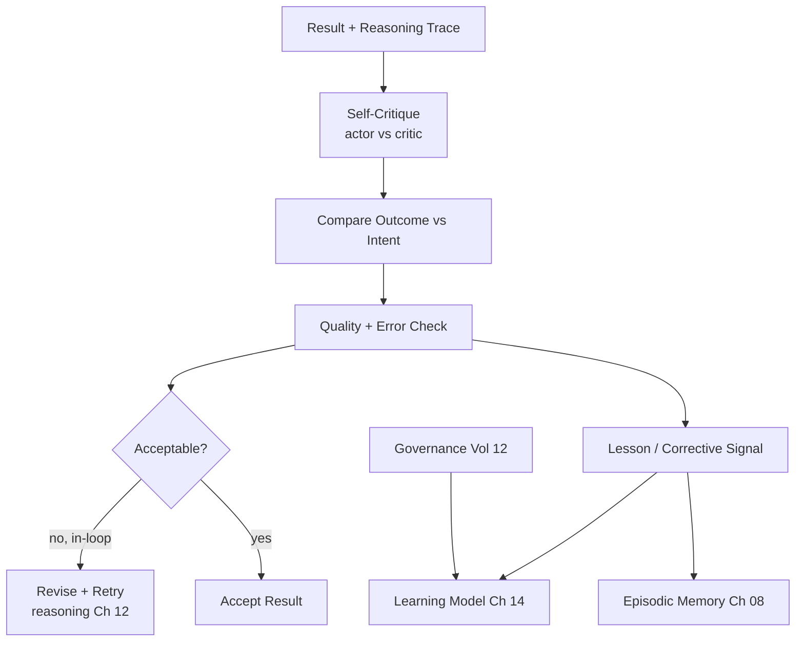

# Volume 13 - Reflection Engine

| Field | Value |
|---|---|
| Document ID | WORLD-VOL13-013 |
| Title | Reflection Engine |
| Version | 1.0 |
| Status | Approved |
| Classification | Internal |
| Founder | Mahesh Choudhary |

## Purpose

This chapter defines how a WORLD agent evaluates its own work. Reasoning produces a decision; reflection asks whether that decision was good. Without reflection an agent repeats its mistakes and cannot be trusted with autonomy. The reflection engine reviews outcomes against intent, detects errors and low-quality results, and produces corrective signals - either an immediate retry or a lesson for the learning model. This chapter specifies how self-evaluation is structured, bounded, and fed back into cognition.

## Scope

The chapter covers self-evaluation, outcome-versus-intent checking, error detection, and the generation of corrective signals. It defines reflection as a distinct step that runs during and after a task, drawing on episodic memory. It does not define how lessons are durably incorporated (Chapter 14) or the reasoning being evaluated (Chapter 12); it defines the critical review layer between them.

## Concept

From first principles, reliable autonomy requires a feedback loop in which the agent checks its own output before and after it matters. Reflection separates the actor from the critic: the same reasoning that produced a result should not be the sole judge of it. The engine compares actual outcome to intended goal, inspects the reasoning trace for flawed steps or unsupported claims, and grades the result against quality criteria. It operates in two modes. **In-loop reflection** runs before commitment - a self-critique that can trigger a revised attempt. **Post-hoc reflection** runs after an outcome is known, extracting what should be remembered or changed. Crucially, reflection produces signals and recommendations; it does not silently rewrite the agent. Any durable change flows through the governed learning model.

## Architecture

A result and its reasoning trace are critiqued, compared against intent, and quality-checked; an unacceptable in-loop result triggers a revised attempt, while lessons are emitted as corrective signals to the governed learning model and episodic memory.

## Key Components

| Component | Responsibility | Output |
|---|---|---|
| Self-Critic | Reviews result independently of the actor | Critique |
| Outcome Comparator | Measures result against intended goal | Gap assessment |
| Quality Checker | Scores result against criteria | Accept/revise verdict |
| Error Detector | Finds flawed steps or unsupported claims | Error report |
| Lesson Generator | Distills a reusable corrective signal | Lesson |
| Governance Gate | Bounds what reflection may change | Safe signal |

## Relationship to Other Layers

**Volume 03 Cognition:** The engine realizes [Reflection and Self-Evaluation](/docs/blueprint/volume-03-ai-business-partner/section-c-ai-cognition/25-reflection-and-self-evaluation.md), inheriting its actor-critic separation. **Volume 14 Knowledge:** Reflection checks claims against grounded facts (Chapter 10), so an assertion contradicted by authoritative knowledge is caught as an error. **Volume 10 Tools:** Post-hoc reflection reviews tool outcomes recorded in episodic memory to judge whether an action achieved its purpose. **Volume 12 Security:** Reflection may recommend change but never performs unsafe self-modification; every durable lesson passes a governance gate and enters the system only through the controlled learning model, preserving auditability and human oversight.

## Trade-offs & Considerations

Reflection improves reliability but adds cost and latency, so in-loop reflection is reserved for consequential or low-confidence outputs rather than every step. A critic that shares the actor's blind spots adds little, so WORLD structures reflection with independent criteria and grounded checks rather than a mere second pass. Over-correction is a real risk - endless retry loops waste resources and can degrade a good answer - so retries are bounded and must show improvement. Reflection must also avoid false confidence: judging its own output "acceptable" does not make it correct, so high-impact acceptances are still subject to human approval. Most importantly, the boundary between reflection and self-modification is strict: reflection recommends, the governed learning model disposes.

**Enterprise example:** A research agent drafts a market-sizing summary for an executive. Before delivering, in-loop reflection critiques the draft and finds a figure asserted without a citation. It compares the claim against retrieved knowledge, discovers the figure is stale, and revises the draft with the current, cited number. After delivery, post-hoc reflection notes that the original error came from over-relying on working memory instead of retrieving fresh data, and emits a lesson: for market figures, always retrieve current knowledge before asserting. That lesson is not applied autonomously - it is passed through the governance gate to the learning model, where it can be reviewed and safely incorporated.

## Cross-References

- [Reasoning Engine](/docs/blueprint/volume-13-ai-agents/section-c-agent-cognition/12-reasoning-engine.md)
- [Learning Model](/docs/blueprint/volume-13-ai-agents/section-c-agent-cognition/14-learning-model.md)
- [Volume 03 - Reflection and Self-Evaluation](/docs/blueprint/volume-03-ai-business-partner/section-c-ai-cognition/25-reflection-and-self-evaluation.md)
- [Volume 12 - Security](/docs/blueprint/volume-12-security/README.md)

## References

- [Volume 01 - Vision and Philosophy](/docs/blueprint/volume-01-vision-and-philosophy/README.md)
- [Document Standards](/docs/governance/document-standards.md)

## Change Log

| Version | Date | Author | Notes |
|---|---|---|---|
| 1.0 | 2026-07-12 | Lead Software Engineer | Initial approved version. |
