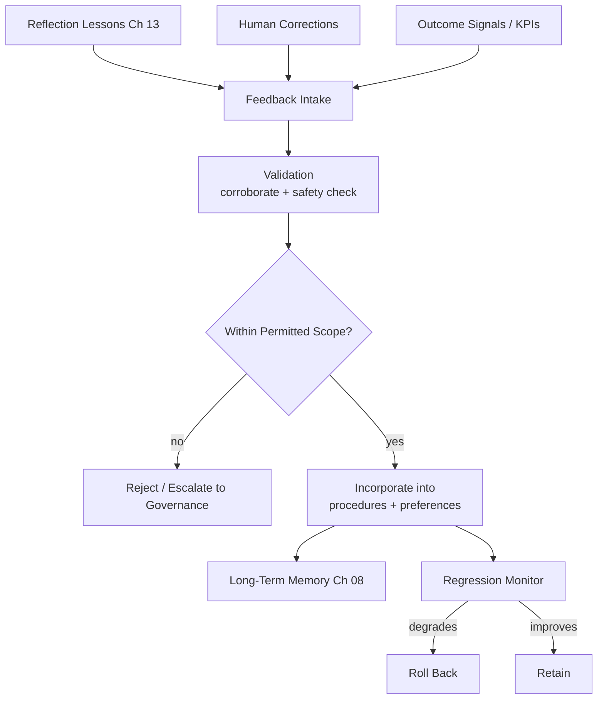

# Volume 13 - Learning Model

| Field | Value |
|---|---|
| Document ID | WORLD-VOL13-014 |
| Title | Learning Model |
| Version | 1.0 |
| Status | Approved |
| Classification | Internal |
| Founder | Mahesh Choudhary |

## Purpose

This chapter defines how a WORLD agent improves over time without becoming unpredictable. Reflection produces lessons; the learning model decides which lessons are real, how to incorporate them safely, and how to prevent regression. The central design constraint is that learning must never become unsafe self-modification: an agent may refine its knowledge and procedures within governed boundaries, but it does not rewrite its own code, permissions, or safety rules. This chapter specifies the feedback loop that makes agents better while keeping them controllable.

## Scope

The chapter covers feedback intake, lesson validation, safe incorporation, and regression control. It defines the boundary between permitted learning (facts, preferences, reusable procedures, prompt-level guidance) and prohibited self-modification (code, permissions, guardrails, model weights). It does not define model training pipelines or the reflection that generates lessons (Chapter 13); it defines the governed loop that turns experience into durable, bounded improvement.

## Concept

From first principles, an agent that never learns plateaus, but an agent that learns without control drifts. WORLD resolves this with a governed feedback loop that treats every candidate lesson as a proposal, not a fact. **Intake** collects feedback from reflection, human corrections, and outcome signals. **Validation** tests whether a lesson is genuine - corroborated, non-contradictory, and safe - rather than a one-off coincidence. **Incorporation** applies validated lessons only to permitted stores: long-term memory procedures, preferences, and guidance. **Regression control** monitors that a change actually helps and can be rolled back if it harms performance. Learning is bounded by construction: the agent's identity, authority, and safety envelope are set by governance (Section B and Volume 12) and are outside what the learning model may touch.

## Architecture

Feedback from reflection, humans, and outcomes is validated and checked against permitted scope; only safe, in-scope lessons are incorporated into procedures and preferences, and a regression monitor retains or rolls back each change based on measured effect.

## Key Components

| Component | Responsibility | Boundary |
|---|---|---|
| Feedback Intake | Collects lessons and signals | All sources normalized |
| Validator | Corroborates and safety-checks lessons | Rejects unsafe/unproven |
| Scope Gate | Confirms change is permitted learning | Blocks self-modification |
| Incorporator | Updates procedures and preferences | Permitted stores only |
| Regression Monitor | Measures effect of each change | Rollback on harm |
| Audit Trail | Records what changed and why | Fully traceable |

## Relationship to Other Layers

**Volume 03 Cognition:** The model realizes the [Learning Framework](/docs/blueprint/volume-03-ai-business-partner/section-c-ai-cognition/24-learning-framework.md) and its continuous-improvement discipline. **Volume 14 Knowledge:** The learning model updates the agent's private procedures and preferences; it does not overwrite authoritative shared knowledge, which is governed by the [Knowledge Engine](/docs/blueprint/volume-14-knowledge-engine/README.md). **Volume 10 Tools:** Learned procedures may change which tools an agent prefers for a task, but never grant new tool access, which remains a permission decision. **Volume 12 Security:** The scope gate enforces that identity, permissions, guardrails, and safety rules are immutable to the learning loop; every incorporation is audited, reversible, and subject to governance, so improvement never erodes control.

## Trade-offs & Considerations

Faster learning adapts quickly but risks over-fitting to noise, so lessons require corroboration before incorporation. Broad learning scope maximizes improvement but widens the attack and drift surface, so WORLD deliberately narrows what learning may change to procedures, preferences, and guidance - never code, weights, permissions, or safety rules. There is a tension between autonomy and auditability: fully automatic incorporation is efficient but opaque, so high-impact lessons are staged for human review while low-risk refinements apply automatically under monitoring. Regression is inevitable in any adaptive system, so every change is measured and reversible rather than assumed beneficial. Finally, learning can be poisoned by adversarial feedback, so inputs derived from untrusted content are weighted low and validated against grounded knowledge before they can influence behaviour.

**Enterprise example:** Over a quarter, a collections agent repeatedly sees that reminder emails sent on Monday mornings yield higher payment rates than Friday sends, and human collectors confirm the pattern. Reflection emits this as a lesson; intake collects it alongside the outcome KPI. Validation corroborates it across enough cases to rule out coincidence, and the scope gate confirms it changes only a scheduling preference - not permissions or tools. The lesson is incorporated into the agent's long-term procedure store, and the regression monitor tracks payment rates afterward. When rates hold, the change is retained; had they fallen, it would have rolled back automatically. The agent got measurably better at its job, and every step of how it changed is auditable and reversible.

## Cross-References

- [Reflection Engine](/docs/blueprint/volume-13-ai-agents/section-c-agent-cognition/13-reflection-engine.md)
- [Agent Memory](/docs/blueprint/volume-13-ai-agents/section-c-agent-cognition/08-agent-memory.md)
- [Volume 03 - Learning Framework](/docs/blueprint/volume-03-ai-business-partner/section-c-ai-cognition/24-learning-framework.md)
- [Volume 12 - Security](/docs/blueprint/volume-12-security/README.md)

## References

- [Volume 01 - Vision and Philosophy](/docs/blueprint/volume-01-vision-and-philosophy/README.md)
- [Document Standards](/docs/governance/document-standards.md)

## Change Log

| Version | Date | Author | Notes |
|---|---|---|---|
| 1.0 | 2026-07-12 | Lead Software Engineer | Initial approved version. |
