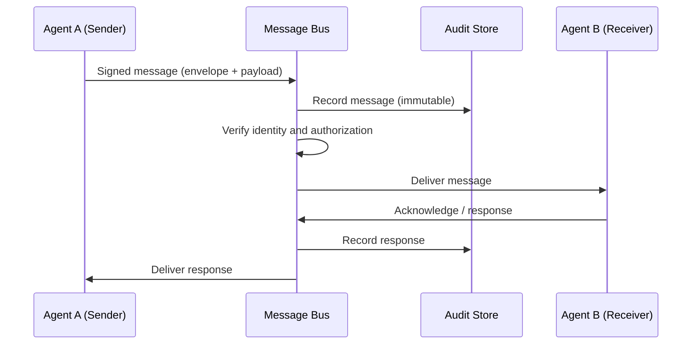

# Volume 13 - Agent Communication

| Field | Value |
|---|---|
| Document ID | WORLD-VOL13-015 |
| Title | Agent Communication |
| Version | 1.0 |
| Status | Approved |
| Classification | Internal |
| Founder | Mahesh Choudhary |

## Purpose

This chapter defines how agents in Project WORLD exchange information with one another, with humans, and with the platform. An agent that cannot communicate reliably is an island: it cannot request work, report results, ask for approval, or coordinate. Communication is therefore the substrate on which orchestration, collaboration, and human control are built. This chapter establishes the message contract, the transport, the addressing model, and the guarantees that make agent-to-agent and agent-to-human exchange predictable, secure, and auditable rather than ad hoc.

## Scope

The chapter covers the canonical agent message format, synchronous and asynchronous transport, addressing and discovery, delivery guarantees, and the security and audit properties every message carries. It defines the primitives consumed by orchestration (Chapter 16), collaboration (Chapter 17), and the human approval model (Chapter 18). It does not define workflow logic or conflict resolution, which are treated in later chapters, nor the underlying transport infrastructure, which belongs to the messaging and event bus of Volume 10.

## Concept

From first principles, communication is the transfer of intent and information between autonomous actors that do not share memory. Because WORLD agents are independent processes with scoped identity, they cannot simply call one another's functions; they must exchange explicit, self-describing messages. WORLD models every exchange as a typed message with a stable envelope: who sent it, who should receive it, what kind of message it is, what it references, and a signed, immutable record of the fact. Two interaction styles are supported: request-response for directed, synchronous work, and publish-subscribe over the event bus for broadcast and loosely coupled coordination. Treating communication as data - not as hidden function calls - is what makes agent behaviour observable, replayable, and governable.

## Architecture

Every message flows through the platform message bus, which enforces identity, authorization, and audit before delivery. Agents never address one another directly at the transport layer; the bus mediates so that policy is applied uniformly.

Because the bus sits on the path of every exchange, it is the single point where authentication, authorization, rate limiting, and audit are applied. This keeps individual agents simple: they trust that any message they receive has already been verified and recorded.

**Enterprise example:** The Finance Agent needs the current cash position to answer an executive question. It sends a typed `data.request` message addressed to the Operations Agent through the bus. The bus authenticates the Finance Agent's identity, confirms it is authorized to read cash data, records the request, and delivers it. The Operations Agent responds with a `data.response` referencing the original message ID. The exchange is now fully reconstructable from the audit store, and neither agent ever held the other's credentials.

## Key Components

| Component | Responsibility |
|---|---|
| Message Envelope | Carries sender, recipient, message type, correlation ID, timestamp, and signature |
| Payload | Typed, schema-validated body specific to the message type |
| Message Bus | Mediates delivery, enforces identity and authorization, applies rate limits |
| Addressing and Discovery | Resolves logical agent names to runtime endpoints via the Agent Registry |
| Delivery Guarantee Layer | Provides at-least-once delivery, ordering by correlation, and dead-letter handling |
| Audit Recorder | Writes an immutable record of every message and response |

## Relationship to Other Layers

Communication realizes the collaboration primitives of the AI Business Partner (Volume 03), giving its multi-agent behaviour a concrete wire format. It runs on the messaging and event bus of Volume 10, which supplies the transport, topics, and delivery semantics; this chapter defines the agent-specific envelope and contract that ride on that bus. Every message is authenticated, authorized, and audited under the security architecture of Volume 12, so an agent's identity and permissions govern what it may send and to whom. Addressing depends on the Agent Registry (Chapter 05) for name resolution.

## Trade-offs and Considerations

Mediating every message through the bus adds latency compared with direct calls, but the uniform enforcement of identity, authorization, and audit is worth the cost for a governed system; hot paths may use fast synchronous channels while retaining the same envelope and audit guarantees. At-least-once delivery means receivers must be idempotent, which pushes complexity into agent design but avoids lost work. Rich, schema-validated messages improve safety and observability at the expense of stricter versioning discipline, so message schemas are versioned and evolved conservatively. Finally, verbose auditing has a storage cost, accepted deliberately because reconstructable communication is a non-negotiable property of a trustworthy agent platform.

## Cross-References

- [Agent Orchestration](/docs/blueprint/volume-13-ai-agents/section-d-collaboration-and-control/16-agent-orchestration.md)
- [Multi-Agent Collaboration](/docs/blueprint/volume-13-ai-agents/section-d-collaboration-and-control/19-multi-agent-collaboration.md)
- [Volume 10 - API and Messaging](/docs/blueprint/volume-10-api/README.md)
- [Volume 12 - Security](/docs/blueprint/volume-12-security/README.md)

## References

- [Volume 01 - Vision and Philosophy](/docs/blueprint/volume-01-vision-and-philosophy/README.md)
- [Document Standards](/docs/governance/document-standards.md)

## Change Log

| Version | Date | Author | Notes |
|---|---|---|---|
| 1.0 | 2026-07-12 | Lead Software Engineer | Initial approved version. |
