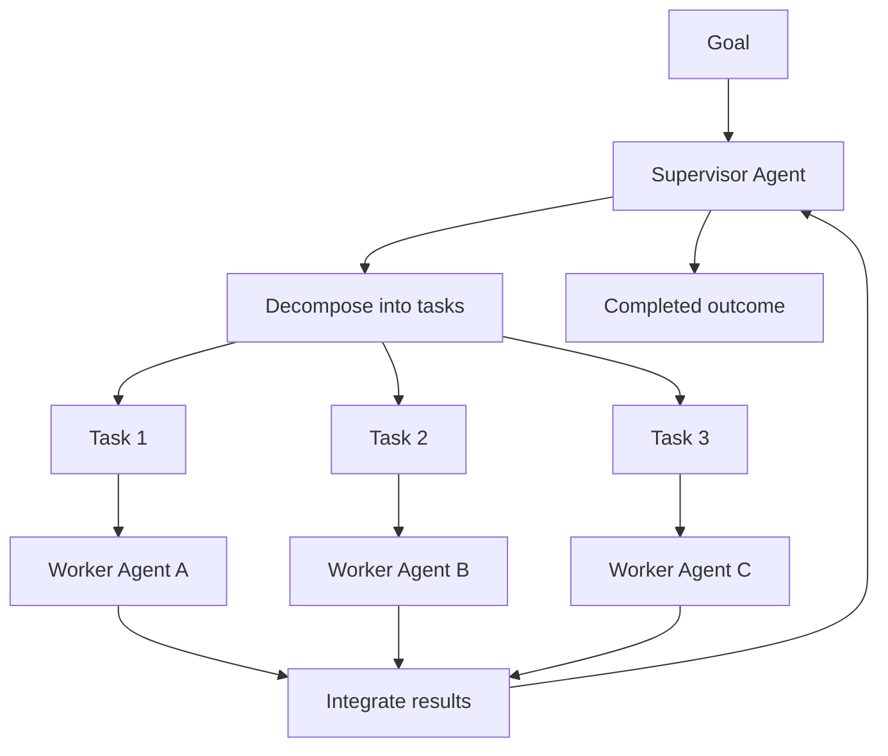

# Volume 13 - Agent Orchestration

| Field | Value |
|---|---|
| Document ID | WORLD-VOL13-016 |
| Title | Agent Orchestration |
| Version | 1.0 |
| Status | Approved |
| Classification | Internal |
| Founder | Mahesh Choudhary |

## Purpose

This chapter defines how Project WORLD coordinates multiple agents to accomplish a goal that no single agent can complete alone. Communication (Chapter 15) lets agents talk; orchestration decides who does what, in what order, and how partial results combine into a finished outcome. Without orchestration, a set of capable agents produces duplicated effort, gaps, and deadlocks. This chapter establishes the supervisor-worker model, task decomposition, handoffs, and failure handling that turn a collection of agents into a directed, accountable workflow.

## Scope

The chapter covers the supervisor-worker pattern, decomposition of a goal into tasks, task assignment and handoff, state tracking, and failure and retry handling. It builds directly on the communication primitives of Chapter 15 and feeds the collaboration patterns of Chapter 17 and the human approval gates of Chapter 18. It does not cover the internal reasoning of individual agents (Section C) nor the semantics of conflict resolution between peers (Chapter 19).

## Concept

From first principles, orchestration exists because complex goals exceed the capability, context, or authority of any one agent. The natural solution is hierarchy: a supervisor agent owns the goal, decomposes it into smaller tasks, assigns each to the worker best suited to it, and integrates the results. This mirrors how an effective manager operates - holding the objective, delegating clearly, and remaining accountable for the whole. WORLD makes the supervisor a first-class agent with explicit decision authority, so that responsibility for a workflow is always locatable. Decomposition, assignment, and handoff are explicit, recorded steps rather than emergent behaviour, which keeps multi-agent execution predictable and auditable.

## Architecture

A supervisor agent receives a goal, decomposes it into a task plan, and dispatches tasks to worker agents through the message bus. Workers execute, report back, and hand off intermediate results; the supervisor tracks state and integrates the final outcome.

Because the supervisor holds the plan and the state, it is the single accountable owner of the workflow: it detects stalled or failed tasks, reassigns or retries them, and decides when the goal is met. Workers remain simple and focused, unaware of the wider plan.

**Enterprise example:** An executive asks WORLD to prepare a quarterly board pack. The Supervisor Agent decomposes this into tasks: pull financial results (Finance Agent), summarize operational KPIs (Operations Agent), draft market analysis (Research Agent), and assemble the narrative (a writing worker). It dispatches each in parallel, tracks completion, handles a timeout on the market-analysis task by retrying with a narrower scope, integrates the sections, and routes the final draft to the human approval gate before delivery. The supervisor's task plan and every handoff are recorded end to end.

## Key Components

| Component | Responsibility |
|---|---|
| Supervisor Agent | Owns the goal, decomposes it, assigns tasks, integrates results, holds accountability |
| Task Decomposer | Breaks a goal into ordered or parallel tasks with clear inputs and outputs |
| Worker Agents | Execute individual tasks within their scoped capability and authority |
| Handoff Protocol | Passes intermediate results and context between tasks via typed messages |
| Workflow State Tracker | Records task status, dependencies, and overall progress |
| Failure Handler | Detects timeouts and errors, applies retry, reassignment, or escalation |

## Relationship to Other Layers

Orchestration operationalizes the coordinated behaviour of the AI Business Partner (Volume 03), giving its goals a concrete execution model with clear ownership. It relies on the communication primitives of Chapter 15, which in turn ride the messaging and event bus of Volume 10 for task dispatch and handoff. Supervisor and worker authority, and the boundaries of what each may do, are enforced under the security architecture of Volume 12, so decomposition never grants an agent capability beyond its permissions. Consequential outcomes route through the human approval model of Chapter 18 before taking effect.

## Trade-offs and Considerations

Centralizing control in a supervisor makes workflows accountable and debuggable but introduces a coordination bottleneck and a single point of failure, mitigated by supervisor redundancy and by keeping supervisors lightweight. Fine-grained decomposition improves parallelism and clarity but adds messaging overhead, so tasks are sized to balance concurrency against coordination cost. Aggressive retry improves resilience but risks duplicated side effects, which is why workers are idempotent and consequential actions are gated. Static plans are predictable but rigid, while dynamic re-planning is flexible but harder to audit; WORLD favours explicit, recorded plans that a supervisor may adjust within logged, bounded rules.

## Cross-References

- [Agent Communication](/docs/blueprint/volume-13-ai-agents/section-d-collaboration-and-control/15-agent-communication.md)
- [Human Approval Model](/docs/blueprint/volume-13-ai-agents/section-d-collaboration-and-control/18-human-approval-model.md)
- [Supervisor Agent](/docs/blueprint/volume-13-ai-agents/section-e-core-agents/20-supervisor-agent.md)
- [Volume 03 - AI Business Partner](/docs/blueprint/volume-03-ai-business-partner/README.md)

## References

- [Volume 01 - Vision and Philosophy](/docs/blueprint/volume-01-vision-and-philosophy/README.md)
- [Document Standards](/docs/governance/document-standards.md)

## Change Log

| Version | Date | Author | Notes |
|---|---|---|---|
| 1.0 | 2026-07-12 | Lead Software Engineer | Initial approved version. |
