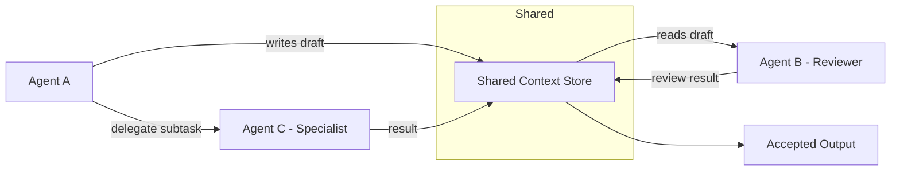

# Volume 13 - Agent Collaboration

| Field | Value |
|---|---|
| Document ID | WORLD-VOL13-017 |
| Title | Agent Collaboration |
| Version | 1.0 |
| Status | Approved |
| Classification | Internal |
| Founder | Mahesh Choudhary |

## Purpose

This chapter defines how agents in Project WORLD work together as peers to produce an outcome better than any could alone. Orchestration (Chapter 16) describes directed, hierarchical execution; collaboration describes the cooperative patterns - delegation, review, negotiation, and shared workspaces - through which agents combine their distinct strengths. This chapter establishes the collaboration patterns, the shared context that makes them possible, and the boundaries that keep cooperation safe and accountable.

## Scope

The chapter covers peer collaboration patterns (delegation, peer review, negotiation, and joint problem solving), shared working context, and the role boundaries that constrain cooperation. It builds on the communication substrate of Chapter 15 and the orchestration model of Chapter 16, and it is the conceptual foundation for the deeper treatment of shared context, conflict resolution, and guardrails in Chapter 19. It does not redefine transport or workflow ownership, which belong to earlier chapters.

## Concept

From first principles, collaboration is valuable because specialization creates complementary capabilities. A single generalist agent is weaker than a team of specialists that can divide work, check one another, and combine perspectives - provided their cooperation is structured. WORLD defines a small set of explicit collaboration patterns so that cooperation is intentional rather than emergent. In delegation, one agent asks another to perform work within its specialty. In peer review, one agent validates another's output before it is trusted. In negotiation, agents with different objectives converge on a decision. Each pattern operates over a shared working context and within clear role boundaries, so that collaboration amplifies capability without eroding accountability.

## Architecture

Collaborating agents operate against a shared context store while exchanging typed messages through the bus. Each agent contributes within its role, and outputs may be routed to a peer reviewer before they are accepted.

The shared context store gives collaborating agents a common view of the problem and its evolving state, while the message bus carries the explicit requests and results between them. Because contributions are attributed and recorded, collaboration remains fully accountable even when several agents touch the same work.

**Enterprise example:** A customer contract needs review. The Legal specialist agent drafts revised clauses into the shared context. The Finance Agent, working in the same context, flags a payment term that conflicts with policy and negotiates an alternative. A QA-style reviewer agent checks the final draft for completeness before it is accepted. Three specialists collaborated on one artifact, each within its role, and the contribution history shows exactly who changed what and why.

## Key Components

| Component | Responsibility |
|---|---|
| Collaboration Patterns | Define delegation, peer review, negotiation, and joint problem solving |
| Shared Context Store | Holds the common, evolving state that collaborating agents read and write |
| Contribution Attribution | Records which agent produced or changed each part of the work |
| Role Boundaries | Constrain each agent to actions within its capability and authority |
| Review Gate | Routes outputs to a peer reviewer before they are accepted as trusted |

## Relationship to Other Layers

Collaboration realizes the cooperative intelligence of the AI Business Partner (Volume 03), turning its vision of a team of specialists into concrete patterns. It uses the communication substrate of Chapter 15 over the Volume 10 messaging and event bus to exchange delegation requests, review results, and negotiation messages. Role boundaries and access to shared context are enforced under the security architecture of Volume 12, so an agent may only read and write the parts of a shared workspace its permissions allow. Where collaboration is directed by a workflow owner, it operates inside the orchestration model of Chapter 16.

## Trade-offs and Considerations

Collaboration increases quality through review and diverse perspective but adds coordination overhead and latency, so it is reserved for work where the quality gain justifies the cost. A shared context store enables rich cooperation but creates contention and consistency concerns, addressed through attribution and the conflict-resolution mechanisms of Chapter 19. Peer review improves trustworthiness yet can introduce circular dependencies if reviewers themselves need review, mitigated by keeping review chains shallow and role-scoped. Finally, more collaborators can dilute accountability; WORLD counters this with strict contribution attribution so that responsibility for every part of a shared output remains traceable.

## Cross-References

- [Agent Communication](/docs/blueprint/volume-13-ai-agents/section-d-collaboration-and-control/15-agent-communication.md)
- [Agent Orchestration](/docs/blueprint/volume-13-ai-agents/section-d-collaboration-and-control/16-agent-orchestration.md)
- [Multi-Agent Collaboration](/docs/blueprint/volume-13-ai-agents/section-d-collaboration-and-control/19-multi-agent-collaboration.md)
- [Volume 03 - AI Business Partner](/docs/blueprint/volume-03-ai-business-partner/README.md)

## References

- [Volume 01 - Vision and Philosophy](/docs/blueprint/volume-01-vision-and-philosophy/README.md)
- [Document Standards](/docs/governance/document-standards.md)

## Change Log

| Version | Date | Author | Notes |
|---|---|---|---|
| 1.0 | 2026-07-12 | Lead Software Engineer | Initial approved version. |
