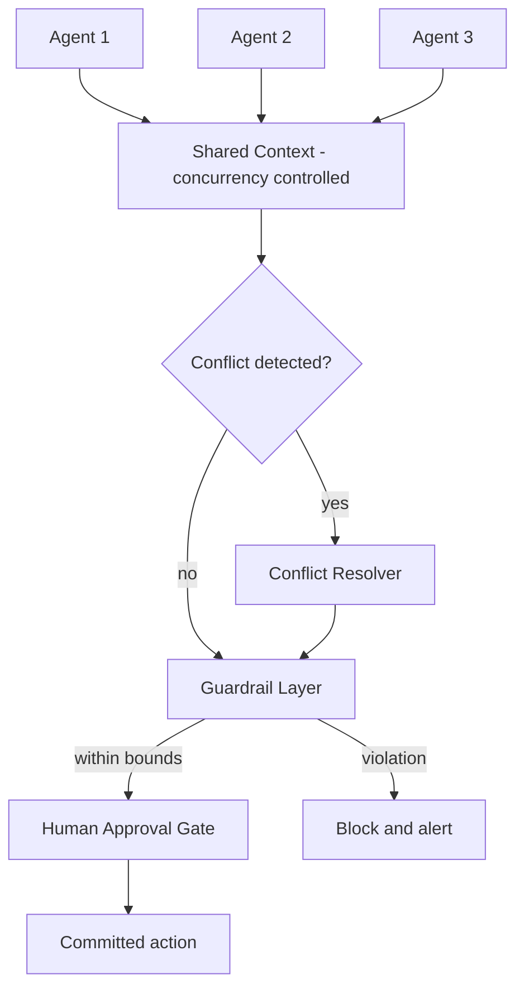

# Volume 13 - Multi-Agent Collaboration

| Field | Value |
|---|---|
| Document ID | WORLD-VOL13-019 |
| Title | Multi-Agent Collaboration |
| Version | 1.0 |
| Status | Approved |
| Classification | Internal |
| Founder | Mahesh Choudhary |

## Purpose

This chapter defines how many agents operate together at scale in Project WORLD while remaining coherent, consistent, and safe. Earlier chapters established communication, orchestration, collaboration patterns, and human approval; this chapter integrates them into a whole and addresses the hard problems that only appear when numerous agents share state and act concurrently: shared context, conflict resolution, and system-wide guardrails. It establishes how WORLD keeps a population of agents productive without letting them contradict, overwrite, or endanger one another.

## Scope

The chapter covers shared context management across many agents, detection and resolution of conflicts between concurrent actions, and the guardrails that bound collective behaviour. It synthesizes Chapters 15 through 18 and aligns with the multi-agent collaboration model of Volume 03. It does not restate the pairwise collaboration patterns of Chapter 17 nor the approval mechanics of Chapter 18; it governs how those operate together across a whole agent society.

## Concept

From first principles, a system of many autonomous agents faces three problems a single agent never does. First, agents need a shared understanding of the world, yet each acts from its own context, so state must be shared without becoming inconsistent. Second, concurrent agents will sometimes propose actions that conflict, so the system needs deterministic ways to detect and resolve contradiction. Third, individually reasonable actions can combine into collectively harmful outcomes, so the system needs guardrails that bound the whole. WORLD treats the agent population as a governed society: agents share a consistent context, conflicts are resolved by explicit rules of precedence and negotiation, and hard guardrails constrain what the collective may do - with consequential collective actions still passing through human approval.

## Architecture

Agents read and write a shared context under concurrency control. A conflict resolver arbitrates contradictory proposals, and a guardrail layer bounds collective behaviour before any consequential action reaches the human approval gate.

The shared context gives every agent a consistent view, the conflict resolver ensures contradictory proposals cannot both commit, and the guardrail layer is the final automated check before consequential actions reach human approval. Together they let a large agent population act in parallel without incoherence.

**Enterprise example:** During a demand spike, several agents act on the same inventory. The Operations Agent proposes reallocating stock to fulfil a large order while a Procurement worker simultaneously proposes reserving the same stock for a replenishment commitment. The conflict resolver detects the contention over the same records and applies precedence rules - confirmed customer orders outrank internal reservations - resolving in favour of fulfilment and notifying procurement to reorder. The guardrail layer confirms neither action breaches inventory-safety limits, and because the reallocation exceeds a value threshold, it routes to the human approval gate before committing. No stock is double-committed, and every step is recorded.

## Key Components

| Component | Responsibility |
|---|---|
| Shared Context Manager | Maintains a consistent, concurrency-controlled view of shared state |
| Conflict Detector | Identifies contradictory or overlapping concurrent proposals |
| Conflict Resolver | Applies precedence rules and negotiation to arbitrate conflicts |
| Guardrail Layer | Enforces hard limits on individual and collective agent behaviour |
| Human Approval Gate | Authorizes consequential collective actions before commit |
| Collective Audit Record | Immutable log of shared-state changes, conflicts, and resolutions |

## Relationship to Other Layers

This chapter is the agent-layer realization of the multi-agent collaboration model of Volume 03, scaling its vision into a governed society of agents. It builds on the communication substrate of Chapter 15 over the Volume 10 messaging and event bus, which carries shared-state updates and conflict signals across the population. Shared-context access, guardrail enforcement, and the integrity of the collective audit record are guaranteed by the security architecture of Volume 12. Consequential collective actions always pass through the human approval model of Chapter 18, so scale never bypasses human control.

## Trade-offs and Considerations

Strong consistency in shared context prevents incoherence but limits concurrency, so WORLD applies concurrency control tightly around contended state and allows looser sharing elsewhere. Rule-based conflict resolution is predictable and auditable but cannot anticipate every situation, so unresolved conflicts escalate to human judgment rather than being forced. Guardrails must be strict enough to prevent collectively harmful outcomes yet not so rigid that they block legitimate coordinated work, a balance that is governed and tuned with evidence. As the agent population grows, coordination cost rises super-linearly, so the architecture favours bounded, well-scoped agent groups over an undifferentiated swarm, keeping collaboration efficient, coherent, and always subject to human oversight.

## Cross-References

- [Agent Collaboration](/docs/blueprint/volume-13-ai-agents/section-d-collaboration-and-control/17-agent-collaboration.md)
- [Human Approval Model](/docs/blueprint/volume-13-ai-agents/section-d-collaboration-and-control/18-human-approval-model.md)
- [Agent Orchestration](/docs/blueprint/volume-13-ai-agents/section-d-collaboration-and-control/16-agent-orchestration.md)
- [Volume 03 - AI Business Partner](/docs/blueprint/volume-03-ai-business-partner/README.md)

## References

- [Volume 01 - Vision and Philosophy](/docs/blueprint/volume-01-vision-and-philosophy/README.md)
- [Document Standards](/docs/governance/document-standards.md)

## Change Log

| Version | Date | Author | Notes |
|---|---|---|---|
| 1.0 | 2026-07-12 | Lead Software Engineer | Initial approved version. |
