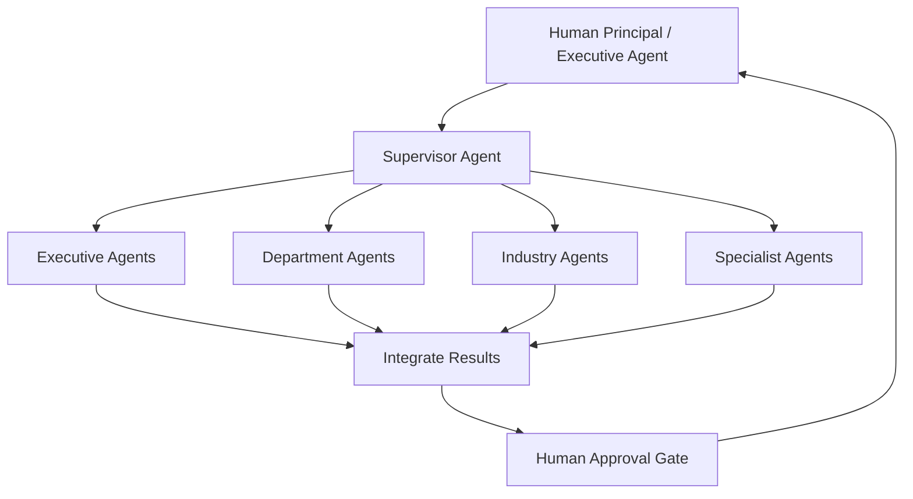

# Volume 13 - Supervisor Agent

| Field | Value |
|---|---|
| Document ID | WORLD-VOL13-020 |
| Title | Supervisor Agent |
| Version | 1.0 |
| Status | Approved |
| Classification | Internal |
| Founder | Mahesh Choudhary |

## Purpose

This chapter defines the Supervisor Agent, the orchestrating agent that owns a goal end to end and coordinates every other agent in Project WORLD to achieve it. Where the orchestration model (Chapter 16) established the supervisor-worker pattern in the abstract, this chapter specifies the Supervisor Agent as a concrete, governed agent with an explicit charter, capabilities, tools, decision authority, and security boundaries. The Supervisor Agent is the single accountable owner of any multi-agent workflow, translating a business objective into a directed, auditable plan and remaining answerable for the whole outcome.

## Scope

This chapter covers the definition of the Supervisor Agent as the top of the agent hierarchy that dispatches Executive Agents (Chapter 21), Department Agents (Chapter 22), Industry Agents (Chapter 23), and Specialist Agents (Section F). It specifies what the Supervisor Agent does, what it may decide alone, and what it must escalate to humans under Volume 03 Section G. It does not redefine the orchestration mechanics of Chapter 16, the communication substrate of Chapter 15, or the internal cognition of Section C, which it consumes.

## Responsibilities

The Supervisor Agent accepts a goal, decomposes it into an ordered or parallel task plan, selects the best-suited agent for each task, dispatches work, tracks state, integrates partial results, handles failures, and confirms goal completion. It maintains the authoritative record of the workflow, detects stalled or failed tasks, and applies retry, reassignment, or escalation. It is the sole agent authorized to route consequential outcomes to the human approval gate on behalf of a workflow, ensuring no worker action of consequence bypasses oversight.

## Capabilities

The Supervisor Agent can plan and re-plan within logged, bounded rules; reason over dependencies to sequence tasks; delegate to any registered agent within its authority scope; monitor progress against the plan; and reconcile conflicting worker outputs by invoking the collaboration and conflict-resolution patterns of Chapters 17 and 19. It maintains workflow memory across long-running goals and can pause, resume, or abort a workflow deterministically.

## Inputs

- A business goal or objective, from a human principal or an Executive Agent.
- Agent capability descriptors from the Agent Registry (Chapter 05).
- Task results, status, and error signals from worker agents.
- Policy and threshold configuration from governance (Volume 03 Section G).
- Context from the Knowledge Engine (Volume 14) relevant to the goal.

## Outputs

- A task plan with assignments, dependencies, and success criteria.
- Task dispatch messages to worker agents over the message bus.
- An integrated, completed outcome delivered to the requesting principal.
- Approval requests routed to the human approval gate for consequential actions.
- A full audit trail of the plan, every handoff, and every decision.

## Tools

| Tool | Purpose |
|---|---|
| Task Planner | Decomposes a goal into an ordered or parallel task plan |
| Agent Registry Client | Discovers agents and their capabilities and authority |
| Message Bus Dispatcher | Sends task assignments and handoffs to workers |
| Workflow State Store | Tracks task status, dependencies, and progress |
| Approval Gate Client | Submits consequential actions for human authorization |
| Audit Logger | Records the plan, handoffs, and decisions immutably |

## Knowledge Sources

The Supervisor Agent draws on the Agent Registry for capability and authority metadata, the Knowledge Engine (Volume 14) for goal context, governance policy for thresholds and rules, and its own workflow memory (Chapter 08) for the state of in-flight goals. It does not hold domain expertise itself; it composes the expertise of the agents it directs.

## Decision Authority

The Supervisor Agent may autonomously decide the task plan, agent assignments, task ordering, retries, and reassignments, and may declare a goal complete. It may not authorize any consequential action - one that moves money, changes records of consequence, or affects people or reputation - on its own authority. Its authority is bounded by the permissions of the agents it can dispatch; it can never grant a worker capability beyond that worker's own scope.

## Human Approval Requirements

In line with Volume 03 Section G and Chapter 18, the Supervisor Agent must route every consequential outcome produced by a workflow to the human approval gate before it takes effect. It must also escalate to a human when a workflow cannot proceed within bounded rules, when workers return irreconcilable conflicts, or when an approval request times out. The Supervisor Agent never executes a gated action itself and never approves its own workflow.

**Enterprise example:** A managing director asks WORLD to close the fiscal quarter and produce a board pack. The Supervisor Agent decomposes the goal, dispatching the Finance Department Agent to reconcile ledgers, the Operations Agent to compile KPIs, and a Research Agent to draft market context. It tracks each task, retries a stalled reconciliation with a narrower scope, integrates the sections, and routes the final ledger-close entries and the board pack to the finance controller through the approval gate. Only after human authorization does the close post and the pack publish. The entire plan and every handoff are recorded end to end.

## KPIs

| KPI | Definition | Target |
|---|---|---|
| Goal completion rate | Workflows completed successfully without human rescue | >= 95% |
| Plan accuracy | Tasks completed as first planned without reassignment | >= 90% |
| Escalation precision | Escalations that were genuinely necessary | >= 98% |
| Mean time to completion | Median wall-clock time from goal to delivered outcome | Within SLA |
| Approval compliance | Consequential actions correctly gated before execution | 100% |

## Security Boundaries

The Supervisor Agent operates under the identity, permission, and isolation controls of Volume 12 and Chapters 06 and 07. Its authority is the union of no worker's authority; delegation never elevates privilege. It cannot read or write outside the data scope granted to a given workflow, cannot bypass the approval gate, and cannot alter the audit record. Supervisor redundancy mitigates its role as a coordination bottleneck, and each supervisor instance is scoped to a tenant and goal so that a failure or compromise is contained.

## Cross-References

- [Agent Orchestration](/docs/blueprint/volume-13-ai-agents/section-d-collaboration-and-control/16-agent-orchestration.md)
- [Executive Agents](/docs/blueprint/volume-13-ai-agents/section-e-core-agents/21-executive-agents.md)
- [Human Approval Model](/docs/blueprint/volume-13-ai-agents/section-d-collaboration-and-control/18-human-approval-model.md)
- [Volume 03 - AI Business Partner](/docs/blueprint/volume-03-ai-business-partner/README.md)

## References

- [Volume 01 - Vision and Philosophy](/docs/blueprint/volume-01-vision-and-philosophy/README.md)
- [Document Standards](/docs/governance/document-standards.md)

## Change Log

| Version | Date | Author | Notes |
|---|---|---|---|
| 1.0 | 2026-07-12 | Lead Software Engineer | Initial approved version. |
