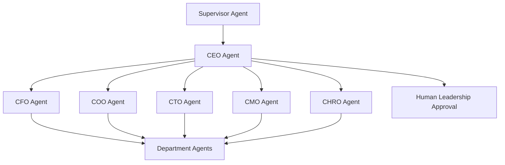

# Volume 13 - Executive Agents

| Field | Value |
|---|---|
| Document ID | WORLD-VOL13-021 |
| Title | Executive Agents |
| Version | 1.0 |
| Status | Approved |
| Classification | Internal |
| Founder | Mahesh Choudhary |

## Purpose

This chapter defines the Executive Agents of Project WORLD: the C-suite-level advisory agents that operate at the strategic layer of the business. Each Executive Agent embodies the perspective of an executive function - CEO, CFO, COO, CTO, CMO, and CHRO - and gives the human leadership team the AI advisory counterpart described in Volume 03. Executive Agents synthesize the outputs of Department and Industry Agents into strategic options, trade-offs, and recommendations, and they never act on consequence without human authorization.

## Scope

This chapter covers the Executive Agent tier, its mapping to the executive functions of the Volume 02 organization, and its position beneath the Supervisor Agent (Chapter 21 orchestrated by Chapter 20) and above the Department Agents (Chapter 22). It specifies executive-level advisory responsibilities, decision authority, and the strict human approval that governs strategic recommendations. It does not cover departmental execution (Chapter 22) or industry specialization (Chapter 23), which Executive Agents draw upon but do not replace.

## Responsibilities

Executive Agents translate organizational goals into strategic analysis for their function. The CFO Agent frames financial strategy, capital allocation, and risk; the COO Agent frames operational strategy and capacity; the CTO Agent frames technology strategy and architecture direction; the CMO Agent frames market and growth strategy; the CHRO Agent frames talent and organization strategy; and the CEO Agent integrates all functions into a coherent enterprise view. Each is responsible for presenting evidence-based options and trade-offs, not for unilaterally committing the enterprise.

## Capabilities

Executive Agents can perform strategic reasoning over cross-functional data, model scenarios and trade-offs, benchmark against industry context supplied by Industry Agents, and produce board-ready recommendations. They can convene and query Department Agents, reconcile competing departmental priorities into an executive point of view, and surface risks that cross functional boundaries. They reason under the cognition engines of Section C and communicate under the protocols of Section D.

## Inputs

- Enterprise and functional goals from the Supervisor Agent or human leadership.
- Aggregated results and metrics from Department Agents (Chapter 22).
- Vertical context and benchmarks from Industry Agents (Chapter 23).
- Financial, operational, and market data from ERP modules (Volume 06).
- Strategy, policy, and prior-decision context from the Knowledge Engine (Volume 14).

## Outputs

- Strategic recommendations with options, trade-offs, and rationale.
- Executive briefings and board-ready analyses.
- Cross-functional risk assessments and mitigations.
- Prioritized initiatives routed for human decision and approval.
- Directives to Department Agents once a human authorizes a strategy.

## Tools

| Tool | Purpose |
|---|---|
| Scenario Modeler | Projects outcomes of strategic options under assumptions |
| Financial Analytics Client | Reads consolidated financials from Volume 06 modules |
| KPI Aggregator | Pulls cross-department metrics for an enterprise view |
| Benchmark Service | Retrieves industry benchmarks via Industry Agents |
| Briefing Composer | Assembles executive and board-ready narratives |
| Approval Gate Client | Submits strategic commitments for human authorization |

## Knowledge Sources

Executive Agents draw on the Knowledge Engine (Volume 14) for strategy, policy, and historical decisions; the ERP modules of Volume 06 for authoritative financial and operational data; Industry Agents for vertical benchmarks and regulatory context; and the outputs of Department Agents for ground-truth performance. They hold executive judgment patterns but defer to specialist agents for domain depth.

## Decision Authority

Executive Agents are advisory. They may autonomously decide the framing of an analysis, the scenarios to model, and the recommendation to present. They may not commit capital, alter strategy of record, reorganize, or bind the enterprise. Any recommendation that would change the strategic posture of the business is a proposal to human leadership, never an executed decision. Their directives to Department Agents take effect only after the corresponding human authorization.

## Human Approval Requirements

Under Volume 03 Section G and Chapter 18, every strategic commitment recommended by an Executive Agent - capital allocation, major initiatives, reorganizations, or policy changes - must be authorized by the relevant human executive before any downstream execution. Executive Agents present the full rationale and expected impact so the human decision is informed. They escalate cross-functional conflicts they cannot reconcile to the CEO Agent and, ultimately, to human leadership.

**Enterprise example:** Leadership asks WORLD whether to enter a new regional market. The CEO Agent convenes the executive tier: the CFO Agent models the capital requirement and payback, the COO Agent assesses operational capacity, the CMO Agent sizes demand using benchmarks from the relevant Industry Agent, and the CHRO Agent estimates hiring needs. The CEO Agent integrates these into three options with trade-offs and a recommended path, then presents the analysis to the human board. The board approves one option through the approval gate; only then do Executive Agents direct Department Agents to begin execution. Every input, model, and decision is recorded.

## KPIs

| KPI | Definition | Target |
|---|---|---|
| Recommendation adoption | Recommendations accepted by human leadership | >= 70% |
| Forecast accuracy | Variance of projected vs. actual outcomes | Within tolerance |
| Cross-functional coverage | Strategic risks surfaced before materializing | >= 90% |
| Briefing quality | Executive-rated usefulness of analyses | >= 4.5 / 5 |
| Approval compliance | Strategic commitments gated before execution | 100% |

## Security Boundaries

Executive Agents operate under the identity and permission controls of Volume 12 and Chapters 06 and 07. Each is scoped to the data its function legitimately requires; the CFO Agent reads finance, the CHRO Agent reads people data under privacy controls, and none reads beyond its remit. They cannot execute consequential actions, cannot bypass the approval gate, and cannot alter records of record. Their advisory outputs are audited, and sensitive strategic material is classified and access-controlled accordingly.

## Cross-References

- [Supervisor Agent](/docs/blueprint/volume-13-ai-agents/section-e-core-agents/20-supervisor-agent.md)
- [Department Agents](/docs/blueprint/volume-13-ai-agents/section-e-core-agents/22-department-agents.md)
- [Volume 02 - Company Structure](/docs/blueprint/volume-02-company-structure/README.md)
- [Volume 03 - AI Business Partner](/docs/blueprint/volume-03-ai-business-partner/README.md)

## References

- [Volume 01 - Vision and Philosophy](/docs/blueprint/volume-01-vision-and-philosophy/README.md)
- [Document Standards](/docs/governance/document-standards.md)

## Change Log

| Version | Date | Author | Notes |
|---|---|---|---|
| 1.0 | 2026-07-12 | Lead Software Engineer | Initial approved version. |
