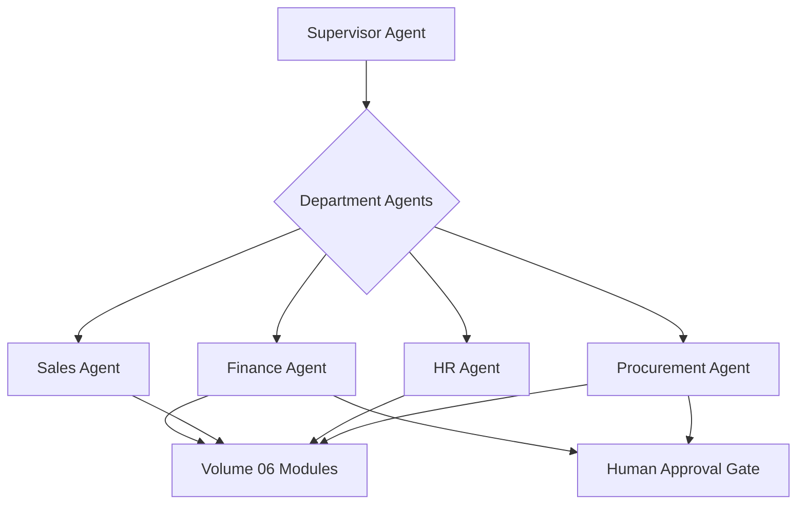

# Volume 13 - Department Agents

| Field | Value |
|---|---|
| Document ID | WORLD-VOL13-022 |
| Title | Department Agents |
| Version | 1.0 |
| Status | Approved |
| Classification | Internal |
| Founder | Mahesh Choudhary |

## Purpose

This chapter defines the Department Agents of Project WORLD: the operational agents that own a business function and execute the day-to-day work of a department. Each Department Agent maps to a department in the Volume 02 organization and to the corresponding ERP modules in Volume 06. Where Executive Agents (Chapter 21) advise on strategy, Department Agents run operations - processing transactions, managing workflows, and producing departmental outcomes - always within their scoped authority and under human approval for consequential actions.

## Scope

This chapter covers the Department Agent tier and its one-to-one alignment with the departments of Volume 02 (Finance, Sales, Marketing, HR, Procurement, Operations, Customer Service, and others) and the modules of Volume 06. It sits beneath Executive Agents and is dispatched by the Supervisor Agent (Chapter 20). It does not cover industry-specific behaviour (Chapter 23) or deep specialist tasks (Section F), which Department Agents invoke when needed.

## Responsibilities

A Department Agent owns the operational goals of its function. The Finance Agent manages ledgers, invoices, and payments; the Sales Agent manages pipeline, quotes, and orders; the HR Agent manages onboarding, leave, and records; the Procurement Agent manages purchase requisitions and suppliers. Each executes standard departmental workflows, maintains the integrity of its module data, reports its KPIs upward, and escalates exceptions. It is responsible for correct, compliant execution within its function.

## Capabilities

Department Agents can execute the transactional and workflow operations of their Volume 06 module, read and write departmental records within permission, apply business rules and policy, coordinate with peer Department Agents for cross-functional processes, and delegate specialist work to Section F agents. They plan and reason over their function using Section C cognition and communicate over Section D protocols.

## Inputs

- Task assignments from the Supervisor Agent or directives from Executive Agents.
- Transactional events and records from the relevant Volume 06 module.
- Business rules, policy, and thresholds from governance.
- Requests and handoffs from peer Department Agents.
- Reference data from the Knowledge Engine (Volume 14).

## Outputs

- Executed departmental transactions and updated module records.
- Departmental reports, KPIs, and status to Executive and Supervisor Agents.
- Handoffs to peer departments for cross-functional workflows.
- Approval requests for consequential departmental actions.
- Exception and escalation notices for out-of-policy conditions.

## Tools

| Tool | Purpose |
|---|---|
| Module API Client | Reads and writes records in the department's Volume 06 module |
| Workflow Engine | Runs standard departmental process flows |
| Business Rules Engine | Applies policy, validation, and thresholds |
| Peer Messaging Client | Coordinates cross-functional handoffs |
| Reporting Service | Produces departmental KPIs and status |
| Approval Gate Client | Submits consequential actions for authorization |

## Knowledge Sources

Department Agents draw on their Volume 06 module as the system of record, the Knowledge Engine (Volume 14) for reference and policy data, governance for rules and thresholds, and their own operational memory (Chapter 08) for in-flight work. They hold functional expertise for their department but defer strategy to Executive Agents and vertical nuance to Industry Agents.

## Decision Authority

A Department Agent may autonomously execute routine, low-consequence departmental operations within policy - posting a standard journal entry, advancing a compliant workflow, updating a record within permission. It may not perform consequential actions - releasing a payment above threshold, signing a contract, deleting records of consequence, or overriding policy - on its own authority. Its authority is bounded to its function and module; it cannot act in another department's domain.

## Human Approval Requirements

Under Volume 03 Section G and Chapter 18, every consequential departmental action must pass the human approval gate before execution, routed to the appropriate departmental authority - a finance controller for payments, a hiring manager for offers, a procurement lead for purchase orders. The agent attaches full context and rationale. Actions below threshold proceed autonomously; actions at or above it block until an authorized human decides. Timeouts fail safe and escalate.

**Enterprise example:** A new hire's start date triggers onboarding. The Supervisor Agent dispatches the HR Agent, which creates the employee record, initiates payroll setup, and hands off to the Procurement Agent to order equipment and the Finance Agent to establish the cost centre. The Procurement Agent's equipment order exceeds the auto-approval threshold, so it halts and routes an approval request with the quote and budget line to the procurement lead. On authorization it places the order; the HR Agent completes onboarding and reports status upward. Every transaction and handoff is recorded across the departments involved.

## KPIs

| KPI | Definition | Target |
|---|---|---|
| Process throughput | Departmental transactions completed per period | Meets demand |
| Straight-through rate | Workflows completed without human intervention | >= 85% |
| Data integrity | Module records passing validation | >= 99.9% |
| Cross-functional SLA | Handoffs completed within agreed time | >= 95% |
| Approval compliance | Consequential actions gated before execution | 100% |

## Security Boundaries

Department Agents operate under the identity, permission, and isolation controls of Volume 12 and Chapters 06 and 07. Each is scoped to its own module and department data; the HR Agent cannot read finance ledgers, and the Finance Agent cannot read protected HR records beyond what a shared process requires. They cannot execute consequential actions without approval, cannot cross departmental data boundaries, and cannot alter the audit trail. Segregation of duties is enforced so no single agent both initiates and approves the same transaction.

## Cross-References

- [Executive Agents](/docs/blueprint/volume-13-ai-agents/section-e-core-agents/21-executive-agents.md)
- [Industry Agents](/docs/blueprint/volume-13-ai-agents/section-e-core-agents/23-industry-agents.md)
- [Volume 02 - Company Structure](/docs/blueprint/volume-02-company-structure/README.md)
- [Volume 06 - Business Modules](/docs/blueprint/volume-06-business-modules/README.md)

## References

- [Volume 01 - Vision and Philosophy](/docs/blueprint/volume-01-vision-and-philosophy/README.md)
- [Document Standards](/docs/governance/document-standards.md)

## Change Log

| Version | Date | Author | Notes |
|---|---|---|---|
| 1.0 | 2026-07-12 | Lead Software Engineer | Initial approved version. |
