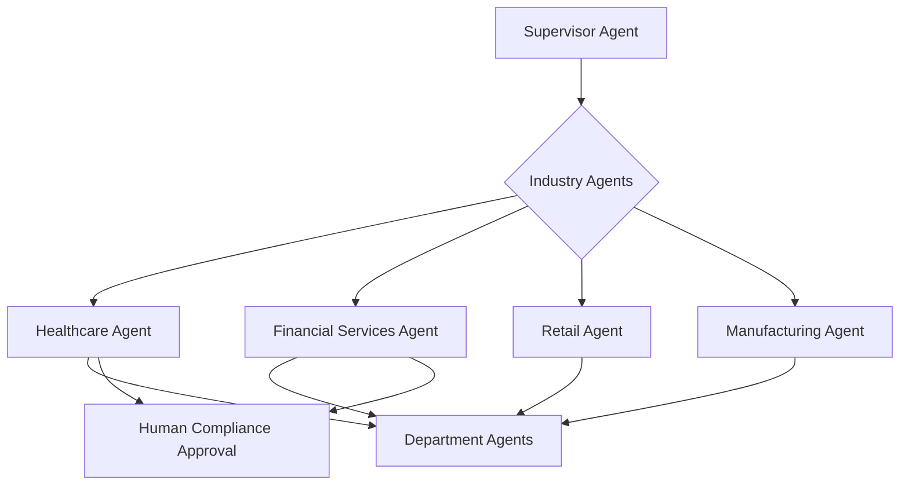

# Volume 13 - Industry Agents

| Field | Value |
|---|---|
| Document ID | WORLD-VOL13-023 |
| Title | Industry Agents |
| Version | 1.0 |
| Status | Approved |
| Classification | Internal |
| Founder | Mahesh Choudhary |

## Purpose

This chapter defines the Industry Agents of Project WORLD: the vertical-specialist agents that adapt the platform to the language, workflows, regulations, and benchmarks of a specific industry. Each Industry Agent maps to an industry solution in Volume 07 and layers domain expertise on top of the horizontal Department Agents (Chapter 22). Industry Agents make WORLD industry-aware, so that a retailer, a hospital, a bank, or a manufacturer each experiences an operating system that speaks its domain while running on the same governed core.

## Scope

This chapter covers the Industry Agent tier and its alignment with the verticals of Volume 07 - retail, healthcare, financial services, manufacturing, logistics, education, and others. It specifies how Industry Agents supply vertical context to Executive and Department Agents and how they enforce industry-specific compliance. It sits within the hierarchy dispatched by the Supervisor Agent (Chapter 20) and does not replace departmental execution (Chapter 22) or specialist tasks (Section F); it specializes and constrains them for the vertical.

## Responsibilities

An Industry Agent owns the vertical correctness of the platform for its industry. The Healthcare Agent enforces clinical and privacy workflows and terminology; the Financial Services Agent enforces regulatory reporting and KYC/AML rules; the Retail Agent enforces merchandising, inventory, and seasonal patterns; the Manufacturing Agent enforces production, BOM, and quality workflows. Each supplies benchmarks, interprets industry regulation, and validates that departmental execution meets vertical requirements.

## Capabilities

Industry Agents can interpret industry regulation and standards, provide vertical benchmarks and taxonomies, adapt departmental workflows to industry practice, validate transactions against industry compliance rules, and advise Executive Agents with market and regulatory context. They reason under Section C cognition, communicate over Section D protocols, and invoke Department and Specialist Agents to execute within vertical constraints.

## Inputs

- Vertical goals and context from the Supervisor or Executive Agents.
- Industry solution configuration and rules from Volume 07.
- Regulatory and standards references from the Knowledge Engine (Volume 14).
- Departmental transactions requiring vertical validation from Chapter 22 agents.
- Market and benchmark data sources for the industry.

## Outputs

- Vertical benchmarks, taxonomies, and regulatory interpretations.
- Industry-adapted workflow configurations for Department Agents.
- Compliance validations and flags on departmental transactions.
- Industry context and analysis for Executive Agents.
- Approval requests where vertical actions are consequential or regulated.

## Tools

| Tool | Purpose |
|---|---|
| Industry Rules Engine | Applies vertical compliance and standards checks |
| Benchmark Service | Provides industry KPIs and comparison data |
| Taxonomy Library | Supplies vertical terminology and classifications |
| Regulatory Reference Client | Retrieves current industry regulation and standards |
| Workflow Adapter | Configures departmental flows for industry practice |
| Approval Gate Client | Submits regulated or consequential actions for authorization |

## Knowledge Sources

Industry Agents draw on the Volume 07 industry solution as their configuration baseline, the Knowledge Engine (Volume 14) for regulation and standards, external and licensed benchmark sources for market data, and their own vertical memory (Chapter 08). They hold deep domain expertise for one industry and defer horizontal execution to Department Agents and enterprise strategy to Executive Agents.

## Decision Authority

An Industry Agent may autonomously supply benchmarks, interpret standards, configure vertical workflows within policy, and flag or block a transaction that violates industry compliance rules. It may not waive a regulatory requirement, approve a regulated transaction, or override a compliance flag on its own authority. Its authority is bounded to its vertical; it cannot impose industry rules outside its assigned tenant or industry context.

## Human Approval Requirements

Under Volume 03 Section G and Chapter 18, any consequential or regulated vertical action - submitting a regulatory filing, approving a clinical or financial transaction of consequence, or overriding a compliance control - must pass the human approval gate to the appropriate domain authority, such as a compliance officer or clinical lead. The Industry Agent attaches the regulatory rationale. It escalates ambiguous or novel regulatory situations to human experts and never self-authorizes a compliance exception.

**Enterprise example:** A financial-services tenant onboards a new corporate client. The Supervisor Agent engages the Financial Services Agent, which applies KYC/AML rules to the onboarding workflow and directs the Sales and Finance Department Agents to collect and validate documentation against regulatory requirements. The Industry Agent flags a high-risk jurisdiction that requires enhanced due diligence and routes the account for approval to the compliance officer through the approval gate. Only after the officer authorizes does onboarding complete. The regulatory checks, the flag, and the decision are recorded for audit and examiner review.

## KPIs

| KPI | Definition | Target |
|---|---|---|
| Compliance accuracy | Transactions correctly validated against vertical rules | >= 99.5% |
| Regulatory currency | Rules updated within window of regulatory change | Within SLA |
| Benchmark relevance | Vertical benchmarks rated useful by Executive Agents | >= 4.5 / 5 |
| Vertical adoption | Departmental workflows correctly industry-adapted | >= 95% |
| Approval compliance | Regulated actions gated before execution | 100% |

## Security Boundaries

Industry Agents operate under the identity, permission, and isolation controls of Volume 12 and Chapters 06 and 07. Each is scoped to its industry and tenant; a Healthcare Agent handles protected health information only under the privacy controls of its vertical, and a Financial Services Agent handles regulated financial data under its own. They cannot execute regulated actions without approval, cannot override compliance controls, cannot cross tenant or industry boundaries, and cannot alter the audit record. Vertical data classifications are enforced end to end.

## Cross-References

- [Department Agents](/docs/blueprint/volume-13-ai-agents/section-e-core-agents/22-department-agents.md)
- [Supervisor Agent](/docs/blueprint/volume-13-ai-agents/section-e-core-agents/20-supervisor-agent.md)
- [Volume 07 - Industry Solutions](/docs/blueprint/volume-07-industry-solutions/README.md)
- [Volume 03 - AI Business Partner](/docs/blueprint/volume-03-ai-business-partner/README.md)

## References

- [Volume 01 - Vision and Philosophy](/docs/blueprint/volume-01-vision-and-philosophy/README.md)
- [Document Standards](/docs/governance/document-standards.md)

## Change Log

| Version | Date | Author | Notes |
|---|---|---|---|
| 1.0 | 2026-07-12 | Lead Software Engineer | Initial approved version. |
