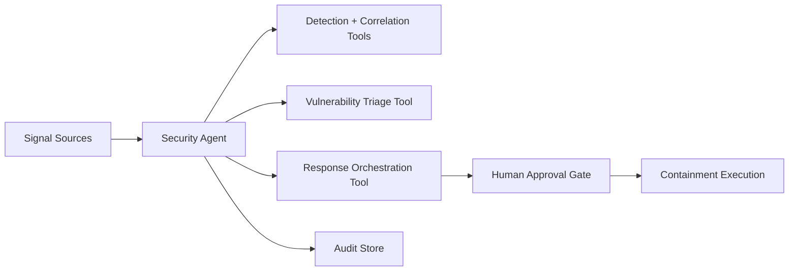

# Volume 13 - Security Agent

| Field | Value |
|---|---|
| Document ID | WORLD-VOL13-024 |
| Title | Security Agent |
| Version | 1.0 |
| Status | Approved |
| Classification | Internal |
| Founder | Mahesh Choudhary |

## Purpose

This chapter defines the **Security Agent**, the specialist agent that continuously protects Project WORLD by detecting, triaging, and responding to security threats across identities, workloads, data, and network boundaries. Where Volume 12 establishes the security architecture as policy and controls, the Security Agent is the autonomous operator that watches those controls in real time, correlates signals into incidents, and drives containment under human authority. Its purpose is to compress the time between a threat appearing and a threat being contained, without ever becoming a privileged actor that can itself be abused.

## Scope

The chapter defines the Security Agent's responsibilities, capabilities, inputs, outputs, tools, knowledge sources, decision authority, human approval requirements, key performance indicators, and security boundaries. Its remit is threat detection, incident triage, vulnerability surfacing, and orchestrated response recommendation for the WORLD platform. It does not set security policy (owned by Volume 12 governance), does not perform financial or operational business actions, and does not replace the human security team - it augments and accelerates them.

## Responsibilities

- Monitor authentication, authorization, and audit event streams for anomalous or malicious behavior.
- Correlate low-level signals into ranked, deduplicated security incidents with evidence.
- Triage vulnerabilities and misconfigurations surfaced by scanners against asset criticality.
- Recommend and, within tight bounds, initiate reversible containment actions such as session revocation.
- Maintain a complete, immutable investigation record for every incident it touches.

## Capabilities

| Capability | Description |
|---|---|
| Anomaly detection | Flags deviations from established identity and workload baselines |
| Incident correlation | Groups related signals across sources into a single incident narrative |
| Threat classification | Maps observed behavior to a known threat taxonomy and severity |
| Containment planning | Proposes least-disruptive, reversible response steps for human approval |
| Evidence assembly | Compiles a timeline, indicators, and impact assessment per incident |

## Inputs

The Security Agent consumes authentication and authorization events, audit logs, network flow and telemetry data, vulnerability scan results, threat intelligence feeds, and asset criticality metadata. All inputs are read through governed, least-privilege interfaces so the agent observes broadly but holds no standing power over the systems it watches.

## Outputs

The agent produces ranked incident records, containment recommendations with rationale, vulnerability triage reports, and immutable investigation timelines. High-severity findings are emitted as approval requests to the human security team rather than executed actions. Every output is signed with the agent's identity and written to the audit store.

## Tools

The Security Agent invokes detection and correlation tools, a vulnerability triage tool, and a response orchestration tool. Consequential response tools are wired behind the human approval gate so the agent can recommend containment but cannot unilaterally disrupt production.

## Knowledge Sources

The agent grounds its reasoning in the Volume 12 security architecture and control catalog, the enterprise threat taxonomy, asset and identity inventories, prior incident history, and external threat intelligence. This knowledge lets it distinguish a benign anomaly from a genuine attack pattern with organizational context.

## Decision Authority

The Security Agent decides autonomously on low-consequence, reversible actions: raising an incident, ranking severity, enriching evidence, and revoking a single suspicious session token. All disruptive or broad-impact actions - blocking an identity, isolating a workload, rotating shared credentials, or changing firewall posture - are recommendations only and require human authorization, consistent with Volume 03 Section G.

## Human Approval Requirements

| Action | Authority |
|---|---|
| Raise incident, enrich evidence | Agent autonomous |
| Revoke single suspicious session | Agent autonomous (reversible) |
| Block identity or isolate workload | Security analyst approval |
| Rotate shared credentials, change network posture | Security lead approval |
| Declare major incident, notify externally | CISO approval |

Approval requests carry full incident context and expire safely if unanswered, escalating to higher authority rather than defaulting to execution.

## KPIs

- Mean time to detect (MTTD) and mean time to triage for confirmed incidents.
- False-positive rate on raised incidents.
- Percentage of critical vulnerabilities triaged within the target window.
- Containment recommendation acceptance rate by human analysts.

## Security Boundaries

The Security Agent operates under strict least privilege per Volume 12: it holds read-mostly access to telemetry, cannot approve its own actions, and cannot alter audit records. Its identity is a first-class principal whose every tool call is authorized and logged. Disruptive capabilities are gated behind human approval, ensuring a compromised agent cannot become an attacker's instrument.

**Enterprise example:** A retail enterprise's Security Agent observes a burst of failed logins followed by a successful login for a finance account from an unfamiliar geography. It correlates the events, classifies a likely credential-stuffing compromise, revokes the active session autonomously, and raises a high-severity incident recommending an identity block. The security analyst reviews the assembled timeline and approves the block within minutes; the CISO is notified, and the full decision chain is preserved in the immutable audit store.

## Cross-References

- [Human Approval Model](/docs/blueprint/volume-13-ai-agents/section-d-collaboration-and-control/18-human-approval-model.md)
- [Agent Orchestration](/docs/blueprint/volume-13-ai-agents/section-d-collaboration-and-control/16-agent-orchestration.md)
- [Volume 12 - Security](/docs/blueprint/volume-12-security/README.md)
- [Volume 11 - Infrastructure](/docs/blueprint/volume-11-infrastructure/README.md)

## References

- [Volume 01 - Vision and Philosophy](/docs/blueprint/volume-01-vision-and-philosophy/README.md)
- [Document Standards](/docs/governance/document-standards.md)

## Change Log

| Version | Date | Author | Notes |
|---|---|---|---|
| 1.0 | 2026-07-12 | Lead Software Engineer | Initial approved version. |
