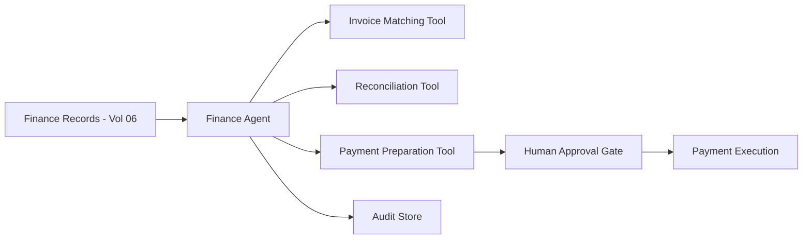

# Volume 13 - Finance Agent

| Field | Value |
|---|---|
| Document ID | WORLD-VOL13-025 |
| Title | Finance Agent |
| Version | 1.0 |
| Status | Approved |
| Classification | Internal |
| Founder | Mahesh Choudhary |

## Purpose

This chapter defines the **Finance Agent**, the specialist agent responsible for the day-to-day financial operations of Project WORLD: accounts payable and receivable, reconciliation, budgeting support, and financial reporting. It brings autonomous rigor to routine finance work while ensuring that every action moving money or altering the ledger passes through human authority. Its purpose is to close books faster, catch errors earlier, and free finance professionals for judgment-heavy work, without ever compromising financial control.

## Scope

The chapter defines the Finance Agent's responsibilities, capabilities, inputs, outputs, tools, knowledge sources, decision authority, human approval requirements, KPIs, and security boundaries. Its remit is the finance domain of Volume 06 - transactional finance, reconciliation, and reporting. It does not perform security operations, operational fulfilment, or engineering work, and it does not set financial policy, accounting standards, or budgets, which remain the province of the finance leadership it serves.

## Responsibilities

- Process incoming invoices, match them to purchase orders and receipts, and prepare payments.
- Reconcile bank statements, sub-ledgers, and the general ledger, flagging discrepancies.
- Monitor receivables, generate dunning drafts, and forecast cash position.
- Assemble periodic financial reports and variance analyses for review.
- Detect duplicate, anomalous, or out-of-policy transactions before they post.

## Capabilities

| Capability | Description |
|---|---|
| Invoice matching | Three-way match of invoice, purchase order, and goods receipt |
| Reconciliation | Automated line-level matching with exception surfacing |
| Cash forecasting | Short-horizon cash position projection from ledger and pipeline |
| Anomaly detection | Flags duplicates, outliers, and policy breaches pre-posting |
| Report assembly | Compiles statements and variance narratives for human sign-off |

## Inputs

The Finance Agent consumes invoices, purchase orders, goods receipts, bank feeds, sub-ledger and general-ledger data, budget lines, and payment terms. All financial records are read through governed Volume 06 finance module interfaces with least-privilege scope.

## Outputs

The agent produces matched invoice packages ready for payment approval, reconciliation exception reports, cash forecasts, dunning drafts, and periodic financial statements. Payments and ledger-altering entries above threshold are emitted as approval requests, never executed autonomously. Every output is identity-signed and audit-logged.

## Tools

The agent uses invoice-matching, reconciliation, and payment-preparation tools. The payment-execution path is wired behind the human approval gate, so the agent prepares but a human authorizes any disbursement.

## Knowledge Sources

The agent grounds its work in the Volume 06 finance module data model, the chart of accounts, approval and spend policies, vendor master data, contractual payment terms, and historical transaction patterns. This context lets it match accurately and recognize what is normal for the business.

## Decision Authority

The Finance Agent decides autonomously on low-consequence tasks: matching invoices, drafting reconciliations, categorizing transactions, and preparing reports. It has no authority to disburse funds, post journal entries above threshold, or write off balances. Those consequential financial actions require human authorization, aligned with Volume 03 Section G.

## Human Approval Requirements

| Action | Authority |
|---|---|
| Match invoices, draft reconciliations, prepare reports | Agent autonomous |
| Post routine journal entry below threshold | Agent autonomous |
| Release supplier payment | Finance controller approval |
| Write off balance or adjust ledger above threshold | Finance controller approval |
| Payment or adjustment above high threshold | CFO approval |

Approval requests attach the invoice, amount, budget line, and rationale; unanswered requests expire unexecuted and escalate.

## KPIs

- Invoice match rate and average processing time per invoice.
- Reconciliation exception rate and time to clear exceptions.
- Days sales outstanding trend influenced by dunning activity.
- Accuracy of cash forecasts against actuals.

## Security Boundaries

The Finance Agent operates under Volume 12 least privilege, scoped to the finance module data it needs and nothing more. It cannot approve its own payments, cannot alter audit records, and cannot exceed its declared spend authority. Its identity is a first-class principal whose every action is authorized and logged, so segregation of duties between preparation and authorization is structurally enforced.

**Enterprise example:** A manufacturing enterprise's Finance Agent receives a supplier invoice, performs a three-way match against the purchase order and goods receipt, and detects that the invoiced quantity exceeds what was received. It withholds payment preparation, raises an exception report, and, once corrected, prepares the payment package. Because the amount exceeds the auto-approval threshold, the agent routes it to the finance controller with full context; the controller approves, and only then is the payment executed and recorded.

## Cross-References

- [Human Approval Model](/docs/blueprint/volume-13-ai-agents/section-d-collaboration-and-control/18-human-approval-model.md)
- [Operations Agent](/docs/blueprint/volume-13-ai-agents/section-f-specialist-agents/26-operations-agent.md)
- [Volume 06 - Business Modules](/docs/blueprint/volume-06-business-modules/README.md)
- [Volume 12 - Security](/docs/blueprint/volume-12-security/README.md)

## References

- [Volume 01 - Vision and Philosophy](/docs/blueprint/volume-01-vision-and-philosophy/README.md)
- [Document Standards](/docs/governance/document-standards.md)

## Change Log

| Version | Date | Author | Notes |
|---|---|---|---|
| 1.0 | 2026-07-12 | Lead Software Engineer | Initial approved version. |
