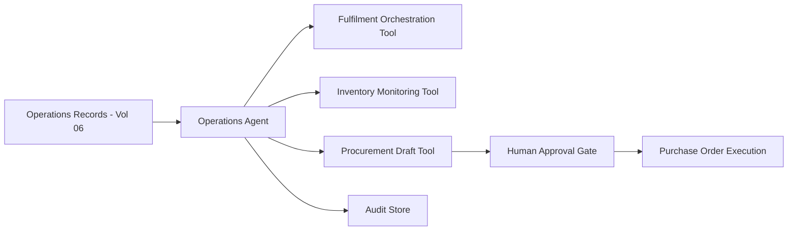

# Volume 13 - Operations Agent

| Field | Value |
|---|---|
| Document ID | WORLD-VOL13-026 |
| Title | Operations Agent |
| Version | 1.0 |
| Status | Approved |
| Classification | Internal |
| Founder | Mahesh Choudhary |

## Purpose

This chapter defines the **Operations Agent**, the specialist agent that runs the business's operational backbone: order fulfilment, inventory, procurement support, and supply-chain coordination. Where the Finance Agent governs money and the ledger, the Operations Agent governs the movement of goods, services, and work through the enterprise. Its purpose is to keep operations flowing smoothly - orders fulfilled on time, stock at healthy levels, exceptions caught early - while deferring consequential commitments to human authority.

## Scope

The chapter defines the Operations Agent's responsibilities, capabilities, inputs, outputs, tools, knowledge sources, decision authority, human approval requirements, KPIs, and security boundaries. Its remit is the operations domain of Volume 06 - fulfilment, inventory, and procurement coordination. It does not post financial transactions (Finance Agent), does not perform security or engineering work, and does not set operational strategy or supplier contracts, which remain with operations leadership.

## Responsibilities

- Monitor order pipelines and coordinate fulfilment from receipt to delivery.
- Track inventory levels, forecast demand, and flag stockouts and overstock.
- Prepare replenishment and purchase-requisition drafts for procurement.
- Detect and route operational exceptions such as delayed shipments or supplier shortfalls.
- Maintain an auditable record of operational decisions and their rationale.

## Capabilities

| Capability | Description |
|---|---|
| Fulfilment orchestration | Sequences and tracks order steps to completion |
| Demand forecasting | Projects near-term demand from history and pipeline |
| Inventory monitoring | Watches stock thresholds and triggers replenishment drafts |
| Exception routing | Detects operational disruptions and routes them for action |
| Supplier coordination | Prepares requisitions and expedite requests for approval |

## Inputs

The Operations Agent consumes sales orders, inventory positions, supplier lead times, shipment and logistics status, demand history, and reorder policies. All operational records are read through governed Volume 06 operations module interfaces with least-privilege scope.

## Outputs

The agent produces fulfilment status updates, replenishment and requisition drafts, demand forecasts, and exception tickets. Purchase commitments and supplier orders above threshold are emitted as approval requests rather than executed. Every output is identity-signed and audit-logged.

## Tools

The agent uses fulfilment-orchestration, inventory-monitoring, and procurement-draft tools. The purchase-order execution path sits behind the human approval gate, so the agent proposes commitments that a human authorizes.

## Knowledge Sources

The agent grounds its work in the Volume 06 operations data model, product and supplier master data, reorder and safety-stock policies, service-level agreements, and historical fulfilment and demand patterns. This context lets it distinguish routine variation from genuine operational risk.

## Decision Authority

The Operations Agent decides autonomously on low-consequence tasks: updating fulfilment status, drafting replenishments, forecasting demand, and raising exception tickets. It has no authority to place purchase orders, commit to suppliers, or alter contractual terms above threshold; those consequential commitments require human authorization, aligned with Volume 03 Section G.

## Human Approval Requirements

| Action | Authority |
|---|---|
| Update fulfilment status, forecast demand | Agent autonomous |
| Draft replenishment or requisition | Agent autonomous |
| Place purchase order below threshold | Operations manager approval |
| Commit supplier order above threshold | Operations lead approval |
| Change contractual terms or expedite at premium | Operations director approval |

Approval requests carry the requisition, quantity, cost, and rationale; unanswered requests expire and escalate rather than execute.

## KPIs

- On-time fulfilment rate and average order cycle time.
- Stockout and overstock incidence against targets.
- Forecast accuracy versus actual demand.
- Exception resolution time.

## Security Boundaries

The Operations Agent operates under Volume 12 least privilege, scoped to the operations data it needs. It cannot approve its own purchase orders, cannot alter audit records, and cannot exceed its declared commitment authority. Its identity is a first-class principal whose every action is authorized and logged, keeping preparation and authorization structurally separate.

**Enterprise example:** A distribution enterprise's Operations Agent detects that a fast-moving product will breach its safety-stock level within the lead time of its primary supplier. It drafts a replenishment requisition sized to forecast demand and routes it to the operations manager because the order value exceeds the auto-approval threshold. The manager approves, the purchase order is executed by procurement, and the agent tracks the inbound shipment - the entire decision chain preserved in the audit store.

## Cross-References

- [Finance Agent](/docs/blueprint/volume-13-ai-agents/section-f-specialist-agents/25-finance-agent.md)
- [Human Approval Model](/docs/blueprint/volume-13-ai-agents/section-d-collaboration-and-control/18-human-approval-model.md)
- [Volume 06 - Business Modules](/docs/blueprint/volume-06-business-modules/README.md)
- [Volume 12 - Security](/docs/blueprint/volume-12-security/README.md)

## References

- [Volume 01 - Vision and Philosophy](/docs/blueprint/volume-01-vision-and-philosophy/README.md)
- [Document Standards](/docs/governance/document-standards.md)

## Change Log

| Version | Date | Author | Notes |
|---|---|---|---|
| 1.0 | 2026-07-12 | Lead Software Engineer | Initial approved version. |
