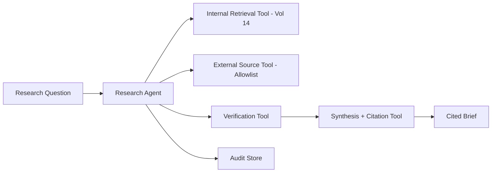

# Volume 13 - Research Agent

| Field | Value |
|---|---|
| Document ID | WORLD-VOL13-027 |
| Title | Research Agent |
| Version | 1.0 |
| Status | Approved |
| Classification | Internal |
| Founder | Mahesh Choudhary |

## Purpose

This chapter defines the **Research Agent**, the specialist agent that gathers, synthesizes, and analyzes information to support decision-making across Project WORLD. Aligned with Volume 04 business intelligence and decision science, it turns scattered internal data and external sources into structured, evidence-backed analysis. Its purpose is to give leaders and other agents well-sourced insight quickly, while being scrupulous about provenance so that no decision rests on unverified or fabricated evidence.

## Scope

The chapter defines the Research Agent's responsibilities, capabilities, inputs, outputs, tools, knowledge sources, decision authority, human approval requirements, KPIs, and security boundaries. Its remit is investigation, synthesis, and analysis producing advisory outputs. It does not execute transactional actions - it never moves money, changes operational records, or deploys code - and it does not own the decisions its research informs. It is deliberately an advisory agent.

## Responsibilities

- Decompose research questions into structured sub-questions and evidence needs.
- Gather information from governed internal data and approved external sources.
- Verify claims against multiple sources and flag uncertainty and conflicts.
- Synthesize findings into structured, cited briefs and comparative analyses.
- Maintain full provenance so every conclusion traces to its evidence.

## Capabilities

| Capability | Description |
|---|---|
| Question decomposition | Breaks a broad question into researchable sub-questions |
| Multi-source gathering | Retrieves from internal knowledge and approved external sources |
| Claim verification | Cross-checks assertions and grades confidence |
| Synthesis | Produces structured, cited briefs and comparisons |
| Provenance tracking | Links every statement to its supporting evidence |

## Inputs

The Research Agent consumes research questions, governed internal datasets and reports, approved external information sources, and the Volume 14 knowledge engine. All sources are accessed read-only through least-privilege interfaces, and external access is restricted to an approved allowlist.

## Outputs

The agent produces cited research briefs, comparative analyses, evidence tables, and confidence-graded findings. Every output carries citations and an explicit statement of uncertainty. Outputs are advisory and identity-signed; they inform human and agent decisions but never trigger consequential actions directly.

## Tools

The agent uses internal retrieval, allowlisted external source, verification, and synthesis tools. It holds no write or execution tools, so its influence is confined to producing evidence, not taking action.

## Knowledge Sources

The agent grounds its work in the Volume 14 knowledge engine, governed enterprise datasets and prior analyses, the Volume 04 decision-science methods, and an approved catalog of external sources. This grounding keeps its output tied to trustworthy, organizationally relevant evidence.

## Decision Authority

The Research Agent decides autonomously on how to conduct research: which sub-questions to pursue, which sources to consult within its allowlist, and how to grade confidence. It has no authority to make or execute business decisions; its conclusions are recommendations that humans or accountable agents act upon, consistent with Volume 03 Section G.

## Human Approval Requirements

| Action | Authority |
|---|---|
| Conduct research, synthesize, cite | Agent autonomous |
| Access source within approved allowlist | Agent autonomous |
| Add a new external source to the allowlist | Knowledge governance approval |
| Publish brief influencing a material decision | Requesting decision-owner review |
| Access restricted or sensitive dataset | Data owner approval |

Because the agent takes no consequential action, its gates concern source access and publication rather than execution.

## KPIs

- Citation coverage - proportion of claims backed by verifiable sources.
- Factual accuracy on spot-checked findings.
- Time to deliver a research brief.
- Decision-owner satisfaction with usefulness and clarity.

## Security Boundaries

The Research Agent operates under Volume 12 least privilege with read-only, allowlisted access and no write or execution capability. It cannot alter records or audit logs, cannot reach unapproved external endpoints, and must attribute every claim to a source, preventing fabrication. Its identity is a first-class principal whose reads are authorized and logged, containing any data exposure to its narrow scope.

**Enterprise example:** A professional-services firm asks its Research Agent to assess entering a new regional market. The agent decomposes the question, pulls internal pipeline and margin data through the knowledge engine, gathers market sizing from allowlisted external sources, cross-checks conflicting figures, and delivers a cited brief grading each conclusion's confidence. The strategy owner uses the brief to inform an investment decision; the agent itself commits nothing, and its provenance trail lets reviewers verify every number.

## Cross-References

- [Coding Agent](/docs/blueprint/volume-13-ai-agents/section-f-specialist-agents/28-coding-agent.md)
- [Multi-Agent Collaboration](/docs/blueprint/volume-13-ai-agents/section-d-collaboration-and-control/19-multi-agent-collaboration.md)
- [Volume 04 - Business Intelligence and Decision Science](/docs/blueprint/volume-04-business-intelligence-and-decision-science/README.md)
- [Volume 12 - Security](/docs/blueprint/volume-12-security/README.md)

## References

- [Volume 01 - Vision and Philosophy](/docs/blueprint/volume-01-vision-and-philosophy/README.md)
- [Document Standards](/docs/governance/document-standards.md)

## Change Log

| Version | Date | Author | Notes |
|---|---|---|---|
| 1.0 | 2026-07-12 | Lead Software Engineer | Initial approved version. |
