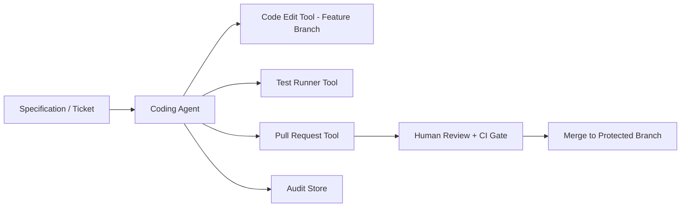

# Volume 13 - Coding Agent

| Field | Value |
|---|---|
| Document ID | WORLD-VOL13-028 |
| Title | Coding Agent |
| Version | 1.0 |
| Status | Approved |
| Classification | Internal |
| Founder | Mahesh Choudhary |

## Purpose

This chapter defines the **Coding Agent**, the specialist agent that writes, modifies, and refactors software within Project WORLD under the architectural standards of Volume 08. It accelerates engineering by turning well-specified requirements into reviewed, tested code changes. Its purpose is to increase engineering throughput and consistency while ensuring that no code reaches production without human review and the platform's automated quality gates.

## Scope

The chapter defines the Coding Agent's responsibilities, capabilities, inputs, outputs, tools, knowledge sources, decision authority, human approval requirements, KPIs, and security boundaries. Its remit is source-code authoring, modification, and refactoring within governed repositories. It does not approve or merge its own changes, does not deploy to production autonomously, and does not perform QA sign-off (QA Agent) or operational and financial business actions.

## Responsibilities

- Translate specifications and tickets into code changes on feature branches.
- Refactor and modernize code while preserving behavior and standards.
- Write and update unit tests alongside code changes.
- Open pull requests with clear descriptions, rationale, and impact notes.
- Address review feedback and keep changes within the stated scope.

## Capabilities

| Capability | Description |
|---|---|
| Code generation | Produces changes conforming to Volume 08 standards |
| Refactoring | Improves structure without altering external behavior |
| Test authoring | Writes unit and integration tests for its changes |
| PR authoring | Opens well-documented pull requests for review |
| Feedback incorporation | Revises changes in response to reviewer comments |

## Inputs

The Coding Agent consumes specifications and tickets, the governed source repository on a working branch, coding standards and architecture guidance from Volume 08, and continuous-integration results. Repository access is scoped to permitted branches with least privilege.

## Outputs

The agent produces code changes on feature branches, accompanying tests, and documented pull requests. It never pushes directly to protected branches or deploys. Every change is attributed to the agent's identity, and its pull requests enter the standard human review and CI pipeline before merge.

## Tools

The agent uses code-edit, test-runner, and pull-request tools scoped to feature branches. Merge to protected branches sits behind human review and the CI gate, so the agent authors changes but cannot release them.

## Knowledge Sources

The agent grounds its work in the Volume 08 architecture and coding standards, the existing codebase and its conventions, API contracts from Volume 10, and the ticket and specification history. This context lets it produce changes that fit the system rather than fight it.

## Decision Authority

The Coding Agent decides autonomously on implementation details within a ticket's scope: how to structure code, which patterns to apply, and what tests to write. It has no authority to merge changes, alter protected branches, change CI policy, or deploy; those consequential actions require human authorization, aligned with Volume 03 Section G.

## Human Approval Requirements

| Action | Authority |
|---|---|
| Author code and tests on feature branch | Agent autonomous |
| Open or update pull request | Agent autonomous |
| Merge to protected branch | Reviewing engineer approval |
| Change build, CI, or dependency policy | Engineering lead approval |
| Deploy to any environment | Release authority approval |

Every pull request requires passing CI and human review before merge; the agent may not self-approve.

## KPIs

- Pull-request acceptance rate and average review iterations to merge.
- Test coverage delta on changed code.
- Change-failure rate attributable to agent-authored changes.
- Cycle time from ticket to merged change.

## Security Boundaries

The Coding Agent operates under Volume 12 least privilege, scoped to permitted repositories and feature branches only. It cannot push to protected branches, cannot approve or merge its own work, cannot modify CI configuration or secrets, and cannot alter audit records. Its identity is a first-class principal whose commits and tool calls are authorized and logged, keeping authorship and release authority separate.

**Enterprise example:** A software enterprise assigns its Coding Agent a ticket to add pagination to an internal reporting API. The agent implements the change on a feature branch following Volume 08 standards, writes unit tests, and opens a pull request describing the change and its impact. CI runs the suite and a human engineer reviews; after one round of feedback the agent refines the change, the engineer approves, and the platform merges it. The agent never touched the protected branch directly, and its full contribution is recorded in the audit store.

## Cross-References

- [QA Agent](/docs/blueprint/volume-13-ai-agents/section-f-specialist-agents/29-qa-agent.md)
- [Research Agent](/docs/blueprint/volume-13-ai-agents/section-f-specialist-agents/27-research-agent.md)
- [Volume 08 - Architecture](/docs/blueprint/volume-08-architecture/README.md)
- [Volume 12 - Security](/docs/blueprint/volume-12-security/README.md)

## References

- [Volume 01 - Vision and Philosophy](/docs/blueprint/volume-01-vision-and-philosophy/README.md)
- [Document Standards](/docs/governance/document-standards.md)

## Change Log

| Version | Date | Author | Notes |
|---|---|---|---|
| 1.0 | 2026-07-12 | Lead Software Engineer | Initial approved version. |
