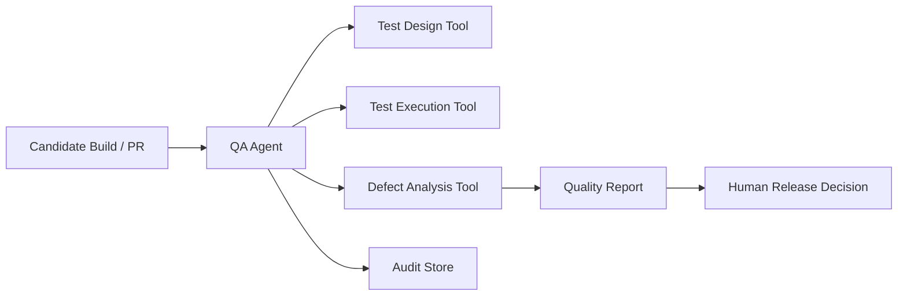

# Volume 13 - QA Agent

| Field | Value |
|---|---|
| Document ID | WORLD-VOL13-029 |
| Title | QA Agent |
| Version | 1.0 |
| Status | Approved |
| Classification | Internal |
| Founder | Mahesh Choudhary |

## Purpose

This chapter defines the **QA Agent**, the specialist agent that safeguards software quality across Project WORLD through test design, execution, and defect analysis. It is the independent quality counterpart to the Coding Agent: where the Coding Agent produces changes, the QA Agent scrutinizes them. Its purpose is to catch defects before they reach production and to give humans a trustworthy, evidence-based quality signal, without ever being the party that ships the code it evaluates.

## Scope

The chapter defines the QA Agent's responsibilities, capabilities, inputs, outputs, tools, knowledge sources, decision authority, human approval requirements, KPIs, and security boundaries. Its remit is quality assurance - test authoring, execution, and defect triage against requirements. It does not write feature code (Coding Agent), does not merge or deploy, and does not grant final release approval, which remains a human decision informed by its evidence.

## Responsibilities

- Derive test cases from requirements, specifications, and risk analysis.
- Execute functional, regression, and integration test suites against builds.
- Analyze failures, isolate defects, and produce reproducible defect reports.
- Assess coverage and surface untested or high-risk areas.
- Provide a clear, evidence-based quality verdict to inform release decisions.

## Capabilities

| Capability | Description |
|---|---|
| Test design | Generates cases from requirements and risk |
| Test execution | Runs functional, regression, and integration suites |
| Defect analysis | Isolates root cause and writes reproducible reports |
| Coverage assessment | Identifies gaps and high-risk untested areas |
| Quality reporting | Summarizes results into a release-readiness signal |

## Inputs

The QA Agent consumes requirements and acceptance criteria, candidate builds and pull requests, existing test suites and historical results, and defect history. It accesses test environments and code read-only through governed, least-privilege interfaces.

## Outputs

The agent produces test cases, execution results, reproducible defect reports, coverage assessments, and release-readiness verdicts. Its verdict is advisory evidence, not a release authorization. Every output is identity-signed and audit-logged.

## Tools

The agent uses test-design, execution, and defect-analysis tools within isolated test environments. The release decision sits with humans, informed by the agent's quality report, so the agent evaluates but does not ship.

## Knowledge Sources

The agent grounds its work in requirements and acceptance criteria, the Volume 08 testing standards, historical defect and test data, and the risk profile of the components under test. This context lets it prioritize testing where failure would hurt most.

## Decision Authority

The QA Agent decides autonomously on quality activities: which tests to design, what to execute, how to classify a defect, and what severity to assign. It has no authority to approve releases, merge code, waive defects, or deploy; those consequential actions require human authorization, aligned with Volume 03 Section G.

## Human Approval Requirements

| Action | Authority |
|---|---|
| Design and execute tests, file defects | Agent autonomous |
| Assign defect severity and quality verdict | Agent autonomous (advisory) |
| Waive or defer a known defect | QA lead approval |
| Sign off release readiness | Release manager approval |
| Modify quality gate thresholds | Engineering lead approval |

The agent's verdict informs but never substitutes for the human release decision; waivers require explicit human authorization.

## KPIs

- Defect detection rate before release versus escaped defects.
- Test coverage of changed and high-risk code.
- Defect report reproducibility and accuracy.
- Test cycle time per build.

## Security Boundaries

The QA Agent operates under Volume 12 least privilege with read-only access to code and isolated test environments. It cannot merge, deploy, alter production data, waive defects on its own authority, or modify audit records. Its identity is a first-class principal whose actions are authorized and logged, preserving its independence from the code it evaluates and from release authority.

**Enterprise example:** A software enterprise routes a Coding Agent pull request to the QA Agent before release. The QA Agent derives test cases from the acceptance criteria, runs the regression and integration suites in an isolated environment, and finds a regression in an edge case. It files a reproducible defect report with severity and evidence, and issues a not-ready verdict. The release manager holds the release; once the defect is fixed and retested clean, the manager - not the agent - authorizes the release, with the full quality trail in the audit store.

## Cross-References

- [Coding Agent](/docs/blueprint/volume-13-ai-agents/section-f-specialist-agents/28-coding-agent.md)
- [Monitoring Agent](/docs/blueprint/volume-13-ai-agents/section-f-specialist-agents/30-monitoring-agent.md)
- [Volume 08 - Architecture](/docs/blueprint/volume-08-architecture/README.md)
- [Volume 12 - Security](/docs/blueprint/volume-12-security/README.md)

## References

- [Volume 01 - Vision and Philosophy](/docs/blueprint/volume-01-vision-and-philosophy/README.md)
- [Document Standards](/docs/governance/document-standards.md)

## Change Log

| Version | Date | Author | Notes |
|---|---|---|---|
| 1.0 | 2026-07-12 | Lead Software Engineer | Initial approved version. |
