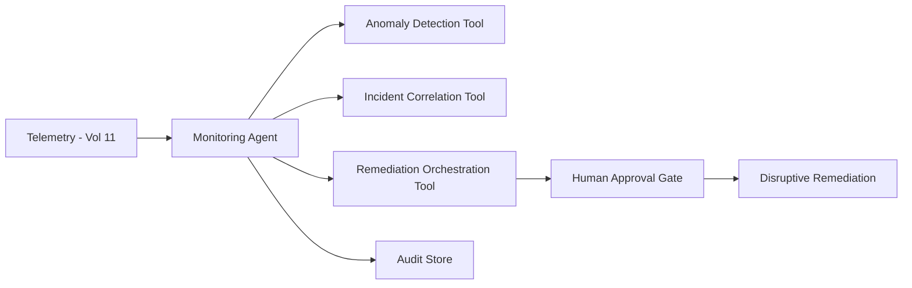

# Volume 13 - Monitoring Agent

| Field | Value |
|---|---|
| Document ID | WORLD-VOL13-030 |
| Title | Monitoring Agent |
| Version | 1.0 |
| Status | Approved |
| Classification | Internal |
| Founder | Mahesh Choudhary |

## Purpose

This chapter defines the **Monitoring Agent**, the specialist agent responsible for the operational health and reliability of Project WORLD's platform and services, aligned with the Volume 11 observability stack. It watches metrics, logs, and traces to detect degradation, correlate symptoms, and drive fast, safe remediation. Its purpose is to keep services reliable and to shorten incidents, while ensuring that any disruptive remediation passes through human authority.

## Scope

The chapter defines the Monitoring Agent's responsibilities, capabilities, inputs, outputs, tools, knowledge sources, decision authority, human approval requirements, KPIs, and security boundaries. Its remit is platform and service reliability - health monitoring, alerting, and remediation recommendation. It does not perform security threat response (Security Agent), does not write application code (Coding Agent), and does not own capacity or architecture strategy, which remain with platform engineering.

## Responsibilities

- Monitor service health signals - metrics, logs, and traces - against defined objectives.
- Detect anomalies and degradations and correlate them into single incidents.
- Alert the right on-call responders with context and probable cause.
- Recommend and, within tight bounds, initiate safe reversible remediations.
- Maintain incident timelines and support blameless post-incident review.

## Capabilities

| Capability | Description |
|---|---|
| Health monitoring | Tracks metrics and SLOs across services |
| Anomaly detection | Flags deviations from healthy baselines |
| Incident correlation | Links related symptoms into one incident narrative |
| Root-cause hinting | Proposes probable causes from signal patterns |
| Remediation planning | Suggests reversible recovery steps for approval |

## Inputs

The Monitoring Agent consumes metrics, logs, distributed traces, service-level objectives, deployment and change events, and the service dependency map. All telemetry is read through governed Volume 11 observability interfaces with least-privilege scope.

## Outputs

The agent produces alerts with context, correlated incident records, root-cause hypotheses, remediation recommendations, and incident timelines. Disruptive remediations above threshold are emitted as approval requests, not executed autonomously. Every output is identity-signed and audit-logged.

## Tools

The agent uses anomaly-detection, correlation, and remediation-orchestration tools. Reversible low-impact actions run autonomously; disruptive remediations are wired behind the human approval gate, so the agent recommends but a human authorizes.

## Knowledge Sources

The agent grounds its work in the Volume 11 observability configuration, service-level objectives, runbooks, the service dependency map, deployment history, and prior incident records. This context lets it separate transient noise from a real reliability threat and propose remediations known to be safe.

## Decision Authority

The Monitoring Agent decides autonomously on low-consequence, reversible actions: raising alerts, correlating incidents, enriching context, and executing a pre-approved safe remediation such as restarting a single unhealthy, stateless instance. Disruptive actions - rolling back a deployment, scaling infrastructure at cost, failing over, or draining traffic - are recommendations requiring human authorization, aligned with Volume 03 Section G.

## Human Approval Requirements

| Action | Authority |
|---|---|
| Raise alert, correlate incident, enrich context | Agent autonomous |
| Restart single stateless unhealthy instance | Agent autonomous (reversible) |
| Roll back a deployment | On-call engineer approval |
| Scale infrastructure incurring cost | Platform lead approval |
| Regional failover or traffic drain | Platform director approval |

Approval requests carry the incident timeline, probable cause, and expected impact; unanswered requests expire safely and escalate rather than execute.

## KPIs

- Mean time to detect and mean time to acknowledge incidents.
- Alert precision - proportion of actionable versus noisy alerts.
- Service-level objective attainment across monitored services.
- Remediation recommendation acceptance rate.

## Security Boundaries

The Monitoring Agent operates under Volume 11 and Volume 12 least privilege with read-mostly telemetry access. It cannot approve its own disruptive actions, cannot alter audit records, and holds only narrowly scoped, pre-approved remediation power. Its identity is a first-class principal whose every action is authorized and logged, so a compromised agent cannot itself become a source of outage.

**Enterprise example:** A SaaS enterprise's Monitoring Agent detects rising latency and error rates on a checkout service shortly after a deployment. It correlates the metrics, logs, and the deploy event into one incident, hypothesizes the new release as the cause, and pages the on-call engineer with a recommendation to roll back. Because rollback is disruptive, the agent does not act alone; the engineer reviews the timeline, approves the rollback, and latency recovers - the entire incident preserved in the audit store for post-incident review.

## Cross-References

- [QA Agent](/docs/blueprint/volume-13-ai-agents/section-f-specialist-agents/29-qa-agent.md)
- [Security Agent](/docs/blueprint/volume-13-ai-agents/section-f-specialist-agents/24-security-agent.md)
- [Volume 11 - Infrastructure](/docs/blueprint/volume-11-infrastructure/README.md)
- [Volume 12 - Security](/docs/blueprint/volume-12-security/README.md)

## References

- [Volume 01 - Vision and Philosophy](/docs/blueprint/volume-01-vision-and-philosophy/README.md)
- [Document Standards](/docs/governance/document-standards.md)

## Change Log

| Version | Date | Author | Notes |
|---|---|---|---|
| 1.0 | 2026-07-12 | Lead Software Engineer | Initial approved version. |
