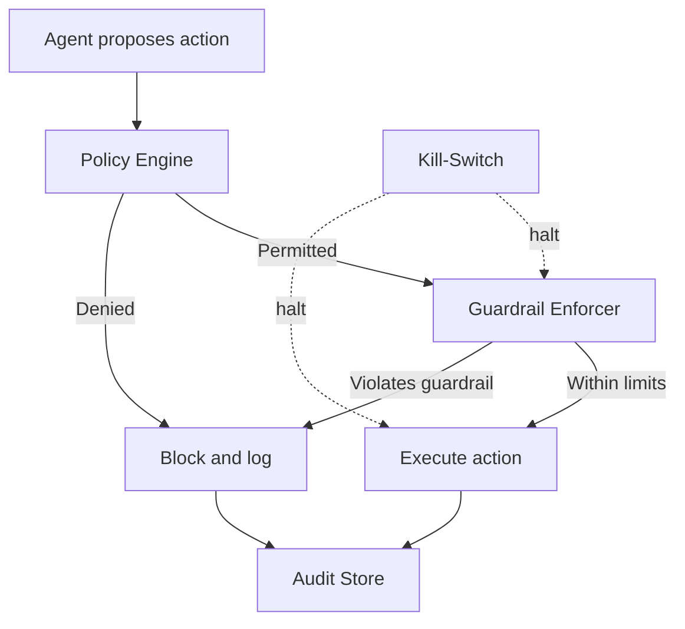

# Volume 13 - Agent Governance

| Field | Value |
|---|---|
| Document ID | WORLD-VOL13-031 |
| Title | Agent Governance |
| Version | 1.0 |
| Status | Approved |
| Classification | Internal |
| Founder | Mahesh Choudhary |

## Purpose

This chapter defines how autonomous agents in Project WORLD are governed so that their power is always bounded, observable, and reversible. Agents act on the business - they move data, invoke tools, and propose consequential actions - and that capability is only acceptable if it operates inside an enforced framework of policy, guardrails, audit, and emergency control. The purpose of agent governance is to make trust a structural property rather than an assumption: every agent runs under explicit policies, cannot exceed hard guardrails, leaves an immutable record of what it did, and can be stopped instantly. This chapter establishes that framework and the roles that own it.

## Scope

The chapter covers the agent policy model, the guardrails that constrain behaviour at runtime, the audit trail that records every action, and the kill-switch that halts agents on demand. It defines who authors and approves agent policy, how guardrails are enforced on the execution path, and how governance decisions are reviewed. It builds directly on the human-in-the-loop governance of Volume 03 (Section G) and the security architecture of Volume 12, applying them to the agent layer. It does not redefine the business rules themselves, which are owned by governance, nor the performance metrics of Chapter 32.

## Concept

From first principles, an autonomous agent must be governed in proportion to what it can affect. Governance is not a single control but a layered system: policy declares what an agent is permitted to do; guardrails enforce those limits at runtime so violations are physically prevented rather than merely discouraged; audit records every decision and action so behaviour is provable after the fact; and the kill-switch guarantees that a misbehaving or compromised agent can be stopped immediately. These four layers are independent, so no single failure removes control. Policy is authored and approved by governance owners, not by the agents themselves, and guardrails are evaluated on the execution path where the agent cannot bypass them. The result is bounded autonomy - agents are free to act, but only inside a fence they cannot move.

## Architecture

Every agent action flows through a governance layer that evaluates policy and guardrails before execution, writes to the audit store, and is subject to an out-of-band kill-switch.

Because the policy engine and guardrail enforcer sit on the execution path, an action cannot proceed unless it is both permitted and within limits. The kill-switch operates out of band and can suspend an individual agent, an agent class, or the entire fleet regardless of what work is in flight.

**Enterprise example:** The Finance Agent attempts to issue a refund. The policy engine confirms refunds are within its remit; the guardrail enforcer checks the amount against its per-action ceiling and the daily aggregate limit. The amount is within the ceiling, so the action executes and is recorded to the audit store with the agent identity, inputs, and outcome. When a later refund exceeds the ceiling, the guardrail blocks it and routes it to human approval. During an incident, an operator triggers the kill-switch for the Finance Agent class, and all in-flight and pending financial actions halt within seconds.

## Key Components

| Component | Responsibility |
|---|---|
| Policy Engine | Evaluates whether a proposed action is permitted for the agent |
| Guardrail Enforcer | Enforces hard runtime limits such as ceilings, scopes, and rate caps |
| Audit Store | Immutable, append-only record of every agent decision and action |
| Kill-Switch | Out-of-band control to suspend an agent, class, or the whole fleet |
| Policy Registry | Versioned store of approved agent policies and their owners |
| Governance Review Board | Human authority that authors, approves, and reviews agent policy |

## Relationship to Other Layers

Agent governance is the agent-layer realization of the human-in-the-loop and governance principles set in Volume 03 (Section G); that volume states the principle and this chapter enforces it at runtime. Identity, non-repudiation, and the immutability of the audit store are guaranteed by the security architecture of Volume 12, so no agent can forge or erase its own record. Guardrails build on agent permissions (Chapter 07) and invoke the human approval model (Chapter 18) whenever a limit is reached. Governance consumes the metrics of agent performance (Chapter 32) as evidence for policy review.

## Trade-offs and Considerations

Strong governance trades some agent throughput for control; every action pays the cost of policy and guardrail evaluation, so those checks are kept efficient and precise. Guardrails set too tightly starve agents of useful autonomy and drive work back to humans; set too loosely they concede safety, so limits are governed, versioned, and reviewed with audit evidence. The kill-switch must be fast and unambiguous, which means accepting that a broad halt may interrupt legitimate work - the correct bias when control is in doubt. Immutable audit adds storage and write overhead, accepted deliberately because provable accountability is foundational to trusting an autonomous fleet.

## Cross-References

- [Agent Permissions](/docs/blueprint/volume-13-ai-agents/section-b-agent-runtime-and-identity/07-agent-permissions.md)
- [Human Approval Model](/docs/blueprint/volume-13-ai-agents/section-d-collaboration-and-control/18-human-approval-model.md)
- [Agent Performance](/docs/blueprint/volume-13-ai-agents/section-g-governance-and-evolution/32-agent-performance.md)
- [Volume 12 - Security](/docs/blueprint/volume-12-security/README.md)

## References

- [Volume 01 - Vision and Philosophy](/docs/blueprint/volume-01-vision-and-philosophy/README.md)
- [Document Standards](/docs/governance/document-standards.md)

## Change Log

| Version | Date | Author | Notes |
|---|---|---|---|
| 1.0 | 2026-07-12 | Lead Software Engineer | Initial approved version. |
