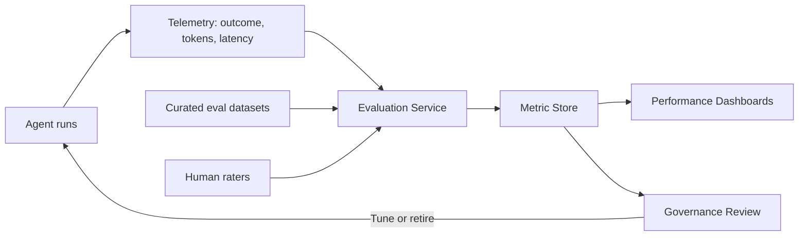

# Volume 13 - Agent Performance

| Field | Value |
|---|---|
| Document ID | WORLD-VOL13-032 |
| Title | Agent Performance |
| Version | 1.0 |
| Status | Approved |
| Classification | Internal |
| Founder | Mahesh Choudhary |

## Purpose

This chapter defines how the performance of agents in Project WORLD is measured, evaluated, and improved. An autonomous fleet is only valuable if it is demonstrably effective, accurate, and affordable, and those properties cannot be assumed - they must be measured continuously against explicit standards. The purpose of agent performance management is to establish the metrics that describe agent behaviour, the evaluation methods that test quality before and after deployment, and the cost accounting that keeps autonomy economically sound. This chapter gives governance the evidence it needs to trust, tune, or retire an agent.

## Scope

The chapter covers evaluation metrics for task success, quality, and latency; offline and online evaluation methods including regression suites and live sampling; quality measurement such as accuracy, faithfulness, and human-rated review; and cost measurement across tokens, tools, and time. It defines how performance is reported to governance and how thresholds trigger review. It builds on agent governance (Chapter 31) and the reflection and learning models of Section C. It does not define the policies that act on the metrics, which belong to governance, nor the runtime guardrails of Chapter 31.

## Concept

From first principles, an agent's performance has three dimensions that must be measured together: effectiveness (does it accomplish the task), quality (is the result correct, faithful, and safe), and cost (what did it consume to do so). Optimizing one in isolation is misleading - a cheap agent that produces wrong answers, or an accurate one that is unaffordable, both fail. WORLD therefore evaluates agents on a balanced scorecard combining outcome, quality, and cost, measured both offline against curated test suites before deployment and online against sampled live traffic after it. Quality is judged against ground truth where it exists and by human raters where judgement is required. Metrics feed governance, which sets thresholds that, when crossed, trigger tuning, additional approval gates, or removal from service.

## Architecture

Agent runs emit telemetry that is scored by an evaluation service against curated datasets and live samples; the resulting metrics flow to dashboards and to the governance review that decides on tuning or retirement.

Because evaluation runs both offline and online, quality regressions are caught before release and drift is detected after it. The metric store is the single source of truth that dashboards and governance both read.

**Enterprise example:** The Research Agent is evaluated offline against a curated set of questions with known-good answers, scoring task success and faithfulness before a new version ships. After release, a sample of live runs is scored by both automated faithfulness checks and periodic human review, while token and tool costs per task are tracked. When faithfulness on live traffic drops below the governed threshold, the metric store flags it, the dashboard surfaces the drift, and the governance review pauses the new version and reverts to the prior one pending tuning.

## Key Components

| Component | Responsibility |
|---|---|
| Telemetry Pipeline | Captures outcome, quality signals, latency, and cost from every run |
| Evaluation Service | Scores runs against curated datasets, automated checks, and human ratings |
| Curated Eval Datasets | Versioned ground-truth sets for offline regression testing |
| Metric Store | Authoritative store of performance metrics over time |
| Performance Dashboards | Present success, quality, latency, and cost trends to owners |
| Cost Accounting | Attributes token, tool, and time cost to agents and tasks |

## Relationship to Other Layers

Agent performance supplies the evidence that agent governance (Chapter 31) uses to approve, constrain, or retire agents. Its quality signals draw on the reflection engine (Chapter 13) and inform the learning model (Chapter 14), which improves agents over successive versions. Telemetry travels over the observability and event infrastructure of Volumes 10 and 11, and cost accounting aligns with the financial visibility expectations of the broader platform. Human-rated evaluation uses the same approver identity guarantees as Volume 12 so that ratings are attributable.

## Trade-offs and Considerations

Rich evaluation costs compute and human time; comprehensive scoring of every run is unaffordable, so WORLD samples live traffic and reserves full evaluation for releases and flagged cases. Offline suites give repeatable signals but can drift from reality, so they are refreshed from live data; online evaluation reflects reality but is noisier, so the two are used together. Optimizing a single metric invites gaming - chasing task success can erode quality or cost - so the balanced scorecard is enforced. Human ratings are the gold standard for judgement but are slow and variable, so they are used where automated checks cannot substitute and are calibrated across raters.

## Cross-References

- [Agent Governance](/docs/blueprint/volume-13-ai-agents/section-g-governance-and-evolution/31-agent-governance.md)
- [Reflection Engine](/docs/blueprint/volume-13-ai-agents/section-c-agent-cognition/13-reflection-engine.md)
- [Learning Model](/docs/blueprint/volume-13-ai-agents/section-c-agent-cognition/14-learning-model.md)
- [Future Agent Evolution](/docs/blueprint/volume-13-ai-agents/section-g-governance-and-evolution/33-future-agent-evolution.md)

## References

- [Volume 01 - Vision and Philosophy](/docs/blueprint/volume-01-vision-and-philosophy/README.md)
- [Document Standards](/docs/governance/document-standards.md)

## Change Log

| Version | Date | Author | Notes |
|---|---|---|---|
| 1.0 | 2026-07-12 | Lead Software Engineer | Initial approved version. |
