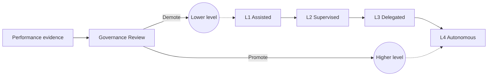

# Volume 13 - Future Agent Evolution

| Field | Value |
|---|---|
| Document ID | WORLD-VOL13-033 |
| Title | Future Agent Evolution |
| Version | 1.0 |
| Status | Approved |
| Classification | Internal |
| Founder | Mahesh Choudhary |

## Purpose

This chapter sets the direction for how agents in Project WORLD grow in capability and autonomy over time without ever outrunning governance. Agents will become more capable as models, tools, and knowledge improve, and the platform must have a principled way to grant them more independence when they have earned it and to pull it back when they have not. The purpose of this chapter is to define the autonomy-level model that structures this evolution: a graduated ladder in which each rung is unlocked by evidence, bounded by governance, and reversible. It describes the direction of travel without committing to dates.

## Scope

The chapter defines the autonomy levels from assisted to fully autonomous, the criteria for promoting or demoting an agent between levels, and the governance controls that apply at each. It covers how increasing capability is matched by increasing oversight rather than replacing it. It builds on agent governance (Chapter 31), agent performance (Chapter 32), and the human approval model (Chapter 18). It deliberately avoids fixed timelines and specific technology bets; it establishes principles and the ladder, not a roadmap with dates.

## Concept

From first principles, autonomy should be earned, graduated, and reversible. An agent begins assisted - proposing actions a human executes - and advances only as it accumulates evidence of reliability, quality, and safe behaviour under real conditions. WORLD models this as a ladder of autonomy levels, each defining what the agent may do unattended and what still requires human authorization. Movement up the ladder is a governance decision backed by performance evidence, not a technical default; movement down is always available and is triggered automatically when performance degrades or incidents occur. Crucially, higher autonomy never means less oversight - it means oversight shifts from approving each action to supervising outcomes and holding the kill-switch. This keeps evolution safe: capability can grow indefinitely while control remains absolute.

## Architecture

Agents occupy an autonomy level; performance evidence and governance review promote or demote them, and each level maps to a distinct set of approval and guardrail settings.

Each level is a preset of the governance controls defined in Chapter 31: lower levels gate more actions for human approval and apply tighter guardrails, higher levels widen autonomous scope while retaining audit and the kill-switch. Promotion and demotion simply change which preset is active.

**Enterprise example:** The Operations Agent starts at L1 Assisted, drafting reorder proposals that a planner executes. After sustained high task success and no safety incidents, governance promotes it to L2 Supervised, where it places routine reorders below a value ceiling and escalates the rest. Over time it reaches L3 Delegated for a bounded product category. When a supplier data problem causes a spike in erroneous proposals, the performance metrics trip a threshold and the agent is automatically demoted to L2 until the issue is resolved - capability paused, control retained.

## Key Components

| Component | Responsibility |
|---|---|
| Autonomy Level Model | Defines the graduated levels and what each permits unattended |
| Promotion Criteria | Evidence thresholds an agent must meet to advance a level |
| Demotion Triggers | Conditions that automatically reduce an agent's autonomy |
| Level-to-Control Mapping | Binds each level to approval gates and guardrail presets |
| Governance Review | Human authority that ratifies promotions and reviews demotions |
| Evolution Audit Record | History of every level change and its justification |

## Relationship to Other Layers

The autonomy ladder is enforced through agent governance (Chapter 31): each level is a configuration of its policy, guardrails, and kill-switch. Promotion and demotion decisions are driven by the metrics of agent performance (Chapter 32) and the improvement produced by the learning model (Chapter 14). At every level the human approval model (Chapter 18) defines which actions still require authorization, and the security guarantees of Volume 12 ensure level changes are attributable and immutable. The direction set here operationalizes the long-term vision of Volume 01 within enforceable bounds.

## Trade-offs and Considerations

Graduated autonomy trades speed of capability rollout for safety; an agent could technically be trusted sooner than its evidence allows, and WORLD deliberately advances only on proof. Automatic demotion may interrupt legitimate work when a threshold trips, which is the correct bias when reliability is in question. Defining objective promotion criteria is hard, so criteria are governed and refined as evidence accumulates rather than fixed once. Withholding dates avoids over-committing to an uncertain technology trajectory, at the cost of less predictability - an acceptable trade because premature timelines would pressure unsafe promotion. Throughout, the invariant holds: autonomy may rise, but audit and the kill-switch never yield.

## Cross-References

- [Agent Governance](/docs/blueprint/volume-13-ai-agents/section-g-governance-and-evolution/31-agent-governance.md)
- [Agent Performance](/docs/blueprint/volume-13-ai-agents/section-g-governance-and-evolution/32-agent-performance.md)
- [Human Approval Model](/docs/blueprint/volume-13-ai-agents/section-d-collaboration-and-control/18-human-approval-model.md)
- [Volume 03 - AI Business Partner](/docs/blueprint/volume-03-ai-business-partner/README.md)

## References

- [Volume 01 - Vision and Philosophy](/docs/blueprint/volume-01-vision-and-philosophy/README.md)
- [Document Standards](/docs/governance/document-standards.md)

## Change Log

| Version | Date | Author | Notes |
|---|---|---|---|
| 1.0 | 2026-07-12 | Lead Software Engineer | Initial approved version. |
