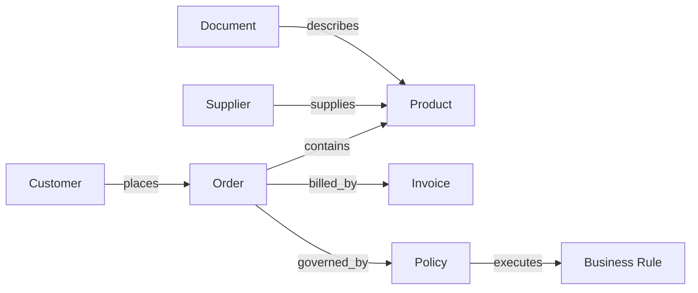

# Volume 14 - Ontology Catalog

| Field | Value |
|---|---|
| Document ID | WORLD-VOL14-A3 |
| Title | Ontology Catalog |
| Version | 1.0 |
| Status | Approved |
| Classification | Internal |
| Founder | Mahesh Choudhary |

## Purpose

This appendix catalogs the core business ontology of Project WORLD: the canonical entities and the relationships between them that the Knowledge Engine uses to structure and connect knowledge. Where the Ontology chapter (Chapter 17) defines the discipline, this appendix provides the concrete reference list of entity types and relationship types that authors, the semantic layer, and the knowledge graph should treat as the shared vocabulary of meaning across the enterprise. Its purpose is to make the ontology usable: one place to look up what a Customer, an Order, or a Policy is, and how each connects to the others.

## Scope

The catalog lists the core entity types, their descriptions, and the principal relationship types that link them, and gives a worked graph example. It covers the cross-domain business ontology shared across WORLD, not domain- or industry-specific extensions, which inherit from this core. It does not specify graph storage, embedding, or retrieval mechanics; those are covered in Sections C and D. The catalog is a reference vocabulary, not an exhaustive schema.

## Core Entities

| Entity | Description |
|---|---|
| Organization | A company, division, or legal entity that WORLD serves or transacts with. |
| Person | An individual actor: an employee, contact, or user. |
| Customer | An organization or person that purchases goods or services. |
| Supplier | An organization or person that provides goods or services. |
| Product | A good or service offered, sold, or consumed. |
| Order | A commercial transaction record for products between parties. |
| Invoice | A financial document requesting payment for an order. |
| Policy | A governed statement of what may or must be done. |
| SOP | A governed procedure specifying how work is performed. |
| Business Rule | Executable logic constraining or automating a decision. |
| Document | An unstructured or semi-structured knowledge artifact. |
| Account | A financial or customer account aggregating related records. |

## Core Relationships

| Relationship | From | To | Meaning |
|---|---|---|---|
| places | Customer | Order | A customer initiates an order. |
| contains | Order | Product | An order includes one or more products. |
| billed_by | Order | Invoice | An order is billed through an invoice. |
| supplies | Supplier | Product | A supplier provides a product. |
| governed_by | Order | Policy | A transaction is subject to a policy. |
| executes | SOP | Business Rule | A procedure applies executable rules. |
| employs | Organization | Person | An organization employs a person. |
| describes | Document | Product | A document provides knowledge about a product. |

## Example Graph

The graph below shows how a single customer order connects across entities, giving the retrieval layer a traversable web of meaning rather than isolated records.

With this structure in place, a query about an order can traverse to the governing policy, the executable rule, the supplying supplier, and the describing document in a single connected retrieval, which is what lets the AI Business Partner answer relationally rather than in fragments.

## Cross-References

- [Ontology](/docs/blueprint/volume-14-knowledge-engine/section-d-structure-and-semantics/17-ontology.md)
- [Knowledge Graph](/docs/blueprint/volume-14-knowledge-engine/section-a-knowledge-foundations/03-knowledge-graph.md)
- [Knowledge Relationships](/docs/blueprint/volume-14-knowledge-engine/section-d-structure-and-semantics/16-knowledge-relationships.md)

## References

- [Volume 01 - Vision and Philosophy](/docs/blueprint/volume-01-vision-and-philosophy/README.md)
- [Document Standards](/docs/governance/document-standards.md)

## Change Log

| Version | Date | Author | Notes |
|---|---|---|---|
| 1.0 | 2026-07-12 | Lead Software Engineer | Initial approved version. |
