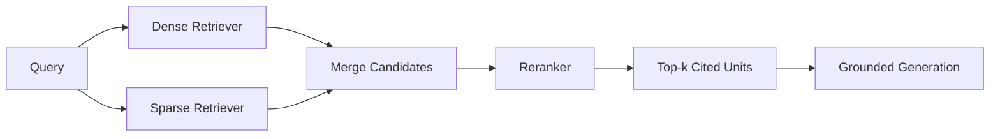

# Volume 14 - Retrieval Patterns

| Field | Value |
|---|---|
| Document ID | WORLD-VOL14-A6 |
| Title | Retrieval Patterns |
| Version | 1.0 |
| Status | Approved |
| Classification | Internal |
| Founder | Mahesh Choudhary |

## Purpose

This appendix catalogs the retrieval patterns available to the Knowledge Engine of Project WORLD and gives guidance on when each applies. Retrieval is not one algorithm but a family of them, each suited to a different query shape and quality target. Where the Retrieval Engine chapter (Chapter 12) defines the mechanism, this appendix provides the practitioner's reference: the named patterns, their intent, and the conditions under which the retrieval layer should select each. Its purpose is to make retrieval choices deliberate and consistent rather than ad hoc.

## Scope

The document describes the core retrieval and RAG patterns - naive RAG, hybrid retrieval, reranking, graph RAG, and query rewriting - with the intent of each and its when-to-use conditions, and illustrates one with a diagram. It covers cross-cutting patterns applicable across sources; source-specific tuning inherits from these. It does not specify embedding models, index structures, or vector-store selection, which are covered in Chapters 13 to 15. The catalog is a selection guide, not an implementation manual.

## Pattern Catalog

| Pattern | Intent | When to Use |
|---|---|---|
| Naive RAG | Retrieve top-k units by vector similarity and generate from them | Simple factual queries over a clean, homogeneous corpus |
| Hybrid Retrieval | Combine dense (vector) and sparse (keyword) retrieval | Queries mixing exact terms (codes, names) with conceptual meaning |
| Reranking | Re-score retrieved candidates with a stronger relevance model | Precision-critical answers where top-k recall is broad but noisy |
| Graph RAG | Traverse the knowledge graph to gather connected context | Relational questions spanning entities, policies, and rules |
| Query Rewriting | Reformulate or decompose the query before retrieval | Vague, multi-part, or conversational queries needing clarification |
| Query Expansion | Enrich the query with related terms or synonyms | Recall-sensitive queries where vocabulary mismatch is likely |

## Pattern Detail: Hybrid Retrieval with Reranking

The most common production pattern in WORLD combines hybrid retrieval with a reranking stage, balancing recall and precision. Dense and sparse retrievers run in parallel, their candidates are merged, and a reranker orders the merged set before the top results are passed to generation with citations.

This pattern is the sensible default for enterprise queries because it captures both exact matches (an invoice number, a policy code) and conceptual matches (the intent behind a question), then uses the reranker to promote the genuinely relevant units to the top before grounding the answer.

## Selection Guidance

Choose the simplest pattern that meets the quality target: naive RAG for clean factual lookups, hybrid when queries mix identifiers and concepts, reranking when precision matters more than latency, graph RAG when the answer depends on relationships between entities, and query rewriting or expansion when the query itself is the weak link. Patterns compose - query rewriting can precede hybrid retrieval, which can precede reranking - and the retrieval engine selects and chains them by query classification rather than applying one fixed pipeline to every request.

## Cross-References

- [Retrieval Engine](/docs/blueprint/volume-14-knowledge-engine/section-c-retrieval-and-context/12-retrieval-engine.md)
- [Semantic Search](/docs/blueprint/volume-14-knowledge-engine/section-c-retrieval-and-context/13-semantic-search.md)
- [Knowledge Glossary](/docs/blueprint/volume-14-knowledge-engine/appendices/knowledge-glossary.md)

## References

- [Volume 01 - Vision and Philosophy](/docs/blueprint/volume-01-vision-and-philosophy/README.md)
- [Document Standards](/docs/governance/document-standards.md)

## Change Log

| Version | Date | Author | Notes |
|---|---|---|---|
| 1.0 | 2026-07-12 | Lead Software Engineer | Initial approved version. |
