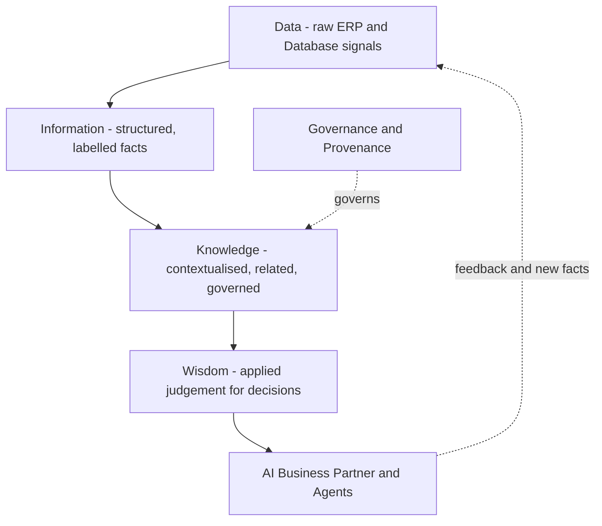

# Volume 14 - Knowledge Philosophy

| Field | Value |
|---|---|
| Document ID | WORLD-VOL14-001 |
| Title | Knowledge Philosophy |
| Version | 1.0 |
| Status | Approved |
| Classification | Internal |
| Founder | Mahesh Choudhary |

## Purpose

Project WORLD is an AI-Native Business Operating System. The AI Business Partner of Volume 03 is its intelligence and the AI Agents of Volume 13 are its hands; the Knowledge Engine is its memory and understanding. This chapter establishes the first principles of what knowledge is in WORLD, why an enterprise needs an engineered knowledge layer, and the non-negotiable convictions that every later chapter of this volume inherits. It is the philosophical foundation on which the knowledge lifecycle, graph, registry, sources, retrieval, and governance are built.

## Scope

The chapter defines the concept of knowledge in WORLD, the DIKW progression that structures it, and the convictions that govern every knowledge asset. It frames the boundary between raw operational data owned by the Database (Volume 09) and the curated, contextual knowledge the engine serves to AI. It does not specify lifecycle mechanics (Chapter 02), graph structure (Chapter 03), or the registry (Chapter 04); it sets the convictions those chapters implement.

## Architecture

Knowledge in WORLD is engineered along the DIKW progression - Data, Information, Information contextualised as Knowledge, and Knowledge applied as Wisdom. Raw signals from the ERP and Database are refined into information, related and contextualised into knowledge, and surfaced as wisdom that grounds decisions. The Knowledge Engine sits between the systems of record and the AI reasoning layer, transforming facts into understanding.

Every layer is grounded in provenance and governance: nothing becomes knowledge without a traceable source, and nothing becomes wisdom without passing the enterprise's quality and trust controls.

## Data Flow

Knowledge flows from origination to application. Operational data is captured by the ERP and persisted by the Database; the Knowledge Engine ingests, refines, and relates it into governed knowledge assets; the AI layer retrieves that knowledge as grounded context; and decisions taken by humans and agents generate new facts that re-enter the flow. The cycle is continuous - the enterprise's understanding compounds rather than resets.

| Stage | Input | Transformation | Output |
|---|---|---|---|
| Capture | Business events | Recording in systems of record | Operational data |
| Refine | Operational data | Cleansing, structuring, labelling | Information |
| Contextualise | Information | Relating, annotating, governing | Knowledge asset |
| Apply | Knowledge asset | Retrieval and reasoning | Grounded decision |

## Relationship with AI

The Knowledge Engine is the grounding substrate for the AI Business Partner (Volume 03) and AI Agents (Volume 13). Rather than reasoning from unmoored model priors, WORLD's intelligence reasons over the enterprise's own facts, policies, and history. This is the difference between a confident guess and a grounded answer. Every conviction here - provenance, currency, and governance - exists so that AI conclusions are traceable to enterprise truth and defensible under audit.

## Relationship with ERP

The ERP (Volumes 05-06) is the primary system of record and therefore the primary source of knowledge. Master data, transactions, and business rules originate as ERP facts. The Knowledge Engine does not duplicate the ERP; it contextualises it, adding relationships, definitions, and provenance that the transactional system does not itself hold. The ERP owns the fact that an invoice exists; the Knowledge Engine understands what that invoice means in the web of customer, contract, and policy.

## Relationship with Analytics

Business Intelligence and Decision Science (Volume 04) consume knowledge as curated, trustworthy input. Analytics answers "what happened and what will happen"; the Knowledge Engine ensures those answers are computed over governed, well-defined, provenance-bearing knowledge rather than ambiguous raw extracts. Shared definitions maintained here become the semantic backbone of every metric and model downstream.

## Implementation Strategy

WORLD implements knowledge philosophy as enforced practice, not aspiration. Every knowledge asset carries provenance and an owner; every asset has a defined currency and review cadence; every asset is classified and access-governed under Volume 12. The engine is built to prefer a small body of trusted, current knowledge over a large body of unverified content. Autonomy of knowledge - its promotion from information to wisdom - is a graduated privilege earned through validation, mirroring the graduated autonomy of agents in Volume 13.

**Enterprise example:** A mid-market manufacturer's ERP records that a supplier's on-time delivery rate fell to 82 percent. On its own this is information. The Knowledge Engine relates it to the supplier's contract SLA, the affected production lines, and the governing procurement policy, producing knowledge: this supplier is now in breach of its service commitment. When the Procurement Agent of Volume 13 reasons about re-sourcing, it retrieves this grounded knowledge - with provenance back to the originating ERP records - and the AI Business Partner can defend its recommendation to a human buyer with a fully traceable chain of reasoning.

## Key Components

| Component | Definition | Principle Enforced |
|---|---|---|
| Knowledge Asset | A governed unit of contextualised understanding | Traceability |
| Provenance | The traceable origin of every asset | Grounding |
| DIKW Progression | Data to Wisdom refinement path | Structured understanding |
| Ownership | The accountable steward of an asset | Accountability |
| Currency | The freshness and review cadence of an asset | Trust |
| Classification | The sensitivity and access tier of an asset | Governed access |

## Cross-References

- [Knowledge Lifecycle](/docs/blueprint/volume-14-knowledge-engine/section-a-knowledge-foundations/02-knowledge-lifecycle.md)
- [Knowledge Graph](/docs/blueprint/volume-14-knowledge-engine/section-a-knowledge-foundations/03-knowledge-graph.md)
- [Volume 03 - AI Business Partner](/docs/blueprint/volume-03-ai-business-partner/README.md)
- [Volume 09 - Database](/docs/blueprint/volume-09-database/README.md)

## References

- [Volume 01 - Vision and Philosophy](/docs/blueprint/volume-01-vision-and-philosophy/README.md)
- [Document Standards](/docs/governance/document-standards.md)

## Change Log

| Version | Date | Author | Notes |
|---|---|---|---|
| 1.0 | 2026-07-12 | Lead Software Engineer | Initial approved version. |
