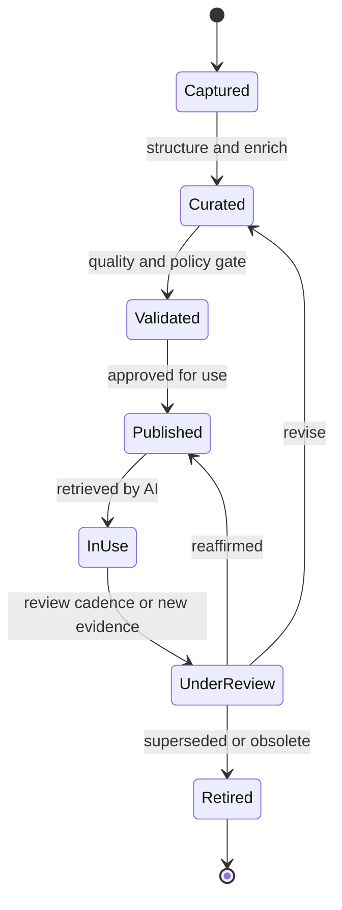

# Volume 14 - Knowledge Lifecycle

| Field | Value |
|---|---|
| Document ID | WORLD-VOL14-002 |
| Title | Knowledge Lifecycle |
| Version | 1.0 |
| Status | Approved |
| Classification | Internal |
| Founder | Mahesh Choudhary |

## Purpose

Knowledge that is not maintained decays into misinformation. This chapter defines the managed lifecycle every knowledge asset in WORLD follows from creation to retirement, so that the Knowledge Engine serves the AI layer only current, validated, and governed understanding. It operationalises the philosophy of Chapter 01: provenance, currency, ownership, and classification are enforced at each lifecycle stage rather than assumed.

## Scope

The chapter defines the lifecycle stages - capture, curate, validate, publish, use, review, and retire - and the transitions, gates, and roles that govern them. It frames how assets move between states and how quality is preserved over time. It does not detail the graph structure (Chapter 03), the registry that indexes assets (Chapter 04), or validation internals (Chapter 21); it establishes the lifecycle those chapters serve.

## Architecture

Every knowledge asset progresses through an explicit state machine. An asset is captured from a source, curated into a structured form, validated against quality and policy gates, published for use, and continuously reviewed. When it becomes stale or superseded it is retired - never silently deleted, preserving auditable history under Volume 12.

Each transition is a governed gate with an accountable owner. Promotion to Published requires passing validation; demotion or retirement requires a recorded rationale.

## Data Flow

The lifecycle is driven by events. Source changes trigger capture; curation enriches and relates the asset; validation gates it; publication makes it retrievable; usage generates signals; and review cadences or contradicting evidence reopen assets. Signals from AI usage - which assets were retrieved, cited, or found unhelpful - feed back into review prioritisation.

| Stage | Trigger | Owner | Gate |
|---|---|---|---|
| Capture | New or changed source | Knowledge Steward | Source is authorised |
| Curate | Captured asset | Domain Expert | Structure and metadata complete |
| Validate | Curated asset | Governance | Quality and policy pass |
| Publish | Validated asset | Knowledge Owner | Approval recorded |
| Review | Cadence or new evidence | Knowledge Steward | Currency confirmed |
| Retire | Superseded or obsolete | Knowledge Owner | Rationale recorded |

## Relationship with AI

The AI Business Partner (Volume 03) and AI Agents (Volume 13) only ever retrieve Published assets, guaranteeing that grounded reasoning draws on validated knowledge. Usage telemetry from AI retrieval is a first-class lifecycle input: assets that agents repeatedly find outdated are flagged for review, so the AI layer actively improves the knowledge base it depends on. This closes the loop between understanding and use.

## Relationship with ERP

ERP events (Volumes 05-06) are primary lifecycle triggers. A changed price list, a revised approval policy, or a new supplier contract each originates a capture event. The lifecycle ensures ERP changes propagate into knowledge in a governed, reviewable way rather than as silent drift, keeping the enterprise's understanding synchronised with its operational reality.

## Relationship with Analytics

Analytics (Volume 04) depends on lifecycle discipline for metric integrity. When a metric definition or business rule changes, the lifecycle governs its curation, validation, and publication, so dashboards and models never silently shift meaning. Lifecycle state - Published versus Retired - directly determines which definitions analytics may compute against.

## Implementation Strategy

WORLD implements the lifecycle as an enforced workflow, not a convention. Each asset carries its state, owner, and next-review date. Automated review cadences raise tasks when currency expires; retirement preserves history for audit. The strategy favours frequent, lightweight review over rare, heavy re-certification, keeping the knowledge base continuously fresh. Lifecycle governance aligns with the versioning and validation chapters of Section E.

**Enterprise example:** A distributor updates its returns policy. The policy document change triggers a capture event; a domain expert curates the new terms and relates them to affected SKUs and regions; governance validates the change against compliance rules; the Knowledge Owner publishes it. The prior policy is moved to Retired with a rationale, not deleted. When a Customer Service Agent later reasons about a return, it retrieves only the Published policy, while an auditor can still trace exactly which policy governed a decision made last quarter.

## Key Components

| Component | Definition | Role in Lifecycle |
|---|---|---|
| State Machine | The defined asset states and transitions | Governs progression |
| Lifecycle Gate | A control that must pass before transition | Enforces quality |
| Knowledge Owner | Accountable steward of an asset | Approves publish and retire |
| Review Cadence | Scheduled currency check | Prevents decay |
| Usage Telemetry | Signals from AI retrieval | Prioritises review |
| Retirement Record | Preserved rationale and history | Ensures auditability |

## Cross-References

- [Knowledge Philosophy](/docs/blueprint/volume-14-knowledge-engine/section-a-knowledge-foundations/01-knowledge-philosophy.md)
- [Knowledge Registry](/docs/blueprint/volume-14-knowledge-engine/section-a-knowledge-foundations/04-knowledge-registry.md)
- [Volume 04 - Business Intelligence and Decision Science](/docs/blueprint/volume-04-business-intelligence-and-decision-science/README.md)
- [Volume 13 - AI Agents](/docs/blueprint/volume-13-ai-agents/README.md)

## References

- [Volume 01 - Vision and Philosophy](/docs/blueprint/volume-01-vision-and-philosophy/README.md)
- [Document Standards](/docs/governance/document-standards.md)

## Change Log

| Version | Date | Author | Notes |
|---|---|---|---|
| 1.0 | 2026-07-12 | Lead Software Engineer | Initial approved version. |
