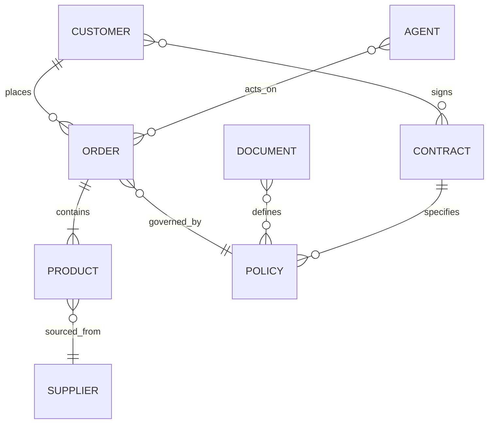

# Volume 14 - Knowledge Graph

| Field | Value |
|---|---|
| Document ID | WORLD-VOL14-003 |
| Title | Knowledge Graph |
| Version | 1.0 |
| Status | Approved |
| Classification | Internal |
| Founder | Mahesh Choudhary |

## Purpose

Knowledge derives its meaning from relationships, not from isolated facts. This chapter defines the WORLD Knowledge Graph - the connected model of enterprise entities and the relationships between them that turns information into understanding. The graph is the structural realisation of the DIKW contextualisation step from Chapter 01, and the substrate over which the AI layer traverses to reason about business reality.

## Scope

The chapter defines the graph's entity and relationship model, its grounding in ERP and Database data, and how it is traversed for grounded reasoning. It frames the core node and edge types that the ontology (Chapter 17) later formalises. It does not specify embeddings (Chapter 14), the vector strategy (Chapter 15), or the full ontology; it establishes the graph those chapters extend.

## Architecture

The Knowledge Graph models the enterprise as typed nodes - customers, products, orders, policies, documents, agents - connected by typed, directional relationships. Every node is grounded in a system of record, and every edge carries provenance. The graph overlays the relational Database (Volume 09) with a semantic layer optimised for traversal and reasoning rather than transactions.

Nodes and edges are versioned and governed under the same lifecycle as any knowledge asset, so the graph is always a current, auditable representation of enterprise structure.

## Data Flow

The graph is populated by projecting Database records and ERP objects into typed nodes, then inferring or asserting edges from foreign keys, business rules, and curated relationships. Retrieval traverses the graph from an anchor node to gather a connected context subgraph, which the AI layer consumes as grounded reasoning input.

| Element | Source | Grounding | Example |
|---|---|---|---|
| Node | Database or ERP object | System of record ID | Customer C-1042 |
| Edge | Foreign key or curated relation | Provenance record | places -> Order O-88 |
| Property | Attribute or annotation | Source field | Order value 42,000 |
| Subgraph | Traversal result | Anchor node | Customer plus orders plus policies |

## Relationship with AI

The graph is the primary structure over which the AI Business Partner (Volume 03) and AI Agents (Volume 13) reason. Where semantic search finds relevant text, graph traversal reveals how entities connect - enabling multi-hop reasoning such as "which customers are exposed to a supplier's delay." Grounding AI in the graph makes its conclusions explainable: every inference can be traced along explicit, provenance-bearing edges.

## Relationship with ERP

The graph's nodes are projections of ERP entities (Volumes 05-06) - orders, invoices, materials, vendors - and its edges encode the business relationships the ERP enforces transactionally. The graph does not replace ERP referential integrity; it exposes it as a traversable semantic network so that meaning, not just structure, is queryable.

## Relationship with Analytics

Analytics (Volume 04) uses the graph to enrich metrics with relational context - attributing revenue along customer-contract-product paths, or tracing risk propagation across supplier networks. The shared entity model ensures that a "customer" in a dashboard is the same governed node the AI reasons over, eliminating definitional divergence between analysis and intelligence.

## Implementation Strategy

WORLD builds the graph as a governed overlay on the Database Knowledge Data of Volume 09 (Chapter 09), synchronised through the knowledge lifecycle. Node and edge types are defined by the ontology and constrained by the taxonomy of Section D. The strategy favours a curated, high-precision core graph extended by inferred relationships that carry confidence and provenance, so reasoning can weight asserted facts above inferred ones. Traversal is optimised for the bounded context subgraphs that AI retrieval requires.

**Enterprise example:** A supplier notifies a manufacturer of a two-week component delay. Anchored on the Supplier node, the AI Business Partner traverses sourced_from to the affected Products, contains to open Orders, and places to the Customers behind them, then follows governed_by to the SLA Policies at risk. In a single grounded traversal it identifies three customers whose contractual delivery commitments are exposed, and the Procurement Agent proposes mitigations - each recommendation traceable along explicit graph edges.

## Key Components

| Component | Definition | Role in Graph |
|---|---|---|
| Node | A typed enterprise entity | Unit of meaning |
| Edge | A typed, directional relationship | Connective context |
| Property | An attribute on a node or edge | Descriptive detail |
| Provenance | Traceable origin of a node or edge | Grounding and audit |
| Subgraph | A connected context slice | Reasoning input |
| Confidence | Weight on inferred relationships | Reasoning precision |

## Cross-References

- [Knowledge Philosophy](/docs/blueprint/volume-14-knowledge-engine/section-a-knowledge-foundations/01-knowledge-philosophy.md)
- [Knowledge Registry](/docs/blueprint/volume-14-knowledge-engine/section-a-knowledge-foundations/04-knowledge-registry.md)
- [Volume 09 - Database](/docs/blueprint/volume-09-database/README.md)
- [Volume 03 - AI Business Partner](/docs/blueprint/volume-03-ai-business-partner/README.md)

## References

- [Volume 01 - Vision and Philosophy](/docs/blueprint/volume-01-vision-and-philosophy/README.md)
- [Document Standards](/docs/governance/document-standards.md)

## Change Log

| Version | Date | Author | Notes |
|---|---|---|---|
| 1.0 | 2026-07-12 | Lead Software Engineer | Initial approved version. |
