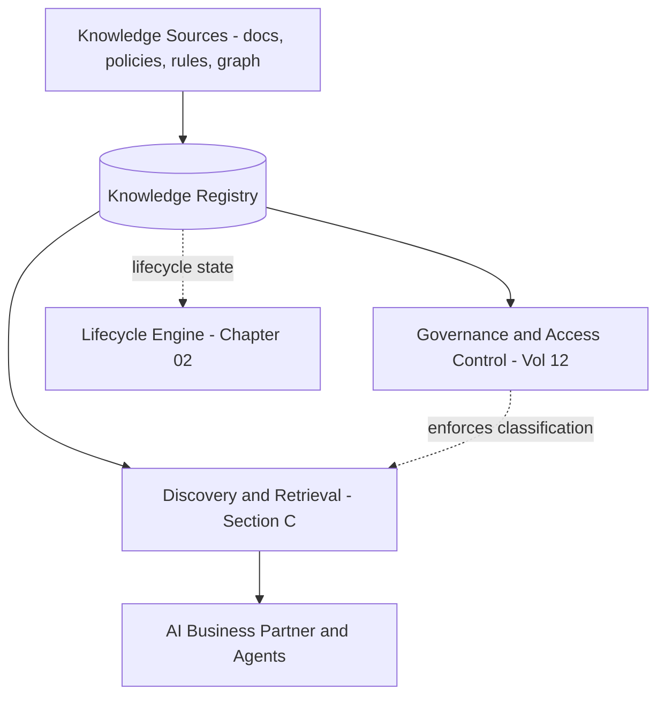

# Volume 14 - Knowledge Registry

| Field | Value |
|---|---|
| Document ID | WORLD-VOL14-004 |
| Title | Knowledge Registry |
| Version | 1.0 |
| Status | Approved |
| Classification | Internal |
| Founder | Mahesh Choudhary |

## Purpose

A body of knowledge that cannot be found, trusted, or governed is not an asset. This chapter defines the WORLD Knowledge Registry - the authoritative catalogue that indexes every knowledge asset with its identity, provenance, lifecycle state, ownership, and classification. The registry is the control plane of the Knowledge Engine: it is how the AI layer discovers knowledge and how governance enforces trust over it.

## Scope

The chapter defines the registry's catalogue model, the metadata it holds for each asset, and how it mediates discovery, access, and governance. It frames the registry as the index across sources (Section B), the graph (Chapter 03), and retrieval (Section C). It does not specify metadata standards in full (Chapter 19) or security internals (Chapter 23); it establishes the registry those chapters detail and enforce.

## Architecture

The registry is a governed catalogue that holds a metadata record for every knowledge asset - documents, policies, business rules, graph nodes, and datasets alike - regardless of where the asset physically resides. Each record carries a stable identifier, provenance, lifecycle state, owner, classification, and location pointer. Retrieval and governance both query the registry rather than the underlying stores directly.

The registry never stores the knowledge content itself; it is the single authoritative index of what exists, where it lives, and under what governance it may be used.

## Data Flow

When an asset is captured, a registry record is created; as the asset moves through its lifecycle, its record is updated; when it retires, the record is preserved and marked accordingly. Every retrieval request first resolves against the registry, which returns only assets the requester is authorised to see and that are in a usable lifecycle state.

| Field | Purpose | Example |
|---|---|---|
| Asset ID | Stable unique identifier | KA-2026-00417 |
| Type | Asset category | Policy |
| Provenance | Origin and lineage | ERP contract module |
| Lifecycle State | Current state | Published |
| Owner | Accountable steward | Head of Procurement |
| Classification | Sensitivity tier | Internal |
| Location | Pointer to content | doc-store://policies/returns |

## Relationship with AI

The AI Business Partner (Volume 03) and AI Agents (Volume 13) discover knowledge exclusively through the registry, guaranteeing that every retrieval is scoped to authorised, published, provenance-bearing assets. The registry gives AI a trustworthy map of what the enterprise knows, so agents ground their reasoning in catalogued truth rather than uncontrolled content and can cite the exact asset behind every conclusion.

## Relationship with ERP

Many registry records point to knowledge derived from ERP objects (Volumes 05-06) - contracts, price lists, approval policies. The registry links each such asset back to its originating ERP source through provenance, keeping the catalogue synchronised with the systems of record and enabling changes in the ERP to trigger registry and lifecycle updates.

## Relationship with Analytics

Analytics (Volume 04) consults the registry to locate governed metric definitions, business rules, and reference datasets, ensuring reports and models draw on catalogued, trusted sources. Because the registry records classification and lifecycle state, analytics can guarantee it computes only over published, appropriately classified knowledge - eliminating the shadow-data problem that undermines conventional BI.

## Implementation Strategy

WORLD implements the registry as the mandatory intermediary between knowledge stores and knowledge consumers. No asset is retrievable unless registered; no retrieval bypasses its access and lifecycle checks. The registry federates over heterogeneous stores - document repositories, the graph, vector indexes, and the Database - presenting one governed catalogue. The strategy prioritises a single authoritative index with strong identity and provenance over convenient but ungoverned direct access, aligning with the metadata standards of Section D and the security model of Volume 12.

**Enterprise example:** A Finance Agent needs the current revenue-recognition policy to reason about a complex contract. It queries the registry, which resolves the request to a single Published, Internal-classified policy asset, returns its location and provenance, and confirms the agent's authorisation. The agent retrieves and cites that exact asset. When an auditor later reviews the decision, the registry record shows precisely which version of which policy was in force, who owned it, and where it originated - a complete, defensible chain of trust.

## Key Components

| Component | Definition | Role in Registry |
|---|---|---|
| Catalogue Record | Metadata entry for an asset | Unit of registration |
| Asset Identifier | Stable unique key | Durable reference |
| Provenance Link | Pointer to originating source | Grounding and lineage |
| Lifecycle Reference | Current state of the asset | Usability gate |
| Classification Tag | Sensitivity and access tier | Governed discovery |
| Location Pointer | Reference to content store | Retrieval resolution |

## Cross-References

- [Knowledge Lifecycle](/docs/blueprint/volume-14-knowledge-engine/section-a-knowledge-foundations/02-knowledge-lifecycle.md)
- [Knowledge Graph](/docs/blueprint/volume-14-knowledge-engine/section-a-knowledge-foundations/03-knowledge-graph.md)
- [Volume 09 - Database](/docs/blueprint/volume-09-database/README.md)
- [Volume 13 - AI Agents](/docs/blueprint/volume-13-ai-agents/README.md)

## References

- [Volume 01 - Vision and Philosophy](/docs/blueprint/volume-01-vision-and-philosophy/README.md)
- [Document Standards](/docs/governance/document-standards.md)

## Change Log

| Version | Date | Author | Notes |
|---|---|---|---|
| 1.0 | 2026-07-12 | Lead Software Engineer | Initial approved version. |
