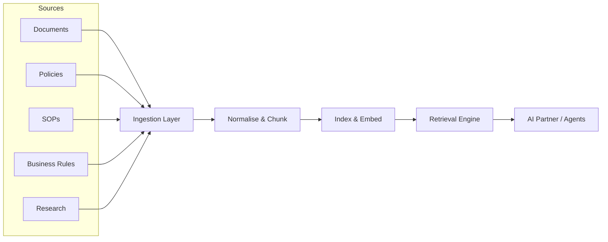

# Volume 14 - Knowledge Sources

| Field | Value |
|---|---|
| Document ID | WORLD-VOL14-005 |
| Title | Knowledge Sources |
| Version | 1.0 |
| Status | Approved |
| Classification | Internal |
| Founder | Mahesh Choudhary |

## Purpose

This chapter defines the concept of a knowledge source in Project WORLD and establishes the common framework by which every source of enterprise knowledge is registered, ingested, indexed, and made retrievable. Where the Knowledge Registry (Chapter 04) catalogues what knowledge exists, this chapter specifies where that knowledge originates, how heterogeneous origins are normalised into a single governed corpus, and how each source feeds the shared ingestion to index to retrieval pipeline that grounds the AI Business Partner (Volume 03) and the AI Agents (Volume 13). A knowledge source is the accountable point of truth for a class of enterprise knowledge; this chapter is the parent contract that the five source-specific chapters in this section inherit.

## Scope

This chapter covers the taxonomy of knowledge sources, the source connector contract, the shared ingestion pipeline, and the responsibilities every source must satisfy to be admitted to the Knowledge Engine. It introduces the five first-class source types detailed in Chapters 06 to 10: documents, policies, standard operating procedures, business rules, and research. It does not specify the internal retrieval mechanics (Section C), the semantic structure applied after ingestion (Section D), or the governance controls (Section E), each of which it consumes or feeds.

## Architecture

A knowledge source is expressed as a governed connector that implements a uniform contract: identity, authority, extraction, change detection, and provenance. Each source registers with the Knowledge Registry, declares its classification and owner, and emits normalised knowledge units into the shared pipeline. The architecture deliberately separates the diverse origin systems from the uniform downstream corpus, so that documents, structured rules, and research all arrive as consistently described, versioned, and access-scoped units.

Each source type is distinguished by its native form and its authority model. Documents are unstructured or semi-structured artifacts; policies and SOPs are governed prose with mandatory review cycles; business rules are executable logic aligned with the Rules Engine; research is evidentiary and citation-bearing. The pipeline treats them uniformly downstream while preserving their distinct provenance and trust weight.

## Data Flow

A source connector detects a new or changed unit, extracts and normalises it, attaches provenance and classification metadata, and submits it to the ingestion layer. The unit is chunked, embedded, and indexed into the vector and keyword stores, and its relationships are registered in the Knowledge Graph (Chapter 03). At retrieval time, a query resolves to ranked units across all sources, filtered by the requesting principal's access scope, and returned with citations back to the originating source.

| Stage | Action | Output |
|---|---|---|
| Detect | Connector observes a new or changed unit | Change event with source reference |
| Extract | Content and metadata are pulled from the origin | Raw knowledge unit |
| Normalise | Unit is cleaned, chunked, and classified | Governed knowledge unit |
| Index | Unit is embedded and written to indexes | Retrievable, cited entry |
| Retrieve | Query returns scoped, ranked units | Grounded, attributable answer |

## Relationship with AI

Knowledge sources are the grounding substrate for every AI capability in WORLD. The AI Business Partner and AI Agents never answer from parametric memory alone; they retrieve from indexed sources and cite them, which is what makes their reasoning auditable and trustworthy. Source classification and trust weight let the retrieval engine prefer authoritative sources - an approved policy outranks a draft document - so the AI reflects the enterprise's own governed truth rather than an unaccountable approximation.

## Relationship with ERP

The ERP (Volumes 05 and 06) is both a consumer and a producer of knowledge sources. Document Management (Volume 05, Chapter 33) and the Document module (Volume 06, Chapter 26) supply document sources; the Business Rules Engine (Volume 05, Chapter 35) supplies the executable rule source. Policies and SOPs govern how ERP transactions must be executed, so the sources close the loop between how work should be done and how the ERP records that it was done.

## Relationship with Analytics

Analytics (Volume 04) consumes knowledge sources to explain and contextualise quantitative findings, and produces new sources in return. A dashboard anomaly is interpreted against the relevant policy or SOP; a research study becomes a citable source for a strategic recommendation. Source usage telemetry - which sources are retrieved, cited, and acted upon - is itself an analytics signal that drives the knowledge quality metrics of Chapter 25.

## Implementation Strategy

WORLD implements knowledge sources connector-first. The shared ingestion contract is built once, then each of the five source types onboards behind that contract in priority order: documents first for breadth, policies and SOPs next for governance value, business rules for executable precision, and research last for depth. Every source is versioned, access-scoped, and provenance-bearing from day one; no source is admitted to the corpus without a registered owner and classification. Incremental change detection keeps the corpus fresh without full re-indexing.

**Enterprise example:** A manufacturing group onboards WORLD across five origins - a SharePoint document library, an approved policy set, an SOP catalogue, the ERP Business Rules Engine, and a market-research archive. Each origin registers as a connector under the shared contract. When a plant manager asks the AI Partner whether a supplier may be paid early, the retrieval engine returns the payment-terms policy, the accounts-payable SOP, the executable early-payment rule, and a cash-flow research note - each cited, each scoped to the manager's authority - producing one grounded, auditable answer from four distinct source types.

## Key Components

| Component | Responsibility |
|---|---|
| Source Connector | Implements the uniform source contract for one origin |
| Ingestion Layer | Accepts, normalises, and chunks incoming units |
| Provenance Recorder | Attaches origin, owner, version, and classification |
| Change Detector | Identifies new and modified units for incremental update |
| Index Writer | Embeds and writes units to vector and keyword stores |
| Source Registry Entry | Registers the source with owner, scope, and trust weight |

## Cross-References

- [Knowledge Registry](/docs/blueprint/volume-14-knowledge-engine/section-a-knowledge-foundations/04-knowledge-registry.md)
- [Document Management](/docs/blueprint/volume-14-knowledge-engine/section-b-knowledge-sources/06-document-management.md)
- [Business Rules Repository](/docs/blueprint/volume-14-knowledge-engine/section-b-knowledge-sources/09-business-rules-repository.md)
- [Volume 05 - ERP Core](/docs/blueprint/volume-05-erp-core/README.md)

## References

- [Volume 01 - Vision and Philosophy](/docs/blueprint/volume-01-vision-and-philosophy/README.md)
- [Document Standards](/docs/governance/document-standards.md)

## Change Log

| Version | Date | Author | Notes |
|---|---|---|---|
| 1.0 | 2026-07-12 | Lead Software Engineer | Initial approved version. |
