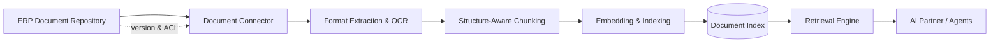

# Volume 14 - Document Management

| Field | Value |
|---|---|
| Document ID | WORLD-VOL14-006 |
| Title | Document Management |
| Version | 1.0 |
| Status | Approved |
| Classification | Internal |
| Founder | Mahesh Choudhary |

## Purpose

This chapter specifies how documents become a first-class knowledge source in Project WORLD. Documents are the largest and most heterogeneous origin of enterprise knowledge - contracts, reports, manuals, presentations, correspondence, and scanned records. This chapter defines how the Document Management subsystem of the ERP (Volume 05, Chapter 33) and the Document module (Volume 06, Chapter 26) are connected to the Knowledge Engine so that every governed document is extracted, chunked, embedded, and made retrievable with full provenance, without duplicating the system of record.

## Scope

This chapter covers the document source connector, content extraction across formats, chunking strategy, version and access alignment, and the retrieval treatment of documents. It does not redefine the ERP document repository, storage, or lifecycle, which remain the authoritative system of record in Volumes 05 and 06; the Knowledge Engine indexes and grounds against them rather than replacing them. Policies and SOPs, though document-shaped, are governed as their own source types in Chapters 07 and 08.

## Architecture

The document source is a read-aligned connector over the ERP document repository. It never owns the document; it mirrors the repository's identity, version, and access-control list into indexed knowledge units. Extraction adapters handle each format - native text, office formats, PDF, and images via OCR - and produce a normalised text stream with structural markers (headings, tables, sections) preserved so that chunking respects meaning rather than arbitrary length.

Each indexed chunk carries a back-reference to the exact document, version, and location, so retrieval can cite a passage precisely and a permission change at the repository propagates to the index. This keeps the Knowledge Engine consistent with the authoritative document lifecycle at all times.

## Data Flow

When a document is created or updated in the repository, the connector receives a change event, extracts and chunks the content, embeds each chunk, and writes it to the document index with provenance and access metadata. Deletions and access revocations propagate as index tombstones. At query time, document chunks are retrieved, re-ranked against other sources, filtered by the caller's permissions, and returned with citations to the source document and version.

| Format | Extraction Method | Notes |
|---|---|---|
| Office documents | Native text and structure parsing | Preserves headings and tables |
| PDF | Text-layer parse; OCR fallback | Layout-aware segmentation |
| Scanned images | OCR pipeline | Confidence scored, flagged if low |
| Spreadsheets | Cell and sheet extraction | Tabular context retained |
| Presentations | Slide and notes extraction | Slide order preserved |

## Relationship with AI

Documents give the AI Partner and Agents the raw evidentiary substance of the enterprise. When an agent drafts a contract clause or answers a compliance question, it retrieves the relevant document passages and cites them, so its output is traceable to a governed artifact and version. Structure-aware chunking is what makes this precise: the AI can cite a specific clause rather than an entire fifty-page agreement, which is essential for trust and auditability.

## Relationship with ERP

Document Management in the ERP (Volume 05, Chapter 33) and the Document module (Volume 06, Chapter 26) remain the systems of record; the Knowledge Engine is a downstream index. The connector honours ERP access-control lists, retention rules, and version history exactly, so a document withdrawn or reclassified in the ERP is immediately withdrawn or reclassified for retrieval. This alignment prevents the Knowledge Engine from ever surfacing content a user could not see in the ERP itself.

## Relationship with Analytics

Analytics (Volume 04) uses indexed documents to contextualise metrics - linking a revenue movement to a signed contract or a variance to a supporting report. Document retrieval telemetry also feeds analytics on knowledge usage: which documents are most cited, which are stale, and which are never retrieved, informing archival and the quality signals of Chapter 25.

## Implementation Strategy

WORLD implements the document source in stages: first native and office formats for immediate breadth, then PDF text extraction, then OCR for scanned and image content. Structure-aware chunking and precise citation are built in from the outset because they are the difference between a searchable pile and a citable corpus. Incremental change detection over the repository keeps the index fresh without costly full re-indexing, and low-confidence OCR output is flagged for review rather than silently trusted.

**Enterprise example:** A legal team stores ten thousand supplier contracts in the ERP document repository. WORLD's document connector extracts and chunks each by clause, embedding indemnity, termination, and payment sections separately. When counsel asks which active contracts allow termination for convenience with under thirty days notice, the retrieval engine returns the exact clauses from the matching contracts, each cited to document and version, scoped to counsel's access - a task that previously required weeks of manual review, answered in seconds and fully auditable.

## Key Components

| Component | Responsibility |
|---|---|
| Document Connector | Read-aligned bridge to the ERP document repository |
| Extraction Adapters | Convert each format into normalised text and structure |
| OCR Pipeline | Recovers text from scanned and image documents |
| Structure-Aware Chunker | Splits content along meaningful boundaries |
| Access Synchroniser | Mirrors ERP ACLs and retention to the index |
| Citation Resolver | Maps chunks back to document, version, and location |

## Cross-References

- [Knowledge Sources](/docs/blueprint/volume-14-knowledge-engine/section-b-knowledge-sources/05-knowledge-sources.md)
- [Metadata Standards](/docs/blueprint/volume-14-knowledge-engine/section-d-structure-and-semantics/19-metadata-standards.md)
- [Volume 06 - Business Modules](/docs/blueprint/volume-06-business-modules/README.md)
- [Volume 05 - ERP Core](/docs/blueprint/volume-05-erp-core/README.md)

## References

- [Volume 01 - Vision and Philosophy](/docs/blueprint/volume-01-vision-and-philosophy/README.md)
- [Document Standards](/docs/governance/document-standards.md)

## Change Log

| Version | Date | Author | Notes |
|---|---|---|---|
| 1.0 | 2026-07-12 | Lead Software Engineer | Initial approved version. |
