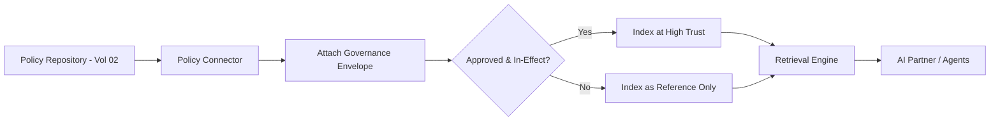

# Volume 14 - Policies

| Field | Value |
|---|---|
| Document ID | WORLD-VOL14-007 |
| Title | Policies |
| Version | 1.0 |
| Status | Approved |
| Classification | Internal |
| Founder | Mahesh Choudhary |

## Purpose

This chapter specifies how organisational policies become a governed knowledge source in Project WORLD. Policies are the authoritative statements of what the enterprise permits, requires, and prohibits. Unlike ordinary documents, a policy carries binding authority, an owner, an approval state, and an effective period, and it must outrank informal content whenever the AI reasons about what is allowed. This chapter defines how policies authored under Volume 02 are ingested, indexed with their governance metadata, and retrieved as high-trust grounding for the AI Business Partner and AI Agents.

## Scope

This chapter covers the policy source connector, policy-specific metadata, trust weighting, effective-dating, and the retrieval treatment that makes approved policy authoritative. It aligns with the policy and SOP framework of Volume 02 (Sections C and G). It does not define how policies are drafted, reviewed, or approved - that lifecycle lives in Volume 02 - nor the executable enforcement of policy, which is realised as business rules in Chapter 09. Procedures that operationalise policy are covered as SOPs in Chapter 08.

## Architecture

The policy source is a governed connector over the policy repository maintained under Volume 02. Each policy is ingested as a knowledge unit that carries not only its text but its governance envelope: owner, approval status, version, effective and expiry dates, and applicability scope. Only approved, in-effect policies are given full authoritative trust weight; drafts and superseded versions are indexed but marked so they can never masquerade as current authority.

This architecture ensures that when the AI answers a question of permission, the governance envelope, not merely the text, decides how much weight a policy statement carries.

## Data Flow

A policy approval or revision in the Volume 02 repository raises a change event. The connector ingests the new version, attaches the governance envelope, evaluates its effective state, and indexes it at the appropriate trust level. Superseded versions are demoted, and expired policies are flagged. At query time, the retrieval engine prefers approved, in-effect policies, filters by applicability scope and caller access, and returns the governing statement with its citation and effective date.

| Metadata | Purpose |
|---|---|
| Owner | Accountable authority for the policy |
| Approval status | Distinguishes binding from draft content |
| Version | Identifies the exact revision cited |
| Effective date | Establishes when the policy governs |
| Expiry date | Retires policy from authoritative use |
| Applicability scope | Limits the policy to the units it governs |

## Relationship with AI

Policies give the AI its guardrails. When the AI Partner or an agent evaluates whether an action is permitted, it retrieves the governing policy and treats it as high-trust authority, above any conflicting document or informal note. Effective-dating lets the AI reason about what was permitted at a past moment as well as now, which is essential for compliance explanations. Because every policy answer is cited to an approved version, the AI's guardrails are transparent and auditable.

## Relationship with ERP

Policies govern how ERP transactions must be conducted - spending limits, approval hierarchies, credit terms, and segregation of duties. The policy source informs the AI's guidance, while the executable enforcement of those same policies is expressed as business rules in the ERP Business Rules Engine (Volume 05, Chapter 35) and indexed via Chapter 09. Policy and rule are kept deliberately traceable to one another so that what the ERP enforces can always be explained by the policy it derives from.

## Relationship with Analytics

Analytics (Volume 04) uses policies to interpret and audit behaviour: an exception report is judged against the policy it breaches, and policy coverage can be measured against observed activity. Retrieval telemetry reveals which policies are frequently consulted, which are ambiguous enough to generate repeated queries, and which are never referenced, feeding policy rationalisation and the quality metrics of Chapter 25.

## Implementation Strategy

WORLD implements the policy source by binding directly to the Volume 02 approval lifecycle so that trust weight is never assigned manually. Approved status and effective-dating are enforced at ingestion; no policy is treated as authoritative unless its envelope says so. The connector maintains full version history for point-in-time compliance queries, and applicability scope is indexed so policies surface only where they govern. Conflicts between policies are surfaced for human resolution rather than silently ranked.

**Enterprise example:** A finance controller asks WORLD whether a business-class flight for a two-hour domestic trip is permitted. The retrieval engine returns the current approved Travel and Expense policy, effective this quarter, which limits business-class travel to flights over six hours. The AI cites the exact clause and version, notes the trip does not qualify, and flags that a superseded prior-year policy - indexed only as reference - had allowed it. The controller receives an authoritative, dated, auditable answer.

## Key Components

| Component | Responsibility |
|---|---|
| Policy Connector | Bridges the Volume 02 policy repository to the engine |
| Governance Envelope Attacher | Binds owner, status, and dates to each unit |
| Effective-State Evaluator | Determines authoritative versus reference trust |
| Version Historian | Retains revisions for point-in-time queries |
| Scope Indexer | Records applicability for scoped retrieval |
| Conflict Detector | Surfaces contradictory policies for resolution |

## Cross-References

- [Knowledge Sources](/docs/blueprint/volume-14-knowledge-engine/section-b-knowledge-sources/05-knowledge-sources.md)
- [SOP Management](/docs/blueprint/volume-14-knowledge-engine/section-b-knowledge-sources/08-sop-management.md)
- [Business Rules Repository](/docs/blueprint/volume-14-knowledge-engine/section-b-knowledge-sources/09-business-rules-repository.md)
- [Volume 02 - Founder Operating System](/docs/blueprint/volume-02-founder-operating-system/README.md)

## References

- [Volume 01 - Vision and Philosophy](/docs/blueprint/volume-01-vision-and-philosophy/README.md)
- [Document Standards](/docs/governance/document-standards.md)

## Change Log

| Version | Date | Author | Notes |
|---|---|---|---|
| 1.0 | 2026-07-12 | Lead Software Engineer | Initial approved version. |
