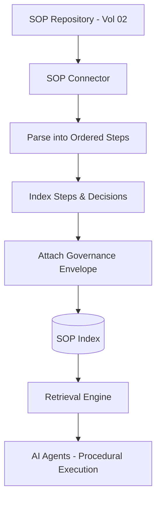

# Volume 14 - SOP Management

| Field | Value |
|---|---|
| Document ID | WORLD-VOL14-008 |
| Title | SOP Management |
| Version | 1.0 |
| Status | Approved |
| Classification | Internal |
| Founder | Mahesh Choudhary |

## Purpose

This chapter specifies how standard operating procedures (SOPs) become a governed knowledge source in Project WORLD. Where policies state what must be true, SOPs state how work is actually performed - the ordered, repeatable steps that operationalise policy into daily execution. SOPs are the source the AI relies on to guide, and increasingly to perform, procedural work. This chapter defines how SOPs authored under Volume 02 are ingested with their step structure intact, indexed for procedural retrieval, and made executable-ready for AI Agents.

## Scope

This chapter covers the SOP source connector, step-structured ingestion, procedural metadata, version and ownership alignment, and the retrieval treatment that lets the AI follow a procedure step by step. It aligns with the SOP framework of Volume 02 (Sections C and G). It does not define how SOPs are authored or approved, which lives in Volume 02, nor the policy authority that SOPs implement (Chapter 07), nor the executable rules that automate individual steps (Chapter 09).

## Architecture

The SOP source is a governed connector that preserves procedural structure. Unlike a flat document, an SOP is ingested as an ordered graph of steps, each with its trigger, actor, action, decision points, and expected outcome. This structure is what allows the AI to retrieve not just \"the SOP\" but \"the next step given where we are\". Each step is individually addressable and citable, and the whole SOP carries the same governance envelope as a policy: owner, approval status, version, and effective period.

By indexing steps and decision points as first-class units, the architecture lets an agent walk a procedure deterministically while remaining grounded in the approved, current version.

## Data Flow

An approved SOP revision raises a change event. The connector parses the SOP into ordered steps and decision branches, attaches the governance envelope, and indexes each step with its position and dependencies. At execution time, an agent retrieves the SOP, identifies the current step from workflow state, and is returned the specific next action with its guardrails, citing the SOP and version. Completed and abandoned procedures feed usage telemetry back to knowledge quality.

| Step Attribute | Purpose |
|---|---|
| Trigger | Condition that begins the step |
| Actor | Human or agent responsible |
| Action | The work to be performed |
| Decision | Branch conditions to the next step |
| Outcome | Expected result and success criteria |
| Controls | Approvals and checks required |

## Relationship with AI

SOPs are the procedural backbone for AI Agents (Volume 13). An agent executing a workflow retrieves the governing SOP and follows its steps in order, honouring each decision point and control. Because steps are individually indexed, the agent can resume mid-procedure, explain exactly which step it is on, and cite the approved version it is following. This is what lets WORLD automate procedures without losing the auditability of who did what and under which instruction.

## Relationship with ERP

SOPs describe how ERP transactions are carried out - how a purchase requisition is raised and approved, how a goods receipt is booked, how a customer refund is processed. The SOP source guides both human users and agents through these ERP workflows, while the enforceable controls within steps are realised as business rules (Chapter 09) in the Business Rules Engine (Volume 05, Chapter 35). SOP and rule together ensure the ERP process is both explained and enforced.

## Relationship with Analytics

Analytics (Volume 04) measures SOP adherence and efficiency: how often a procedure is followed as written, where steps are skipped, and which steps consume the most time or generate the most exceptions. This turns SOPs into a measurable operating standard rather than static text, feeding process-improvement analytics and the knowledge quality metrics of Chapter 25.

## Implementation Strategy

WORLD implements the SOP source by parsing procedures into structured, step-addressable units at ingestion, binding to the Volume 02 approval lifecycle for trust and effective-dating. High-volume, high-risk procedures are onboarded first because they yield the greatest automation and compliance value. Decision points are indexed explicitly so agents can branch deterministically, and controls within steps are cross-linked to their enforcing business rules so that guidance and enforcement never drift apart.

**Enterprise example:** A shared-services centre onboards its accounts-payable SOP. WORLD parses it into steps: capture invoice, match to purchase order, resolve exceptions, obtain approval by threshold, and schedule payment. When an invoice arrives, the AP Agent retrieves the SOP, matches the invoice, and reaches the approval step; the indexed decision point routes any invoice over the policy threshold to a human approver, citing the exact SOP version. Every processed invoice is handled identically and auditably, and adherence is measured step by step.

## Key Components

| Component | Responsibility |
|---|---|
| SOP Connector | Bridges the Volume 02 SOP repository to the engine |
| Step Parser | Converts prose into ordered, addressable steps |
| Decision Indexer | Records branch conditions for deterministic flow |
| Governance Envelope Attacher | Binds owner, status, and version to the SOP |
| Execution Cursor | Resolves the current step from workflow state |
| Control Linker | Cross-links step controls to enforcing rules |

## Cross-References

- [Policies](/docs/blueprint/volume-14-knowledge-engine/section-b-knowledge-sources/07-policies.md)
- [Business Rules Repository](/docs/blueprint/volume-14-knowledge-engine/section-b-knowledge-sources/09-business-rules-repository.md)
- [Volume 02 - Founder Operating System](/docs/blueprint/volume-02-founder-operating-system/README.md)
- [Volume 13 - AI Agents](/docs/blueprint/volume-13-ai-agents/README.md)

## References

- [Volume 01 - Vision and Philosophy](/docs/blueprint/volume-01-vision-and-philosophy/README.md)
- [Document Standards](/docs/governance/document-standards.md)

## Change Log

| Version | Date | Author | Notes |
|---|---|---|---|
| 1.0 | 2026-07-12 | Lead Software Engineer | Initial approved version. |
