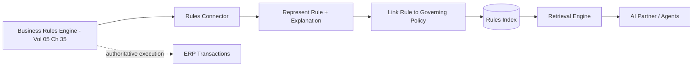

# Volume 14 - Business Rules Repository

| Field | Value |
|---|---|
| Document ID | WORLD-VOL14-009 |
| Title | Business Rules Repository |
| Version | 1.0 |
| Status | Approved |
| Classification | Internal |
| Founder | Mahesh Choudhary |

## Purpose

This chapter specifies how business rules become a governed, executable knowledge source in Project WORLD. Business rules are the enterprise's decision logic in machine-executable form - the conditions and actions that determine credit approval, pricing, eligibility, routing, and validation. Where documents, policies, and SOPs are prose, business rules are precise, testable logic. This chapter defines how the rules governed by the ERP Business Rules Engine (Volume 05, Chapter 35) are indexed as knowledge so the AI can retrieve, explain, and reason about the exact logic that governs a decision, while the engine remains the authoritative executor.

## Scope

This chapter covers the business-rules source connector, rule representation as knowledge, alignment with the Rules Engine, and the retrieval treatment of executable logic. It aligns tightly with the Business Rules Engine of Volume 05 (Chapter 35), which owns rule authoring, evaluation, and execution. This chapter does not redefine that engine; it indexes its rules as a knowledge source so they can be searched, explained, and traced to the policies (Chapter 07) they enforce. Rule execution itself remains in the ERP.

## Architecture

The business-rules source is a governed connector over the Business Rules Engine's rule repository. Each rule is ingested as a knowledge unit with two faces: its executable definition (conditions, actions, priority) and its human-readable explanation. The connector preserves the rule's identity, version, owner, and the policy it implements, so retrieval can answer both \"what is the rule\" and \"why does it exist\". The engine remains the single source of execution truth; the Knowledge Engine indexes a faithful, versioned mirror for retrieval and explanation, never a divergent copy.

This two-faced representation is what lets the AI explain a decision in plain language while pointing to the exact executable rule and version that produced it.

## Data Flow

When a rule is created, modified, or retired in the Business Rules Engine, the connector ingests the new version, generates or updates its explanation, links it to its governing policy, and indexes it. At query time, the AI retrieves the applicable rules for a decision, ranks them by the engine's own priority, filters by scope, and returns the governing logic with its explanation, version, and policy lineage. Rule-evaluation outcomes from the engine are also captured to support decision-audit retrieval.

| Rule Element | Indexed As | Retrieval Use |
|---|---|---|
| Conditions | Structured predicate | Explains when the rule applies |
| Actions | Structured effect | Explains what the rule does |
| Priority | Ordering weight | Resolves conflicting rules |
| Version | Revision identifier | Point-in-time decision audit |
| Policy link | Lineage reference | Traces rule to its authority |

## Relationship with AI

Business rules give the AI exact, executable decision logic rather than interpretation. When the AI Partner or an agent explains why a loan was declined or a discount denied, it retrieves the governing rule, cites its conditions and version, and traces it to the policy it enforces. The AI never re-implements or overrides the logic - it reads and explains the rule the engine actually ran, which keeps automated decisions transparent, consistent, and contestable.

## Relationship with ERP

This source is the Knowledge Engine's tightest coupling to the ERP. The Business Rules Engine (Volume 05, Chapter 35) authors and executes rules against live transactions; the rules repository indexes those same rules for retrieval and explanation. Execution authority stays with the engine, so the ERP remains the system of record for every decision, while the Knowledge Engine ensures the logic behind each decision is discoverable, explainable, and linked back to policy.

## Relationship with Analytics

Analytics (Volume 04) uses the indexed rules and their evaluation outcomes to measure decision behaviour: approval rates, exception frequency, and the business impact of a rule change. Because each rule is versioned and policy-linked, analytics can attribute a shift in outcomes to a specific rule revision, supporting rule effectiveness review and the knowledge quality metrics of Chapter 25.

## Implementation Strategy

WORLD implements the rules source by binding to the Business Rules Engine as the authoritative producer and indexing rules automatically on every change, so the index can never drift from execution. Each rule is paired with a maintained plain-language explanation and an explicit link to its governing policy, making lineage first-class. High-impact rule sets - credit, pricing, compliance - are onboarded first. Rule versions are retained so any historical decision can be explained against the exact logic that produced it.

**Enterprise example:** A customer disputes a declined credit-limit increase. An agent retrieves the governing rule from the repository: it declines increases where debt-to-income exceeds forty percent and account age is under twelve months. The AI cites the rule, its version active on the decision date, and the underlying credit policy it enforces, then explains in plain language why the application failed both conditions. The dispute is resolved with a transparent, versioned, policy-traced explanation - and the engine, not the Knowledge Engine, remains the authority that ran the logic.

## Key Components

| Component | Responsibility |
|---|---|
| Rules Connector | Bridges the Business Rules Engine to the index |
| Rule Representer | Stores executable definition and explanation |
| Explanation Generator | Maintains plain-language rule descriptions |
| Policy Linker | Traces each rule to its governing policy |
| Version Historian | Retains rule revisions for decision audit |
| Priority Resolver | Orders conflicting rules by engine priority |

## Cross-References

- [Policies](/docs/blueprint/volume-14-knowledge-engine/section-b-knowledge-sources/07-policies.md)
- [SOP Management](/docs/blueprint/volume-14-knowledge-engine/section-b-knowledge-sources/08-sop-management.md)
- [Knowledge Sources](/docs/blueprint/volume-14-knowledge-engine/section-b-knowledge-sources/05-knowledge-sources.md)
- [Volume 05 - ERP Core](/docs/blueprint/volume-05-erp-core/README.md)

## References

- [Volume 01 - Vision and Philosophy](/docs/blueprint/volume-01-vision-and-philosophy/README.md)
- [Document Standards](/docs/governance/document-standards.md)

## Change Log

| Version | Date | Author | Notes |
|---|---|---|---|
| 1.0 | 2026-07-12 | Lead Software Engineer | Initial approved version. |
