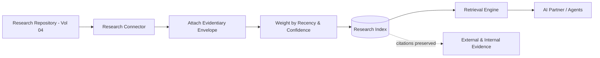

# Volume 14 - Research Repository

| Field | Value |
|---|---|
| Document ID | WORLD-VOL14-010 |
| Title | Research Repository |
| Version | 1.0 |
| Status | Approved |
| Classification | Internal |
| Founder | Mahesh Choudhary |

## Purpose

This chapter specifies how research becomes a governed, evidence-bearing knowledge source in Project WORLD. Research is the enterprise's accumulated analytical knowledge - market studies, competitor analyses, customer insights, technical investigations, and the outputs of AI-driven research (Volume 04). Unlike policies and rules, research is not binding; its authority derives from evidence, method, and recency. This chapter defines how research artifacts are ingested with their evidentiary metadata, indexed for insight retrieval, and made available to ground strategic reasoning by the AI Business Partner and AI Agents.

## Scope

This chapter covers the research source connector, evidentiary metadata, recency and confidence weighting, citation preservation, and the retrieval treatment of research. It aligns with the research and decision-science capabilities of Volume 04. It does not define how research is conducted or how analytical models are built, which live in Volume 04; it governs how completed research is captured as a durable, citable knowledge source. Binding authority remains with policies (Chapter 07) and rules (Chapter 09); research informs, it does not mandate.

## Architecture

The research source is a governed connector over the research repository produced under Volume 04. Each research artifact is ingested as a knowledge unit carrying its evidentiary envelope: author or model, method, sources cited, confidence, and date. Findings are indexed alongside their supporting evidence so a retrieved insight always arrives with the basis for it. Research is weighted by recency and confidence rather than approval status, so fresher, better-evidenced findings surface above stale or speculative ones.

Preserving citations through to the original evidence is what distinguishes a research source from an opinion: every finding can be traced to what supports it.

## Data Flow

When a research artifact is completed or updated in Volume 04, the connector ingests it, attaches the evidentiary envelope, computes a recency-and-confidence weight, and indexes the findings with their citations. At query time, the retrieval engine returns research findings ranked by relevance and evidentiary weight, filtered by access scope, and surfaced with confidence, date, and links to supporting sources so the reader can judge reliability. Superseded studies are demoted but retained for longitudinal comparison.

| Metadata | Purpose |
|---|---|
| Author or model | Attributes the finding to its producer |
| Method | Describes how the finding was reached |
| Cited sources | Links the finding to its evidence |
| Confidence | Signals reliability of the finding |
| Date | Establishes recency for weighting |
| Scope | Bounds the domain the finding covers |

## Relationship with AI

Research gives the AI its depth and foresight. When the AI Partner advises on entering a market or an agent assesses a supplier, it retrieves relevant research and presents findings with their confidence and citations, never as unqualified fact. Because research is weighted by recency and evidence rather than treated as binding, the AI can weigh competing findings and flag uncertainty - grounding strategic recommendations in evidence while being honest about how strong that evidence is.

## Relationship with ERP

Research contextualises the transactional reality captured by the ERP (Volumes 05 and 06). A supplier-risk study explains procurement decisions recorded in the ERP; a demand-forecast informs the planning parameters the ERP executes against. The research source connects external and analytical knowledge to internal operational data, so decisions taken in the ERP can be justified by the evidence that shaped them.

## Relationship with Analytics

Research is the most tightly bound source to Analytics (Volume 04), which is both its producer and its heaviest consumer. Analytical findings are captured here as durable, citable knowledge; conversely, retrieval telemetry shows which research informs decisions, which is never used, and where evidence gaps exist. This closes the loop between generating insight and applying it, and feeds the knowledge quality metrics of Chapter 25.

## Implementation Strategy

WORLD implements the research source by capturing every completed study - human or AI-produced - with its evidentiary envelope intact, refusing to index findings that lack method, sources, or confidence. Recency-and-confidence weighting is applied at ingestion so the corpus self-prioritises without manual curation. Citations are preserved end to end so any finding can be traced to its evidence, and superseded research is retained for trend analysis rather than deleted. AI research outputs from Volume 04 flow in automatically, keeping the repository continuously current.

**Enterprise example:** A strategy team asks WORLD whether to expand into a new regional market. The AI retrieves three research artifacts: a six-month-old market-sizing study at high confidence, a recent competitor analysis at medium confidence, and a two-year-old demand forecast now demoted for age. The AI synthesises a recommendation, presents each finding with its date, confidence, and cited sources, and explicitly flags that the demand data is stale and warrants refresh. The team decides on transparent, evidence-weighted grounding rather than an unqualified assertion.

## Key Components

| Component | Responsibility |
|---|---|
| Research Connector | Bridges the Volume 04 research repository to the index |
| Evidentiary Envelope Attacher | Binds author, method, and confidence to findings |
| Recency-Confidence Weigher | Prioritises fresh, well-evidenced research |
| Citation Preserver | Retains links from finding to source evidence |
| Finding Indexer | Makes individual insights retrievable |
| Longitudinal Store | Retains superseded studies for trend analysis |

## Cross-References

- [Knowledge Sources](/docs/blueprint/volume-14-knowledge-engine/section-b-knowledge-sources/05-knowledge-sources.md)
- [Knowledge Registry](/docs/blueprint/volume-14-knowledge-engine/section-a-knowledge-foundations/04-knowledge-registry.md)
- [Volume 04 - Business Intelligence & Decision Science](/docs/blueprint/volume-04-business-intelligence-and-decision-science/README.md)
- [Volume 03 - AI Business Partner](/docs/blueprint/volume-03-ai-business-partner/README.md)

## References

- [Volume 01 - Vision and Philosophy](/docs/blueprint/volume-01-vision-and-philosophy/README.md)
- [Document Standards](/docs/governance/document-standards.md)

## Change Log

| Version | Date | Author | Notes |
|---|---|---|---|
| 1.0 | 2026-07-12 | Lead Software Engineer | Initial approved version. |
