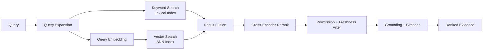

# Volume 14 - Retrieval Engine

| Field | Value |
|---|---|
| Document ID | WORLD-VOL14-012 |
| Title | Retrieval Engine |
| Version | 1.0 |
| Status | Approved |
| Classification | Internal |
| Founder | Mahesh Choudhary |

## Purpose

The Retrieval Engine finds the candidate facts most likely to answer a question. It is the core of WORLD's Retrieval-Augmented Generation (RAG) capability. Where the Context Engine (Chapter 11) decides what to include and how to present it, the Retrieval Engine decides how to find it: combining lexical precision with semantic understanding, reranking for relevance, and returning grounded, citable evidence. Its purpose is to maximize the probability that the true answer is present in the retrieved set while minimizing noise.

## Scope

The chapter covers hybrid retrieval (keyword plus vector), fusion of result sets, reranking, and grounding with citations. It defines how queries are dispatched to lexical and vector indexes, how their results are merged, and how a reranker orders the fused set. It does not define embedding generation (Chapter 14) or the vector store itself (Chapter 15); it consumes both.

## Architecture

Retrieval runs two complementary paths in parallel and fuses them. The lexical path matches exact terms, identifiers, and rare tokens; the vector path matches meaning. A reranker then scores the merged candidates against the query for final ordering.

Hybrid retrieval is deliberate: keyword search excels at exact matches - a part number, a policy code, a person's name - where embeddings blur, while vector search excels at paraphrase and concept, where keywords miss. Fusion combines their strengths, and reranking applies a heavier relevance model to the top candidates for precision.

## Data Flow

A query is optionally expanded with synonyms and acronyms, then dispatched simultaneously to the lexical index and, after embedding, to the approximate-nearest-neighbor (ANN) vector index. Each path returns a ranked list; the fusion step merges them using rank-based combination so neither path dominates. The reranker, a heavier cross-encoder-style relevance model, re-scores the merged top set against the original query. Results are then filtered by permission and freshness, and each surviving item is packaged with its source identifier, version, and confidence for grounding.

## Relationship with AI

The Retrieval Engine is what makes WORLD's AI grounded rather than generative. It supplies the evidence that the AI Business Partner (Volume 03) and Agents (Volume 13, Chapter 10) cite in every consequential claim. Reranking directly raises answer quality by pushing the most relevant passage into the model's attention. Grounding and citation are enforced here: retrieved evidence carries provenance so the consuming model can attribute each assertion, and unretrievable questions return an explicit gap rather than an empty context that invites hallucination.

## Relationship with ERP

Many questions resolve to a transactional fact, not a document. The Retrieval Engine federates structured lookups against ERP entities (Volumes 05-06) alongside unstructured retrieval, so a single query can return both the governing SOP and the live order status. Identifiers - invoice numbers, SKUs, account codes - are exactly where the lexical path shines, ensuring precise joins between a question and the specific ERP record it concerns.

## Relationship with Analytics

Retrieval quality is measured, not assumed. The engine emits per-query metrics - recall proxies, rerank score distributions, path contribution (lexical versus vector), and click-through where feedback exists. Business Intelligence (Volume 04) uses these to detect degrading indexes, poorly covered intents, and queries that consistently fail to ground. This telemetry drives re-chunking, re-embedding, and query-expansion tuning, forming a measurable improvement loop.

## Implementation Strategy

Begin with lexical-only retrieval to guarantee exact-match correctness, then add the vector path and fusion. Introduce reranking once fusion is stable, applying it only to the top candidates to bound cost and latency. Tune fusion weights and expansion dictionaries using Analytics feedback. Enforce permission and freshness filters as non-negotiable stages that cannot be bypassed. Run retrieval paths in parallel and cache stable results within a task to keep interactive latency low.

**Enterprise example:** A support agent asks, "What is our refund window for damaged goods on the 2024 warranty terms?" The lexical path matches the exact token "2024 warranty" and the policy code; the vector path surfaces a paraphrased clause titled "return of defective merchandise" that shares no keywords with the query. Fusion merges both; the reranker promotes the specific clause that mentions both damage and the time window. After a permission and freshness filter confirms the clause is the current approved version, the agent answers "thirty days from delivery" and cites the exact clause - an answer neither path would have found reliably alone.

## Key Components

| Component | Responsibility | Guarantee |
|---|---|---|
| Query Expander | Adds synonyms and acronyms | Higher recall |
| Lexical Index | Exact term and identifier match | Precision on rare tokens |
| Vector Search | Semantic, meaning-based match | Recall on paraphrase |
| Result Fusion | Merges lexical and vector lists | Balanced candidate set |
| Reranker | Re-scores top candidates | Precision at the top |
| Grounding Binder | Attaches provenance and confidence | Citable, auditable evidence |

## Cross-References

- [Context Engine](/docs/blueprint/volume-14-knowledge-engine/section-c-retrieval-and-context/11-context-engine.md)
- [Semantic Search](/docs/blueprint/volume-14-knowledge-engine/section-c-retrieval-and-context/13-semantic-search.md)
- [Vector Database Strategy](/docs/blueprint/volume-14-knowledge-engine/section-c-retrieval-and-context/15-vector-database-strategy.md)
- [Volume 13 - Knowledge Access](/docs/blueprint/volume-13-ai-agents/section-c-agent-cognition/10-knowledge-access.md)

## References

- [Volume 01 - Vision and Philosophy](/docs/blueprint/volume-01-vision-and-philosophy/README.md)
- [Document Standards](/docs/governance/document-standards.md)

## Change Log

| Version | Date | Author | Notes |
|---|---|---|---|
| 1.0 | 2026-07-12 | Lead Software Engineer | Initial approved version. |
