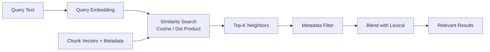

# Volume 14 - Semantic Search

| Field | Value |
|---|---|
| Document ID | WORLD-VOL14-013 |
| Title | Semantic Search |
| Version | 1.0 |
| Status | Approved |
| Classification | Internal |
| Founder | Mahesh Choudhary |

## Purpose

Semantic search retrieves knowledge by meaning rather than by matching characters. Traditional search finds documents that contain a word; semantic search finds documents that answer a question, even when they share no vocabulary with it. This chapter defines how WORLD represents queries and knowledge in a shared meaning space, measures similarity, and returns conceptually relevant results, so that the AI can find the right policy or precedent regardless of how it happens to be phrased.

## Scope

The chapter covers the semantic path: mapping text into a vector space, similarity measurement, top-k selection, and the fusion of semantic results with lexical and metadata signals. It defines the conceptual model of meaning-based retrieval and its role within hybrid retrieval (Chapter 12). It relies on embeddings (Chapter 14) and the vector index (Chapter 15) but does not define their internal construction.

## Architecture

Semantic search projects both the query and every knowledge chunk into the same high-dimensional vector space, where proximity encodes similarity of meaning. A query becomes a point; retrieval returns its nearest neighbors.

Because meaning is captured by vector proximity, a query about "reimbursing travel costs" retrieves a policy titled "expense recovery for business trips" despite zero shared keywords. Metadata filters constrain the neighborhood - by tenant, document type, effective date - so semantic proximity never overrides permission or currency.

## Data Flow

The query text is embedded into a vector by the same model used to embed knowledge, guaranteeing both live in a comparable space. The vector store computes similarity - typically cosine or dot product - between the query vector and indexed chunk vectors, returning the top-k nearest neighbors. Metadata filters prune results that fall outside the actor's scope or the required freshness window. The semantic results are then blended with lexical results (Chapter 12) so exact matches and conceptual matches reinforce each other before ranking and grounding.

## Relationship with AI

Semantic search is how the AI understands intent rather than surface wording. It underpins the Context Understanding of the AI Business Partner (Volume 03) by connecting a naturally phrased question to formally worded knowledge. This tolerance for paraphrase is essential in a conversational system: users do not know the exact title of the policy they need, and agents generate queries in varied language. Semantic retrieval bridges that gap, so grounding succeeds even when vocabulary diverges.

## Relationship with ERP

Semantic search complements, rather than replaces, the exact-match lookups the ERP requires. Financial and transactional queries demand precise identifier matching, which the lexical path provides. Semantic search adds value on the descriptive edges of ERP data - matching a free-text vendor note, a product description, or a service-request narrative to related knowledge - while structured keys remain the authoritative join to Volumes 05-06 records.

## Relationship with Analytics

Embedding-space telemetry is itself analyzable. Business Intelligence (Volume 04) examines query-vector clusters to reveal what the organization asks about, which regions of the knowledge space are dense or sparse, and where questions land far from any indexed content - a signal of a knowledge gap. Similarity-score distributions indicate retrieval health: a drift toward low scores warns that content has aged or that the embedding model needs refreshing.

## Implementation Strategy

Adopt a single embedding model for both queries and content to keep the space consistent, and re-embed all content whenever that model changes. Choose a similarity metric aligned to the model's training - cosine for normalized embeddings. Always pair semantic search with metadata filtering so relevance never bypasses permission or freshness. Tune k to balance recall against context budget, and blend semantic with lexical results rather than choosing one, since the two fail in different ways. Monitor score distributions through Analytics to trigger re-embedding.

**Enterprise example:** A new manager types, "How do I let someone go?" into the AI Business Partner. No document contains that phrase, but the query vector lands nearest to an approved HR document titled "Involuntary Separation Procedure." A metadata filter confirms the manager's region and that the document is the current version. The AI returns the correct procedure and cites it, having matched intent to meaning - a result plain keyword search, looking for "let someone go," would have missed entirely.

## Key Components

| Component | Responsibility | Guarantee |
|---|---|---|
| Query Embedder | Maps query into meaning space | Comparable to content vectors |
| Similarity Search | Finds nearest neighbors | Meaning-based relevance |
| Metadata Filter | Constrains by scope and freshness | Permission-safe results |
| Top-K Selector | Bounds result set size | Fits context budget |
| Lexical Blender | Combines with keyword matches | Robust across query styles |
| Score Monitor | Tracks similarity health | Early drift detection |

## Cross-References

- [Retrieval Engine](/docs/blueprint/volume-14-knowledge-engine/section-c-retrieval-and-context/12-retrieval-engine.md)
- [Embeddings](/docs/blueprint/volume-14-knowledge-engine/section-c-retrieval-and-context/14-embeddings.md)
- [Vector Database Strategy](/docs/blueprint/volume-14-knowledge-engine/section-c-retrieval-and-context/15-vector-database-strategy.md)
- [Volume 03 - AI Business Partner](/docs/blueprint/volume-03-ai-business-partner/README.md)

## References

- [Volume 01 - Vision and Philosophy](/docs/blueprint/volume-01-vision-and-philosophy/README.md)
- [Document Standards](/docs/governance/document-standards.md)

## Change Log

| Version | Date | Author | Notes |
|---|---|---|---|
| 1.0 | 2026-07-12 | Lead Software Engineer | Initial approved version. |
