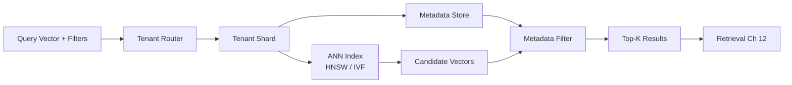

# Volume 14 - Vector Database Strategy

| Field | Value |
|---|---|
| Document ID | WORLD-VOL14-015 |
| Title | Vector Database Strategy |
| Version | 1.0 |
| Status | Approved |
| Classification | Internal |
| Founder | Mahesh Choudhary |

## Purpose

The vector database stores millions of embeddings and answers nearest-neighbor queries in milliseconds. This chapter defines WORLD's strategy for that store: the approximate-nearest-neighbor (ANN) indexes that make similarity search fast, the metadata filtering that keeps it correct, and the multi-tenant isolation that keeps it safe. It aligns with the vector and analytical data strategy of Volume 09, treating the vector store as a first-class, governed data system rather than a bolt-on.

## Scope

The chapter covers ANN index selection (HNSW and IVF families), metadata filtering, multi-tenant isolation, sharding, and operational lifecycle. It defines the storage and retrieval substrate that Semantic Search (Chapter 13) and the Retrieval Engine (Chapter 12) depend upon. It treats the store vendor-neutrally, specifying required properties. It does not define embedding generation (Chapter 14) or query orchestration (Chapter 11).

## Architecture

The vector store organizes embeddings into an ANN index for speed and couples every vector to metadata for correctness. Isolation boundaries partition the store by tenant so no query can cross an organizational line.

Exact nearest-neighbor search over millions of vectors is too slow for interactive use, so WORLD uses ANN indexes that trade a small, tunable amount of recall for large speed gains. **HNSW** (Hierarchical Navigable Small World) builds a layered graph that is navigated greedily from coarse to fine, offering excellent recall and low latency at higher memory cost. **IVF** (Inverted File) partitions the space into clusters and searches only the nearest few, offering strong compression and scale at some recall cost. WORLD selects per workload: HNSW for latency-critical interactive retrieval, IVF for very large or memory-constrained corpora.

## Data Flow

A query arrives as a vector plus metadata filters. The tenant router directs it to the correct tenant shard - the isolation boundary is enforced before any search. Within the shard, the ANN index returns candidate neighbors, which are intersected with the metadata filter (classification, effective date, document type, permission scope). Filtering may be applied during traversal (to preserve recall under selective filters) or after candidate retrieval. The top-k survivors are returned to the Retrieval Engine with source metadata for grounding.

## Relationship with AI

The vector store is the AI's long-term semantic memory. Its recall determines whether the true supporting passage reaches the model, and its latency determines whether grounded retrieval is fast enough for conversation. By enforcing metadata filtering and tenant isolation inside the store, WORLD guarantees that the AI Business Partner (Volume 03) and Agents (Volume 13, Chapter 10) can only ground answers in knowledge their principal is permitted to see - security is a property of retrieval, not an afterthought applied to results.

## Relationship with ERP

The vector store indexes knowledge derived from and about ERP entities (Volumes 05-06) but is not the system of record for transactions. Metadata links each vector to its ERP source, so a semantic hit on a product description or contract clause resolves to the authoritative structured record for the exact fact. This division keeps transactional integrity in the ERP while making its descriptive content semantically discoverable.

## Relationship with Analytics

The store is operated on evidence. Business Intelligence (Volume 04) tracks index recall, query latency percentiles, shard sizes, memory footprint, and filter selectivity. These metrics govern index tuning - HNSW graph connectivity, IVF cluster counts, and the probe breadth at query time - and signal when a shard should be split or an index rebuilt. Retrieval-quality metrics from Chapter 12 feed back to validate that ANN approximation is not silently dropping relevant results.

## Implementation Strategy

Partition by tenant from the outset; isolation retrofitted later is unsafe. Choose HNSW for interactive stores and IVF for archival or very large corpora, and tune the recall-versus-latency parameters against measured workloads rather than defaults. Index metadata fields that drive common filters so filtering is cheap and selective. Treat re-embedding migrations as index rebuilds with dual-serving during cutover. Capacity-plan by vector count, dimension, and index type, and monitor the recall-latency frontier continuously. Align classification, retention, and residency controls with Volume 09 and Volume 12.

| Property | HNSW | IVF |
|---|---|---|
| Structure | Layered proximity graph | Clustered inverted lists |
| Recall | Very high | High, tunable via probes |
| Latency | Very low | Low with sufficient probes |
| Memory | Higher | Lower, compressible |
| Best fit | Interactive retrieval | Large-scale or archival |

**Enterprise example:** WORLD serves two customer organizations from one platform. Each tenant's embeddings live in a separate shard, and the tenant router binds every query to its shard before search - a query from Tenant A can never traverse Tenant B's index. Tenant A's ten-million-vector corpus uses HNSW for sub-fifty-millisecond interactive retrieval, while a rarely queried compliance archive uses IVF to hold cost down. When a Tenant A user searches with a filter for "current, region-EU, HR-classified" documents, the metadata filter runs alongside the ANN traversal, returning only permitted, current results - fast, correct, and isolated.

## Key Components

| Component | Responsibility | Guarantee |
|---|---|---|
| Tenant Router | Binds query to tenant shard | Hard multi-tenant isolation |
| ANN Index | Fast approximate neighbor search | Low-latency recall |
| Metadata Store | Holds filter attributes per vector | Scope and freshness control |
| Filter Engine | Intersects candidates with filters | Permission-safe results |
| Shard Manager | Splits and balances shards | Scale without hotspots |
| Index Lifecycle | Rebuilds on re-embed and drift | Sustained retrieval quality |

## Cross-References

- [Embeddings](/docs/blueprint/volume-14-knowledge-engine/section-c-retrieval-and-context/14-embeddings.md)
- [Semantic Search](/docs/blueprint/volume-14-knowledge-engine/section-c-retrieval-and-context/13-semantic-search.md)
- [Retrieval Engine](/docs/blueprint/volume-14-knowledge-engine/section-c-retrieval-and-context/12-retrieval-engine.md)
- [Volume 09 - Database](/docs/blueprint/volume-09-database/README.md)

## References

- [Volume 01 - Vision and Philosophy](/docs/blueprint/volume-01-vision-and-philosophy/README.md)
- [Document Standards](/docs/governance/document-standards.md)

## Change Log

| Version | Date | Author | Notes |
|---|---|---|---|
| 1.0 | 2026-07-12 | Lead Software Engineer | Initial approved version. |
