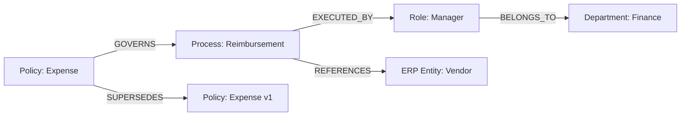

# Volume 14 - Knowledge Relationships

| Field | Value |
|---|---|
| Document ID | WORLD-VOL14-016 |
| Title | Knowledge Relationships |
| Version | 1.0 |
| Status | Approved |
| Classification | Internal |
| Founder | Mahesh Choudhary |

## Purpose

Knowledge becomes useful when its pieces are connected. An isolated fact answers one question; a connected fact answers many, because the connections carry meaning of their own. This chapter defines how WORLD represents relationships between knowledge entities - the typed, directional links that turn a collection of documents, entities, and concepts into a navigable knowledge graph. It establishes the relational substrate on which the Ontology (Chapter 17) imposes formal semantics, and it aligns with the entity and reference models of Volume 09 so that a relationship in the knowledge layer resolves cleanly to the authoritative record beneath it.

## Scope

The chapter covers relationship types, directionality, cardinality, provenance, and the graph structure that binds knowledge entities together. It defines how relationships are asserted, attributed to a source, and traversed during retrieval. It provides the connective tissue that the Ontology formalizes and the Taxonomy (Chapter 18) organizes hierarchically. It does not define the formal class model (Chapter 17), the classification hierarchy (Chapter 18), or the descriptive attributes carried by each entity (Chapter 19, Metadata Standards).

## Architecture

A knowledge relationship is a typed, directional edge between two knowledge entities. Each edge names a predicate - the nature of the connection - and carries provenance describing who asserted it and on what evidence. Entities and edges together form a property graph that can be traversed in any direction.

Every edge is more than a pointer. It declares a predicate drawn from a governed vocabulary (`GOVERNS`, `REFERENCES`, `SUPERSEDES`, `EXECUTED_BY`), a direction that fixes subject and object, and a cardinality that constrains how many entities may participate. This discipline is what separates a knowledge graph from a tangle of hyperlinks: the meaning of a traversal is knowable in advance.

## Data Flow

Relationships are born from extraction and assertion. When a source is ingested, the Knowledge Engine extracts candidate entities and the links between them; curators and agents may also assert relationships directly. Each candidate edge is typed against the governed predicate vocabulary, attributed to its source, and written to the graph store with provenance. During retrieval, the graph is traversed outward from a seed entity to gather related knowledge - a policy pulls in the processes it governs and the roles that execute them - and the resulting neighborhood is passed to the Retrieval Engine (Chapter 12) as connected, grounded context rather than a flat list.

## Relationship with AI

Relationships give the AI the ability to reason across facts rather than merely recall them. When the AI Business Partner (Volume 03) answers a question about an expense policy, graph traversal lets it also surface the affected process, the responsible role, and the superseded prior version - context a single document could never supply. Agents (Volume 13) rely on relationship traversal to plan multi-step work, following `DEPENDS_ON` and `EXECUTED_BY` edges to understand what a task touches. Typed, provenance-bearing edges also make the AI's reasoning auditable: every inferred connection can be traced to the assertion that justified it.

## Relationship with ERP

Knowledge relationships describe and connect ERP entities without replacing them. A `REFERENCES` edge from a contract clause to a vendor record links descriptive knowledge to the authoritative structured entity in Volumes 05-06, but the ERP remains the system of record for the vendor's identity, balances, and status. This separation lets the knowledge graph express rich semantic connections - which policy governs which process, which process touches which entity - while transactional integrity stays in the ERP, joined by stable identifiers rather than duplicated.

## Relationship with Analytics

The relationship graph is itself a rich analytical object. Business Intelligence (Volume 04) measures graph structure - node degree, connected components, orphaned entities, and the density of relationship types - to reveal how well-connected the organization's knowledge is. Highly central entities indicate load-bearing knowledge; orphans signal gaps or stale content. Traversal telemetry shows which relationship paths retrieval actually uses, guiding where to enrich the graph and where connections are noise.

## Implementation Strategy

Govern the predicate vocabulary from the outset - an ungoverned edge type is as harmful as an ungoverned field. Make every relationship directional and provenance-bearing so traversals are meaningful and auditable. Constrain cardinality where the domain demands it, and validate asserted edges against the Ontology (Chapter 17) before they are trusted. Prefer stable entity identifiers over embedded copies so relationships survive content change. Traverse with depth and type limits to keep retrieval neighborhoods bounded, and monitor graph health through Analytics to prune noise and fill gaps.

**Enterprise example:** A finance manager asks the AI, "What changes if we update the travel expense policy?" The engine seeds on the `Policy: Expense` node and traverses outward: a `GOVERNS` edge reaches the reimbursement process, an `EXECUTED_BY` edge reaches the manager role, a `REFERENCES` edge reaches the vendor entities involved, and a `SUPERSEDES` edge exposes the prior version for comparison. In one traversal the AI assembles the full blast radius of the change - process, people, and data - and cites the provenance of each connection.

## Key Components

| Component | Responsibility | Guarantee |
|---|---|---|
| Predicate Vocabulary | Defines allowed relationship types | Meaningful, governed edges |
| Edge Asserter | Creates typed, directional links | Provenance on every relationship |
| Graph Store | Persists entities and edges | Efficient multi-hop traversal |
| Cardinality Validator | Enforces participation limits | Structurally valid graph |
| Traversal Engine | Gathers related neighborhoods | Bounded, relevant context |
| Graph Health Monitor | Tracks connectivity and orphans | Early gap and noise detection |

## Cross-References

- [Ontology](/docs/blueprint/volume-14-knowledge-engine/section-d-structure-and-semantics/17-ontology.md)
- [Taxonomy](/docs/blueprint/volume-14-knowledge-engine/section-d-structure-and-semantics/18-taxonomy.md)
- [Metadata Standards](/docs/blueprint/volume-14-knowledge-engine/section-d-structure-and-semantics/19-metadata-standards.md)
- [Volume 09 - Database](/docs/blueprint/volume-09-database/README.md)

## References

- [Volume 01 - Vision and Philosophy](/docs/blueprint/volume-01-vision-and-philosophy/README.md)
- [Document Standards](/docs/governance/document-standards.md)

## Change Log

| Version | Date | Author | Notes |
|---|---|---|---|
| 1.0 | 2026-07-12 | Lead Software Engineer | Initial approved version. |
