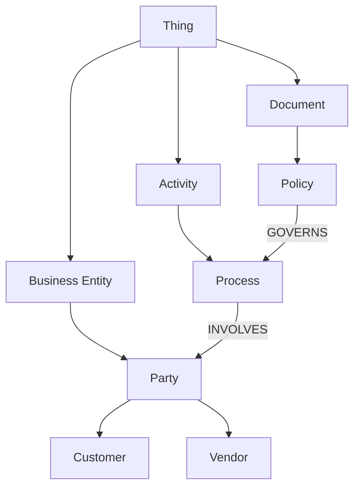

# Volume 14 - Ontology

| Field | Value |
|---|---|
| Document ID | WORLD-VOL14-017 |
| Title | Ontology |
| Version | 1.0 |
| Status | Approved |
| Classification | Internal |
| Founder | Mahesh Choudhary |

## Purpose

An ontology is the formal, shared model of what exists in a domain and how the things that exist relate. Where Knowledge Relationships (Chapter 16) provide typed edges, the ontology provides the rules that make those edges consistent: the classes of entity WORLD recognizes, the relations permitted between them, and the axioms that must always hold. This chapter defines WORLD's ontology as the semantic contract of the Knowledge Engine, ensuring that every part of the system - and every AI reasoning over it - means the same thing by the same term. It aligns with the shared business vocabulary of Volume 02 and the data models of Volume 09.

## Scope

The chapter covers ontology structure: classes and their hierarchy, properties and relations, axioms and constraints, and the reasoning they enable. It defines the formal semantics that govern the knowledge graph and validate its relationships. It builds on Volume 02 terminology and does not redefine it. It does not cover hierarchical browsing categories (Chapter 18, Taxonomy) or per-entity descriptive attributes (Chapter 19, Metadata Standards), both of which are grounded in the classes defined here.

## Architecture

The ontology is organized as a hierarchy of classes, each carrying properties and connected by named relations, with axioms constraining what combinations are valid. A subclass inherits the properties and constraints of its parent, so structure defined once applies everywhere below it.

Three elements define the model. **Classes** name the kinds of things that exist (`Document`, `Party`, `Process`) and form an inheritance hierarchy. **Relations** name how classes may connect (`GOVERNS`, `INVOLVES`), with domain and range restricting which classes each relation joins. **Axioms** state rules that must hold - for example, that `Customer` and `Vendor` are both subclasses of `Party`, or that every `Process` must have at least one responsible `Party`. Together these let a reasoner infer facts never explicitly stated.

## Data Flow

The ontology is authored and governed centrally, then applied continuously. As knowledge is ingested, extracted entities are classified against ontology classes and each asserted relationship is validated against the relation's domain and range - an edge that would join incompatible classes is rejected or flagged. A reasoner then applies axioms to derive implied facts: if a record is a `Customer`, it is inferred to be a `Party` and inherits every constraint of that class. The validated, enriched entities flow into the knowledge graph, where the Retrieval Engine (Chapter 12) and Analytics (Volume 04) consume a semantically consistent model.

## Relationship with AI

The ontology is the AI's model of reality. It lets the AI Business Partner (Volume 03) interpret a question in terms of well-defined concepts rather than raw strings, disambiguating whether "account" means a customer or a ledger by its class. Agents (Volume 13) plan against ontology relations, reasoning that because a `Policy` `GOVERNS` a `Process`, changing the policy may affect the process. Axioms constrain the AI's inferences to what the domain permits, reducing hallucination: the model reasons inside a formally bounded world rather than an open-ended one.

## Relationship with ERP

The ontology harmonizes ERP structures into a shared conceptual model without altering them. ERP tables for customers, vendors, and orders (Volumes 05-06) map to ontology classes, so knowledge about a `Customer` connects seamlessly to the authoritative customer record. The ontology is the semantic bridge - it names the concept once and binds every ERP representation of it to that name - while the ERP remains the system of record. This lets descriptive knowledge and transactional data share a vocabulary without duplicating either.

## Relationship with Analytics

A shared ontology makes analytics comparable across the enterprise. Because Business Intelligence (Volume 04) computes metrics over consistently classified entities, a measure of "active customers" means the same thing in every report. The ontology also becomes an analytical target in its own right: coverage metrics reveal how much ingested knowledge maps cleanly to known classes, and constraint-violation rates expose where reality diverges from the model, signaling that the ontology itself should evolve.

## Implementation Strategy

Start small and grounded - model the core classes the business actually uses, drawn from Volume 02, before extending. Give every relation an explicit domain and range so validation is possible. Express axioms that capture genuine business rules, not incidental patterns, and version the ontology so changes are governed and traceable. Validate all asserted relationships against the ontology before trusting them, and run a reasoner to enrich rather than to over-infer. Treat ontology evolution as a governed process, measuring class coverage and violation rates through Analytics to guide growth.

**Enterprise example:** A knowledge source describes "Acme Corp" as a party that both buys and supplies goods. The ontology classifies Acme as both `Customer` and `Vendor`, each a subclass of `Party`. When a manager asks the AI for "everything about Acme," the reasoner uses the `Party` axioms to unify both roles, retrieving purchase history and supply contracts together and linking each to its authoritative ERP record - a coherent view that a flat, unclassified store could not produce.

## Key Components

| Component | Responsibility | Guarantee |
|---|---|---|
| Class Hierarchy | Defines entity types and inheritance | Consistent classification |
| Relation Registry | Defines relations with domain/range | Valid, meaningful connections |
| Axiom Set | Encodes domain rules and constraints | Sound, bounded inference |
| Classifier | Maps entities to ontology classes | Semantic consistency |
| Reasoner | Derives implied facts from axioms | Enriched, coherent knowledge |
| Ontology Governance | Versions and evolves the model | Traceable semantic change |

## Cross-References

- [Knowledge Relationships](/docs/blueprint/volume-14-knowledge-engine/section-d-structure-and-semantics/16-knowledge-relationships.md)
- [Taxonomy](/docs/blueprint/volume-14-knowledge-engine/section-d-structure-and-semantics/18-taxonomy.md)
- [Volume 02 - Business Foundation](/docs/blueprint/volume-02-business-foundation/README.md)
- [Volume 09 - Database](/docs/blueprint/volume-09-database/README.md)

## References

- [Volume 01 - Vision and Philosophy](/docs/blueprint/volume-01-vision-and-philosophy/README.md)
- [Document Standards](/docs/governance/document-standards.md)

## Change Log

| Version | Date | Author | Notes |
|---|---|---|---|
| 1.0 | 2026-07-12 | Lead Software Engineer | Initial approved version. |
