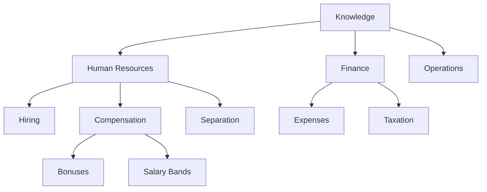

# Volume 14 - Taxonomy

| Field | Value |
|---|---|
| Document ID | WORLD-VOL14-018 |
| Title | Taxonomy |
| Version | 1.0 |
| Status | Approved |
| Classification | Internal |
| Founder | Mahesh Choudhary |

## Purpose

A taxonomy is a hierarchical classification scheme - a controlled set of categories arranged from general to specific - that gives knowledge a consistent place to live and a predictable way to be found. Where the Ontology (Chapter 17) models what things are and how they relate, the taxonomy organizes them into browsable, mutually understood buckets. This chapter defines WORLD's approach to taxonomy: how categories are structured, governed, and applied so that every piece of knowledge is classified the same way regardless of who files it. It aligns with the data classification and metadata standards of Volume 09 and the shared vocabulary of Volume 02.

## Scope

The chapter covers taxonomy structure: hierarchical categories, controlled vocabulary, classification rules, and multi-faceted classification. It defines how knowledge is categorized for navigation, filtering, and governance. It complements the ontology, which supplies formal semantics, and feeds the metadata schema (Chapter 19), which records the assigned categories. It does not define entity relationships (Chapter 16), formal axioms (Chapter 17), or the full metadata field set (Chapter 19).

## Architecture

The taxonomy is a tree of categories in which each node is more specific than its parent and each knowledge item is assigned to one or more nodes. WORLD supports multiple parallel trees, or facets - by domain, by document type, by sensitivity - so an item can be classified along several independent dimensions at once.

Each category is drawn from a controlled vocabulary - a governed list of allowed terms with a single preferred label and any synonyms mapped to it. The hierarchy is strict: a child belongs to exactly one parent within a facet, so a path such as `Human Resources > Compensation > Bonuses` is unambiguous. Faceting keeps concerns separate: the same document can sit at `Compensation` in the domain facet, `Policy` in the type facet, and `Confidential` in the sensitivity facet.

## Data Flow

Classification happens at ingestion and is revisited on change. When knowledge enters the engine, an automated classifier proposes categories from the controlled vocabulary based on content and metadata, and curators or agents confirm or correct the assignment. The chosen categories are recorded in the item's metadata (Chapter 19) and indexed so that retrieval can filter and browse by them. During retrieval, taxonomy paths narrow the search space - a query scoped to `Finance > Expenses` restricts candidates before semantic ranking - and drive navigational browsing in the interface.

## Relationship with AI

The taxonomy gives the AI a coarse, fast map of the knowledge space. Before semantic search runs, the AI Business Partner (Volume 03) can scope a query to the relevant branch, improving both speed and precision by excluding whole regions of irrelevant content. Agents (Volume 13) use taxonomy paths to target the correct policy domain for a task. Because categories come from a controlled vocabulary, the AI's filtering is deterministic and explainable: a result was included because it sits under a named, governed category, not because of an opaque score.

## Relationship with ERP

Taxonomy categories align knowledge with the operational structure the ERP already uses. Chart-of-accounts groupings, product categories, and organizational units in Volumes 05-06 map to taxonomy facets, so a document filed under `Finance > Expenses` connects naturally to the corresponding ERP transaction categories. The taxonomy classifies the descriptive knowledge; the ERP keeps the operational hierarchy authoritative. Shared category names let a user move from a knowledge article to the matching ERP view without translation.

## Relationship with Analytics

Categorized knowledge is measurable knowledge. Business Intelligence (Volume 04) reports coverage and volume by category, revealing which domains are richly documented and which are thin. Classification-confidence and reclassification rates expose where the automated classifier struggles, and query-by-category telemetry shows which branches users actually rely on. These signals guide where to invest in content and whether the taxonomy itself needs new branches or pruning of unused ones.

## Implementation Strategy

Govern the controlled vocabulary centrally, with one preferred label per concept and synonyms mapped to it, so classification never fragments. Keep each facet single-purpose and each hierarchy strict, and prefer several shallow facets over one deep, overloaded tree. Automate first-pass classification but require human confirmation for sensitive or ambiguous items. Record assigned categories in metadata (Chapter 19) and align sensitivity facets with Volume 09 and Volume 12 classification. Review the taxonomy on a governed cycle, using Analytics to add, merge, or retire categories as the business evolves.

**Enterprise example:** An HR specialist uploads a document on severance pay. The classifier proposes `Human Resources > Separation` in the domain facet, `Policy` in the type facet, and `Confidential` in the sensitivity facet; the specialist confirms. Later, a manager browsing `Human Resources > Separation` finds it immediately, and the AI, scoping a question about layoffs to that same branch, retrieves it quickly while the `Confidential` facet ensures only permitted roles see it. One consistent classification serves browsing, retrieval, and governance at once.

## Key Components

| Component | Responsibility | Guarantee |
|---|---|---|
| Controlled Vocabulary | Governs allowed category terms | Consistent, unambiguous labels |
| Category Hierarchy | Arranges terms general to specific | Predictable navigation |
| Facet Manager | Maintains parallel classification axes | Multi-dimensional filing |
| Auto-Classifier | Proposes categories from content | Scalable first-pass classification |
| Classification Store | Records assigned categories | Searchable, filterable knowledge |
| Taxonomy Governance | Reviews and evolves categories | Controlled structural change |

## Cross-References

- [Ontology](/docs/blueprint/volume-14-knowledge-engine/section-d-structure-and-semantics/17-ontology.md)
- [Knowledge Relationships](/docs/blueprint/volume-14-knowledge-engine/section-d-structure-and-semantics/16-knowledge-relationships.md)
- [Metadata Standards](/docs/blueprint/volume-14-knowledge-engine/section-d-structure-and-semantics/19-metadata-standards.md)
- [Volume 02 - Business Foundation](/docs/blueprint/volume-02-business-foundation/README.md)

## References

- [Volume 01 - Vision and Philosophy](/docs/blueprint/volume-01-vision-and-philosophy/README.md)
- [Document Standards](/docs/governance/document-standards.md)

## Change Log

| Version | Date | Author | Notes |
|---|---|---|---|
| 1.0 | 2026-07-12 | Lead Software Engineer | Initial approved version. |
