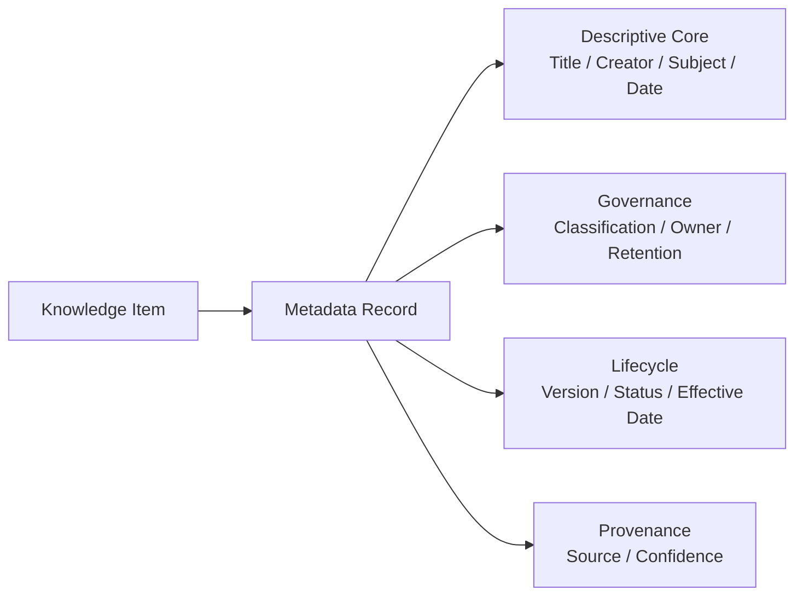

# Volume 14 - Metadata Standards

| Field | Value |
|---|---|
| Document ID | WORLD-VOL14-019 |
| Title | Metadata Standards |
| Version | 1.0 |
| Status | Approved |
| Classification | Internal |
| Founder | Mahesh Choudhary |

## Purpose

Metadata is data about knowledge - the structured description that tells the system what a knowledge item is, where it came from, who may see it, and whether it is still current. Without consistent metadata, knowledge cannot be governed, filtered, or trusted. This chapter defines WORLD's metadata standard: a common schema of descriptive fields, applied to every knowledge item, that makes the corpus discoverable, governable, and auditable. It extends the metadata and data-standards model of Volume 09 (Chapter 10) into the knowledge layer and adopts a Dublin-Core-style core of universally understood descriptive fields.

## Scope

The chapter covers the metadata schema: required and optional fields, controlled-value fields, provenance and lifecycle attributes, and the standard's role in governance and retrieval. It defines the descriptive envelope that wraps every knowledge item and records the outputs of relationship, ontology, and taxonomy processing. It aligns with Volume 09 data standards rather than redefining them, and it does not cover storage internals (Volume 09) or the classification schemes it references (Chapters 17-18).

## Architecture

Every knowledge item carries a metadata record built from a small, stable core of descriptive fields plus governance and lifecycle fields. The schema is layered: a Dublin-Core-style descriptive core that is always present, and extension fields that specific knowledge types add.

The descriptive core follows the spirit of Dublin Core - a compact set of fields such as Title, Creator, Subject, Description, Date, Type, and Identifier that any consumer can understand without domain knowledge. Governance fields bind each item to a classification, an accountable owner, and a retention rule. Lifecycle fields record version, status, and effective dates so currency is explicit. Provenance fields capture the source and an extraction-confidence signal. Controlled-value fields draw from the taxonomy (Chapter 18) and ontology (Chapter 17) so metadata stays consistent.

## Data Flow

Metadata is assembled progressively. At ingestion, descriptive and provenance fields are captured from the source; classification and ontology processing then populate subject, type, and category fields from controlled vocabularies; governance fields are set from policy. The completed record is stored alongside the item and indexed so that retrieval can filter on any field - classification, effective date, owner, or category. Throughout the item's life, lifecycle fields are updated on each revision, and retention fields drive archival and disposal, keeping the metadata a faithful, current description of the knowledge it wraps.

## Relationship with AI

Metadata is how the AI knows whether it may use a piece of knowledge and whether it should. The AI Business Partner (Volume 03) and Agents (Volume 13) read classification and permission fields before grounding, so a restricted document never reaches an unauthorized answer. Effective-date and status fields let the AI prefer current knowledge and flag superseded content. Because every grounded fact carries source and confidence metadata, the AI can cite its evidence and qualify its certainty - trust in the AI's answers rests directly on the quality of this metadata.

## Relationship with ERP

Metadata standards in the knowledge layer mirror the data standards the ERP already enforces. Identifier fields link a knowledge item back to its ERP source entity in Volumes 05-06, and shared classification and owner conventions let knowledge and transactional records be governed by one consistent policy. The ERP remains authoritative for the operational record; the knowledge metadata describes and points to it. Consistent identifiers and controlled values across both layers make the join reliable and the governance uniform.

## Relationship with Analytics

Metadata is the backbone of knowledge analytics. Business Intelligence (Volume 04) reports completeness - what fraction of items carry every required field - and uses lifecycle fields to measure how much of the corpus is current versus stale. Classification and owner fields let analytics attribute knowledge volume and freshness to domains and accountable parties. Low confidence or missing provenance flags content that needs review. In short, without standard metadata there is nothing consistent to measure; with it, the health of the entire corpus is visible.

## Implementation Strategy

Define a small mandatory core and enforce it at ingestion - an item without required metadata should not be trusted for grounding. Adopt Dublin-Core-style descriptive fields for universality and bind controlled-value fields to the taxonomy and ontology so descriptions stay consistent. Align classification, retention, and residency fields with Volume 09 and Volume 12 so one policy governs all knowledge. Capture provenance and confidence automatically at extraction. Validate completeness continuously through Analytics, and version the schema under governance so it can extend without breaking existing records.

**Enterprise example:** A finance policy is ingested. Its metadata record captures Title and Creator (descriptive core), `Finance > Expenses` and `Policy` (controlled subject and type from the taxonomy), `Confidential` classification with the Finance lead as owner and a seven-year retention rule (governance), version 3 with status Approved and an effective date (lifecycle), and the source system with a high extraction confidence (provenance). When the AI later answers an expense question, it reads these fields to confirm the policy is current and permitted, grounds its answer, and cites the exact version - governance, retrieval, and trust all served by one standard record.

## Key Components

| Component | Responsibility | Guarantee |
|---|---|---|
| Descriptive Core | Holds Dublin-Core-style fields | Universal discoverability |
| Governance Fields | Bind classification, owner, retention | Policy-consistent control |
| Lifecycle Fields | Track version, status, effective date | Explicit currency |
| Provenance Fields | Record source and confidence | Auditable, citable knowledge |
| Schema Validator | Enforces required fields at ingestion | Trustworthy, complete metadata |
| Metadata Governance | Versions and extends the schema | Safe, traceable evolution |

## Cross-References

- [Taxonomy](/docs/blueprint/volume-14-knowledge-engine/section-d-structure-and-semantics/18-taxonomy.md)
- [Ontology](/docs/blueprint/volume-14-knowledge-engine/section-d-structure-and-semantics/17-ontology.md)
- [Knowledge Relationships](/docs/blueprint/volume-14-knowledge-engine/section-d-structure-and-semantics/16-knowledge-relationships.md)
- [Volume 09 - Database](/docs/blueprint/volume-09-database/README.md)

## References

- [Volume 01 - Vision and Philosophy](/docs/blueprint/volume-01-vision-and-philosophy/README.md)
- [Document Standards](/docs/governance/document-standards.md)

## Change Log

| Version | Date | Author | Notes |
|---|---|---|---|
| 1.0 | 2026-07-12 | Lead Software Engineer | Initial approved version. |
